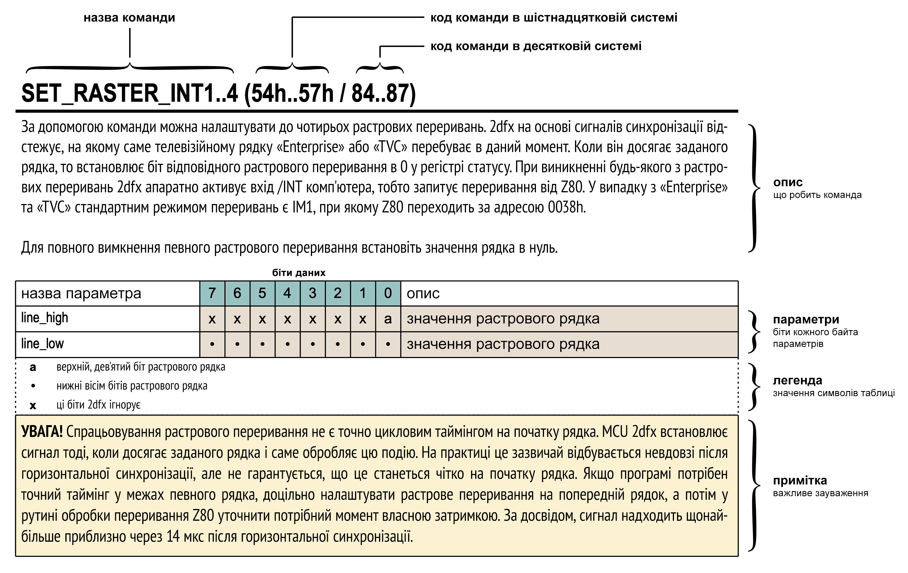

## Комунікація з 2dfx

Як на «Enterprise», так і на «Videoton TVC», пристрій [2dfx](../../hardware/hv-2dfx.md) здійснює комунікацію всього через два I/O порти процесора Z80. На обох машинах це жорстко зафіксовані порти [F8h (248)](../../programming/system-info/ports/port248.md) та [F9h (249)](../../programming/system-info/ports/port249.md).

Команди та параметри є абсолютно однаковими незалежно від використовуваного комп'ютера. Це значно спрощує портування додатків між «Enterprise» та «TVC»: графічні об'єкти, що виводяться за допомогою 2dfx, відображаються за допомогою тих самих команд і в тій самій системі координат.

При портуванні, звісно, слід зважати на різницю у видимій області екрана обох машин, початкову позицію зображення та інтерпретацію кольорів — про це детально йшлося в розділах «[Геометрія](1-6_geometry.md)» та «[Робота з кольором](1-7_color-management.md)».

Порт [F8h (248)](../../programming/system-info/ports/port248.md) є одночасно портом команд та статусу: він доступний як для запису, так і для зчитування. [Порт F9h (249)](../../programming/system-info/ports/port249.md) — це порт даних, який працює тільки на запис; саме через нього 2dfx отримує параметри відповідної команди. Відправка команди з трьома параметрами має такий вигляд:

```
OUT 248, aaa ; aaa = код команди
OUT 249, bbb ; bbb = значення першого параметра
OUT 249, ccc ; ccc = значення другого параметра
OUT 249, ddd ; ddd = значення третього параметра
```

Результат виконання графічних команд для спрайтів та **2DPT** завжди відображається в наступному кадрі. Це запобігає використанню напівпідготовлених параметрів об'єктів під час рендерингу і дозволяє в межах одного кадру — без додаткових програмних затримок — у будь-який момент підготувати зміни для наступного кадру. Усі зміни стають активними під час найближчого вертикального синхроімпульсу (кадрової синхронізації).

Надалі для опису команд та їхніх параметрів використовується така таблична форма:




