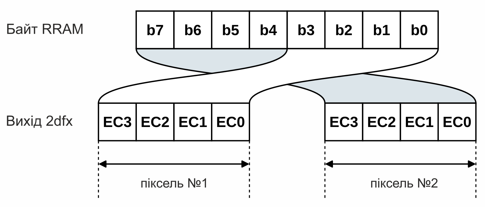

## Структура та використання Resource RAM (RRAM)

На карті [2dfx](../../hardware/hv-2dfx.md) доступно **8 МБ** ОЗП для збереження даних, необхідних для рендерингу. Сюди можуть завантажуватися, наприклад, бітмапи спрайтів, набори символів (шрифти), тайли, тайлові карти, текст для виведення та будь-які інші дані, які використовуються підсистемами малювання. Цю область пам'яті ми називаємо Resource RAM, скорочено **RRAM**.

Для забезпечення ефективного відображення внутрішній формат пікселів 2dfx зберігає в одному байті індекси кольорів двох сусідніх пікселів:

  
Тобто один байт RRAM містить індекси кольорів двох сусідніх пікселів — майбутні значення вихідних сигналів **EC0-3**.

Збереження наборів символів (шрифтів) також відбувається в RRAM. Оскільки для шрифтів ми не зберігаємо колір для кожного пікселя окремо, а лише інформацію про те, чи є даний піксель видимим, використовується формат 1bpp. Таким чином, символи на основі FONT, виведені через 2dfx, можуть бути  лише одноколірні. Колір, звісно, можна вільно змінювати для кожного рядка або символа, але не в межах одного й того самого символу.

Діапазон адрес RRAM становить **000000h**–**7FFFFFh**. Уся ця область повністю доступна користувачеві, і дані можна вільно завантажувати, починаючи з будь-якої адреси. Адреси є 23-бітними, і підсистеми 2dfx усюди очікують їх у вигляді трьох байтів у форматі little-endian: спочатку нижні вісім бітів, потім середні вісім бітів, і нарешті — верхні сім бітів. Найвищий біт третього байта повинен дорівнювати **0**.

Якщо завантаження перевищує адресу **7FFFFFh**, 2dfx автоматично закольцовується і переходить на адресу **000000h**. Тобто байт, що йде після **7FFFFFh**, потрапляє вже на початок RRAM, і збільшення лічильника адрес продовжується звідти (address wrap).

За допомогою команд **UPLOAD_xx** за одну транзакцію можна завантажити щонайбільше **65 536 байтів** (тобто **64 КБ**). Це не обмежує повний розмір графічного об'єкта; це лише означає, що більші обсяги даних потрібно передавати в RRAM кількома послідовними завантаженнями.

> Команди завантаження працюють подібно до інструкції **LDIR** у процесорі Z80: якщо кількість байтів для завантаження дорівнює нулю, команда очікує **65 536 байтів** даних. У протилежному випадку вона очікує рівно стільки, скільки було передано у двобайтовому полі довжини.

Для завантаження даних у власному форматі 2dfx, надсилання даних шрифтів та передачі будь-яких інших даних (наприклад, рядків) до 2dfx, які вимагають байт-у-байт збереження в RRAM, потрібно використовувати команду [UPLOAD_RAW](commands/upload_raw.md).

Чип [NICK](../../hardware/hm-nick.md) комп'ютера «Enterprise» та різні графічні конвертери зберігають дані пікселів у відмінному від цього порядку, тому 2dfx мусить підтримувати і цей формат.

Те саме стосується й «Videoton TVC», де збереження 16-колірної піксельної інформації також відрізняється від внутрішнього формату 2dfx. До того ж на материнській платі «TVC» підключення колірних входів **EC0-3** не відповідає логіці традиційних відеорежимів: **EC0** підключено до сигналу **I**, **EC1** — до **R**, **EC2** — до **G**, а **EC3** — до **B**.

Через це команди [UPLOAD_NICK](commands/upload_nick.md) та [UPLOAD_TVC](commands/upload_tvc.md) під час завантаження конвертують кожен байт даних із формату **NICK** або **TVC** відповідно у внутрішній піксельний формат 2dfx. Команда [UPLOAD_RAW](commands/upload_raw.md), навпаки, зберігає дані в RRAM байт-у-байт без жодної конвертації.

[UPLOAD_RAW (80h / 128)](commands/upload_raw.md)  
[UPLOAD_NICK (81h / 129)](commands/upload_nick.md)  
[UPLOAD_TVC (82h / 130)](commands/upload_tvc.md)  

2dfx також має вбудований розпакувальник **ZX1**. За допомогою команды [UPLOAD_RAW](commands/upload_raw.md) до RRAM можна завантажувати заздалегідь стиснуті пакети даних **ZX1**, а потім розпаковувати їх у потрібну цільову область. [UNZX1_RAW](commands/unzx1_raw.md) виконує розпакування байт-у-байт, тоді як [UNZX1_NICK](commands/unzx1_nick.md) та [UNZX1_TVC](commands/unzx1_tvc.md) після розпакування додатково здійснюють відповідне перегрупування бітів на відповідній ділянці RRAM.

Наприклад, якщо графічний об'єкт у форматі «Enterprise» стиснути за допомогою **ZX1** на комп'ютері розробника, стиснуті дані слід завантажувати командою [UPLOAD_RAW](commands/upload_raw.md). Після цього команда [UNZX1_NICK](commands/unzx1_nick.md) розпакує дані та виконає для них перетворення з формату **NICK** у формат 2dfx.

Вичерпний табличний огляд усіх можливих варіантів завантаження та розпакування наведено в розділі «Керівництво із завантаження».

Після завантаження даних, стиснутих у **ZX1**, розпакування завжди потрібно виконувати окремо. Графічні підсистеми 2dfx інтерпретують відповідну область RRAM як сирі (необроблені) дані; вони «не знають» про те, що там насправді міститься стиснутий пакет даних.

> **Увага!** Під час розпакування **UNZX1** поточна робота з рендерингу призупиняється. На екрані залишається останній сформований кадр доти, доки операцію не буде завершено. З цієї причини великі завантаження/розпакування доцільно виконувати під час запуску програми, між рівнями гри або під час переходів між сценами у демосценах.

[UNZX1_RAW (83h / 131)](commands/unzx1_raw.md)  
[UNZX1_NICK (84h / 132)](commands/unzx1_nick.md)  
[UNZX1_TVC (85h / 133)](commands/unzx1_tvc.md)  

