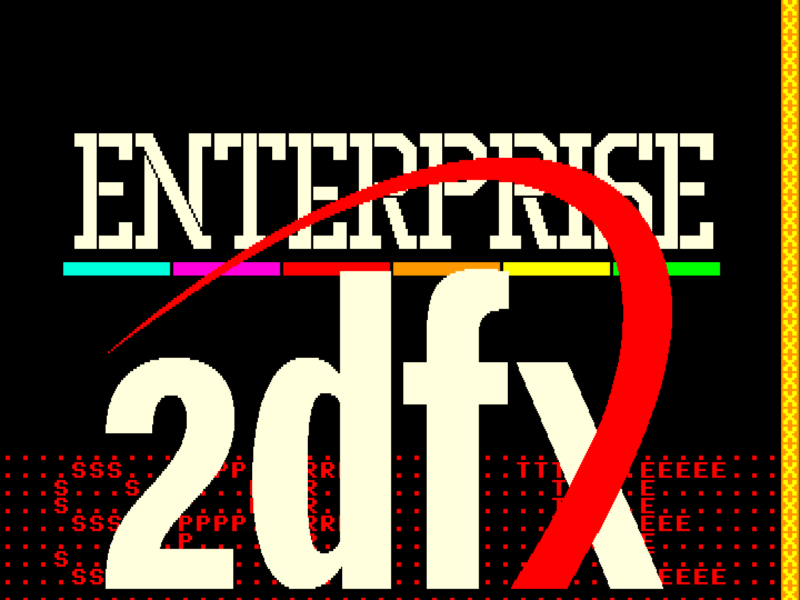

## EGG_C0 (C0h / 192) – «Як тебе назвати?»

Я створив це демо спеціально як видовищний елемент для [зустрічі клубу Enterprise](https://www.youtube.com/watch?v=rkOJymZdHxc), що відбулася 29 травня 2026 року: після того, як я продемонстрував тестову плату та її роботу, остаточним аккордом стало рішення «дати дитині ім’я». саме тоді вельмишановна публіка дізналася, що плата називається 2dfx. Демо складається з п'яти основних сцен:

1. **Хаос** – Тут окремі літери напису Enterprise відбиваються одна від одної та від меж екрана незалежно одна від одної протягом приблизно півтора хвилин. Кожна з літер є окремим спрайтом, проте в RRAM збережені зображення лише унікальних літер: `E`, `N`, `T`, `R`, `P`, `I`, `S`. Спрайти мають висоту **52** пікселі, а їхня ширина варіюється від **14** до **34** пікселів. Для відображення з правильними пропорціями у кожного спрайта увімкнено біт **Xdouble**, тому кожен піксель подвоюється по горизонталі. Крім того, видно шість кольорових смуг — це також спрайти розміром **48**×**6** пікселів (тут біт **Xdouble** також увімкнено).  
   
   При досягненні правого або нижнього краю екрана спрайт відповідної літери проходить через анімацію з **11** горизонтальних та **11** вертикальних заздалегідь згенерованих фаз руху. У цей момент спрайт «складається», після чого ця ж послідовність повторюється у зворотному порядку, але так, що залежно від ситуації в [SPB](../2-3_sprite-subsystem.md) (Sprite Parameter Block) даного спрайта вмикаються трансформаційні біти **Xflip** або **Yflip**, і свій шлях екраном продовжує вже трансформований спрайт. Тобто, наприклад, дані спрайта літери, що летить догори ногами, окремо не зберігаються в RRAM — рендерер виконує трансформацію «на льоту» на основі біта трансформації, встановленого в SPB. Зміна анімаційних фаз відбувається шляхом перезапису початкової адреси зображення спрайта в RRAM безпосередньо під час роботи.
   
   Варто також звернути увагу на взаємодію між правою крайньою кольоровою смугою та літерою `T`: для цих двох спрайтів увімкнено детекцію зіткнень (collision detection). Якщо видимі пікселі двох спрайтів перекривають один одного (зіштовхуються), у нижній третині екрана по центру спалахує кольорова смуга, яка залишається на екрані доти, доки триває стан зіткнення. Ця смуга також є спрайтом, внутрішня логіка «великодки» постійно перевіряє наявність зіткнення; під час зіткнення в SPB спрайта просто вмикається біт **SPRITE_ENABLE**, а після завершення зіткнення — вимикається.

2. **Збирання** – Усі літери рухаються над кольоровими смугами, збираючись у напис `ENTERPRISE`.

3. **Розвертання** – Ті спрайти, які під час збирання перебували в якійсь із фаз трансформації **Xflip** або **Yflip**, повертаються на своєму місці у вихідне положення, повторюючи фази анімації, описані в сцені «хаос». У випадку форм літер, симетричних відносно однієї з осей (наприклад, літера `I`), таке розвертання не відбувається.

4. **Презентація 2dfx** – Приблизно через десять секунд після третьої сцени, симулюючи ефект гравітації та відскоку, логотип 2dfx падає і зупиняється в певній позиції **Y**. Розмір логотипу становить **515**×**198** пікселів, він завантажується окремо (це не вбудований [SHOW_BUILTIN_LOGO](show_builtin_logo.md)).

5. **Веселка** – Кольорові смуги (спрайти) під написом `ENTERPRISE` починають чергуватися; цього вдається досягти шляхом зміни позицій **X** цих смуг у відповідних SPB.

**Підсумок:** За допомогою 2dfx можна створювати вражаючу анімацію, змінюючи лише SPB. Оскільки анімаційні фази зберігаються в RRAM, десять літер, що рухаються незалежно одна від одної та плавно повертаються, шість кольорових смуг, індикація зіткнень та великий логотип, що падає, керуються виключно модифікацією відповідних SPB.

**Динаміка часу рендерингу:**

| **Сцена**                           | **Час рендерингу EP** | **Час рендерингу TVC** |
| ----------------------------------- | --------------------- | ---------------------- |
| Хаос                                | 2,5 мс (12,5%)        | 2,42 мс (12,1%)        |
| Остання сцена (все на своїх місцях) | 2,97 мс (14,85%)      | 2,93 мс (14,65%)       |