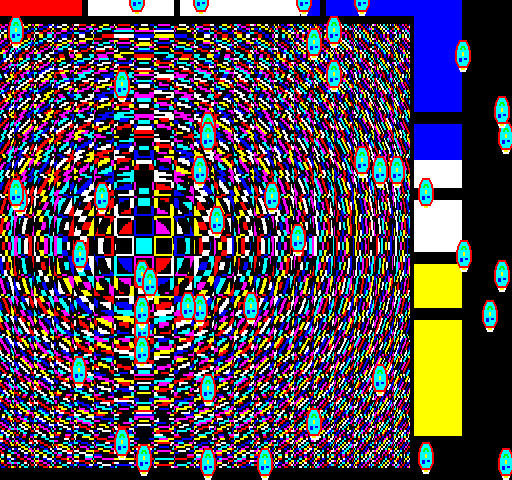

## EGG_C1 (C1h / 193) – бенчмарк трансформацій

У цьому демо на екрані з'являються всі 64 можливі спрайти з використанням [SPB](../2-3_sprite-subsystem.md). Метою демо було показати трансформації спрайтів та задокументувати різницю в часі рендерингу, необхідному для цього.

Два прямокутники у формі картин (що нагадують Піта Мондріана та Віктора Вазарелі) складаються з попередньо розрахованих даних, які були стиснуті за допомогою **ZX1**. Насправді їхній розмір величезний: **540**×**230** пікселів. Попри це, у стиснутому вигляді вони займають відносно мало місця. Для розміру **540**×**230** пікселів знадобилося б зберегти та завантажити **62 100** байт даних. Натомість фактичний обсяг даних прямокутника Мондріана становить **170** байт (!), а Вазарелі — **25 851** байт. Демо завантажує їх у RRAM за допомогою внутрішнього аналога команди [UPLOAD_RAW](upload_raw.md) (який використовує API відповідної команди **F8h**, тобто працює точно так само, ніби ми завантажували її з «Enterprise» або «TVC»), а потім розпаковує їх у RRAM за допомогою [UNZX1_RAW](unzx1_raw.md).

**62** SPB смайликів використовують одні й ті самі дані спрайта розміром **16**×**16** пікселів, завантажені в RRAM командою [UPLOAD_RAW](upload_raw.md), і завантажуються лише один раз. Смайлик розміром **16**×**16** пікселів займає всього **128** байт у RRAM, тому для цієї невеликої графіки я свідомо не застосовував стиснення **ZX1**. Цікаво, що фактичні дані смайлика за допомогою **ZX1** можна стиснути до **76** байт для версії «Enterprise» і до **84** байт для версії «TVC».

Демо складається з трьох основних сцен:

1. **Прибуття спрайтів** – На екрані спочатку з'являються дві картини розміром **540**×**230** пікселів, а потім одна за одною **62** смайлики розміром **16**×**16**.

2. **Демонстрація трансформацій зі спрайтами смайликів** – Тут ми змінюємо видимі дані зображення за допомогою різних прапорів трансформації в SPB. Жодних інших операцій із самими даними спрайта, збереженими в RRAM, у цей час не проводиться. Два великих спрайти свідомо не піддаються трансформації.

3. **Рух спрайтів** – Два великих спрайти відбиваються всередині визначеної області на екрані, а **62** смайлики рухаються у випадково вибраних напрямках та з випадковою швидкістю; де спрайт виходить за межі екрана, там він входить з протилежного боку. Можливо, деякі спрайти будуть стояти: це чисто справа випадку, оскільки під час випадкового генерування швидкості **X** та **Y** для кожного спрайта обидва значення виявилися нульовими. Тим часом до смайликів безкінечно застосовуються фази трансформації з другої сцени.

**Підсумок:** Усі **64** спрайти можуть з'являтися на екрані, рухатися і навіть за одночасного застосування різних трансформацій не обов'язково досягають критичного часу рендерингу у **20 мс**.

**Динаміка часу рендерингу:**

| **Трансформація**                        | **Час рендерингу EP** | **Час рендерингу TVC** |
| ---------------------------------------- | --------------------- | ---------------------- |
| Нормальний (вимкнені біти трансформації) | 5,81 мс (29,05%)      | 4,52 мс (22,6%)        |
| X double                                 | 6,32 мс (31,6%)       | 5 мс (25%)             |
| Y double                                 | 6,12 мс (30,6%)       | 4,75 мс (23,75%)       |
| X+Y double                               | 7,28 мс (36,4%)       | 5,92 мс (29,6%)        |
| X flip                                   | 5,92 мс (29,6%)       | 4,64 мс (23,2%)        |
| Y flip                                   | 5,72 мс (28,6%)       | 4,44 мс (22,2%)        |
| X+Y flip                                 | 8,82 мс (44,1%)       | 7,54 мс (37,7%)        |
| X double + X flip                        | 6,32 мс (31,6%)       | 5,02 мс (25,1%)        |
| Y double + Y flip                        | 8,82 мс (44,1%)       | 7,54 мс (37,7%)        |
| X+Y double + X+Y flip**                  | 7,42 мс (37,1%)       | 6,04 мс (30,2%)        |