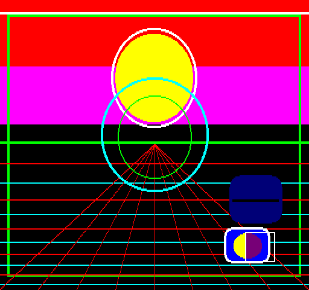

## EGG_C2 (C2h / 194) – анімоване 2DPT-демо

У цьому демо взагалі немає спрайтів. Використовується лише плейлист фону [2DPT](../2-4_2dpt-introducing.md) на 256 елементів, а з повного набору команд — окрім загальних [SET_COLOR](2dpt-set_color.md) та [RET](2dpt-ret.md) — застосовуються графічні примітиви. Малювання екрана складається із 73 слотів 2DPT, з яких 36 — це [SET_COLOR](2dpt-set_color.md), 1 — [RET](2dpt-ret.md), а решта: [FILL_RECT](2dpt-fill_rect.md), [LINE](2dpt-line.md), [RECT](2dpt-rect.md), [ELLIPSE](2dpt-ellipse.md), [ROUND_RECT](2dpt-round_rect.md), [FILL_ROUND_RECT](2dpt-fill_round_rect.md), [ERASE_LINE](2dpt-erase_line.md) та [BUCKET_FILL](2dpt-bucket_fill.md).

Після кожного оновлення кадру вся таблиця 2DPT перебудовується наново. Насправді в цьому немає жодної потреби, адже було б достатньо перезаписувати лише ті слоти, де змінюються координати (наприклад, рухома лінія або нижній рухомий прямокутник) та/або радіуси (два верхні кола). Рендерер кожні 20 мс стартує з порожнім екраном і проходить слотами 2DPT, поки не зустріне інструкцію [RET](2dpt-ret.md).

Зміна часу рендерингу зумовлена тим, що розмір намальованих кіл змінюється під час роботи.

**Підсумок:** Навіть без спрайтів і ресурсних команд 2DPT можна створити складну ігрову сцену. Таким чином, малювання всього ігрового поля для гри типу Elite можна виконати шляхом простої зміни параметрів малювання.

**Динаміка часу рендерингу:**

| **Параметр** | **Час рендерингу EP** | **Час рендерингу TVC** |
| ------------ | --------------------- | ---------------------- |
| Мінімум      | 0,95 мс (4,75%)       | 0,87 мс (4,35%)        |
| Максимум     | 1,18 мс (5,9%)        | 1,11 мс (5,55%)        |