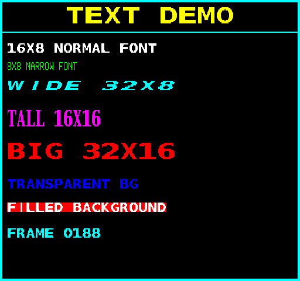

## EGG_C3 (C3h / 195) – робота зі шрифтами та виведення тексту

Це демо одночасно використовує п'ять повних наборі шрифтів (по 128 гліфів у кожному) за допомогою ресурсних команд [2DPT](../2-4_2dpt-introducing.md) [DEFINE_FONT](define_font.md) та [DRAW_TEXT](2dpt-draw_text.md): вузький шрифт **8**×**8** пікселів, стандартний **16**×**8** пікселів, широкий **32**×**8** пікселів, високий **16**×**16** пікселів та великий **32**×**16** пікселів.

Усі шрифти збережені в коді мікроконтролера (MCU) в офлайн-режимі зі стисненням **ZX1**. Під час запуску демо завантажує їх у [RRAM](../2-1_rram.md) за допомогою команди [UPLOAD_RAW](upload_raw.md), розпаковує через [UNZX1_RAW](unzx1_raw.md), після чого визначає їх для [2dfx](../../../hardware/hv-2dfx.md) за допомогою команд [DEFINE_FONT](define_font.md). Крім того, демо завантажує самі текстові рядки в RRAM, а потім відображає їх через [DRAW_TEXT](2dpt-draw_text.md). Під час роботи демо змінює в RRAM лише фрагмент тексту з лічильником кадрів (завантажує новий), залишаючи все інше — зокрема й усю таблицю 2DPT — без змін.

Використовується 24 слоти з 2DPT: вони відповідають за малювання самого екрана (прямокутник із лінією всередині та [SET_COLOR](2dpt-set_color.md)), а також за команду [DRAW_TEXT](2dpt-draw_text.md) із посиланням на відповідні визначення шрифтів і рядки в RRAM.

**Підсумок:** Завдяки підтримці 2dfx виведення тексту або відображення написів та HUD в іграх вимагає мінімуму ресурсів з боку 2dfx, а передача рядків з боку Enterprise або TVC є дуже простим процесом.

**Динаміка часу рендерингу:**

| **Час рендерингу EP** | **Час рендерингу TVC** |
|:---------------------:|:----------------------:|
|    1,32 мс (6,6%)     |    1,31 мс (6,55%)     |