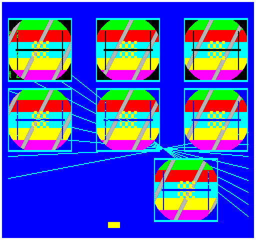

## EGG_C4 (C4h / 196) – демонстрація BLIT

У цьому демо ми бачимо операції, які можна реалізувати за допомогою [BLIT](2dpt-blit.md). Растровий об'єкт розміром **128**×**64** пікселі, що використовується в демо, має **64** анімаційні фази, підготовлені заздалегідь в офлайн-режимі. Вони містяться в коді мікроконтролера (MCU) у вигляді єдиного банку анімацій, стиснутого за допомогою **ZX1**. Цей банк завантажується в [RRAM](../2-1_rram.md) за допомогою аналогів операцій [UPLOAD_RAW](upload_raw.md) та [UNZX1_RAW](unzx1_raw.md), де після розпакування займає **256 кБ** пам'яті. Крім того, щоб обсяг завантажених даних був ще більшим, ці самі **64** фази зберігаються в RRAM ще у трьох додаткових банках із зсувом у **16** фаз. Практичної користі це не має — це лише демонструє можливість простого завантаження великих обсягів даних у [2dfx](../../../hardware/hv-2dfx.md). Усі чотири банки разом займають **1 МБ** простору RRAM.

Малювання виконується за допомогою [2DPT](../2-4_2dpt-introducing.md) двома способами: у першому рядку об'єкти [BLIT](2dpt-blit.md) виводяться на екран без перевірки прозорості. Завдяки різним джерелам добре видно зсунуте положення смуг, що рухаються, відносно одна одної. У другому рядку ті самі об'єкти виводяться вже з перевіркою прозорості, тоді як у нижньому рядку екземпляр, що рухається горизонтально, також виводиться із застосуванням прозорого [BLIT](2dpt-blit.md).

Під час роботи демо не змінює команди [BLIT](2dpt-blit.md) у 2DPT, за винятком координати **X** для екземпляра, що рухається в нижньому рядку. Анімація досягається переважно тим, що в кожному кадрі в дескрипторі [DEFINE_BITMAP](define_bitmap.md) змінюється початкова адреса растрового зображення в RRAM, тому вона завжди вказує на поточну анімаційну фазу розміром **4 КіБ**. Під час видимої анімації нові растрові дані більше не завантажуються й не розпаковуються.

**Динаміка часу рендерингу:**

| **Час рендерингу EP** | **Час рендерингу TVC** |
|:---------------------:|:----------------------:|
|    1,77 мс (8,85%)    |    1,63 мс (8,15%)     |

