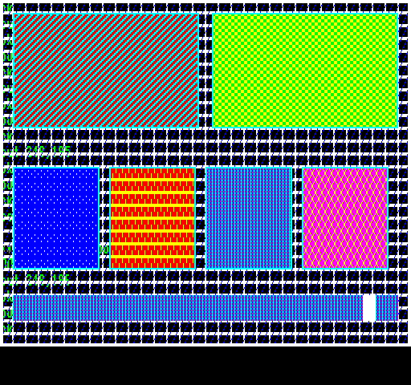

## EGG_C5 (C5h / 197) – демонстрація PATTERN_FILL

Це демо показує роботу команди [PATTERN_FILL](2dpt-pattern_fill.md) з [2DPT](../2-4_2dpt-introducing.md). Демо створює та використовує вісім візерунків заповнення (текстур) розміром **16**×**8** пікселів. Велика фонова область, два широкі прямокутники, три менші прямокутники та найнижча широка смуга працюють саме з цими вісьмома типами візерунків. У нижній частині екрана також постійно рухається менший суцільний [FILL_RECT](2dpt-fill_rect.md) розміром **16**×**16** пікселів.

З точки зору роботи, вісім візерунків фіксованого розміру збережені послідовно в єдиному **512**-байтовому набору візерунків у RRAM, який робиться доступним для 2DPT за допомогою одного дескриптора [DEFINE_PATTERN](define_pattern.md). Різні незалежні команди [PATTERN_FILL](2dpt-pattern_fill.md) вибирають із цього набору той візерунок, який потрібно використати в поточний момент.

Візерунок великого фону змінюється повільніше, а візерунок нижньої широкої смуги — швидше, поки суцільний прямокутник **16**×**16** пікселів пересувається вздовж нижньої смуги. Під час кожного оновлення демо перебудовує список 2DPT для фону.

**Підсумок:** Заповнення візерунком дуже добре підходить, наприклад, для малювання підлоги, фону індикаторів стану або інших повторюваних поверхонь, причому необхідний для цього розмір графічних ресурсів та час обчислень залишаються мінімальними.

**Динаміка часу рендерингу:**

| **Час рендерингу EP** | **Час рендерингу TVC** |
|:---------------------:|:----------------------:|
|    2,16 мс (10,8%)    |    1,73 мс (8,65%)     |