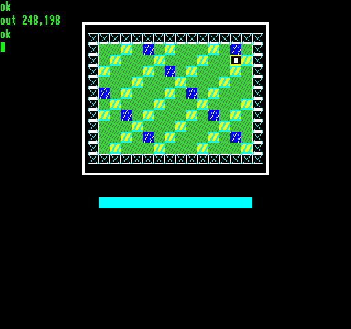

## EGG_C6 (C6h / 198) – міні-демонстрація TILEMAP

Тут ми бачимо роботу команди [TILEMAP](2dpt-tilemap.md) у [2DPT](../2-4_2dpt-introducing.md). Ігрове поле що виводиться на екран складається з **16**×**12** тайлів розміром **16**×**8** пікселів кожен. Навколо поля видно рамку, а під ним — кольорову смугу; вони вимальовуються простими графічними примітивами 2DPT.

Загалом демо виділяє місце для набору з восьми тайлів розміром **16**×**8** пікселів. Один тайл займає **64** байти, тож весь тайлсет із восьми елементів займає **512** байтів у RRAM.

У тайлмапі розміром **16**×**12** комірок кожній комірці відповідає лише один байт, який вказує порядковий номер тайла для відображення, тому повний опис карти займає **192** байти у RRAM.

Структура команд тайлмапа у цьому демо також працює за допомогою трьох інструкцій, згаданих у описі: сам набір тайлів задається командою [DEFINE_TILESET](define_tileset.md), а карта (tilemap) — командою [DEFINE_TILEMAP](define_tilemap.md). Після цього повна тайлова карта **16**×**12** виводиться на екран за допомогою лише одного слота команд 2DPT.

Під час роботи демо налаштовує ці три команди лише один раз. У процесі анімації заново формується **192**-байтовий опис карти (шляхом зміни номера тайла в потрібному місці) і завантажується в RRAM. Очевидно, це також можна було б оптимізувати, перезаписуючи в RRAM лише ті кілька байтів, які реально змінюються, але для спрощення ми заново завантажуємо всі **192** байти. При наступному рендерингу та сама єдина команда 2DPT [TILEMAP](2dpt-tilemap.md) вже автоматично вимальовує оновлений вміст.

**Динаміка часу рендерингу:**

| **Час рендерингу EP** | **Час рендерингу TVC** |
|:---------------------:|:----------------------:|
|    0,47 мс (2,35%)    |      0,4 мс (2%)       |

