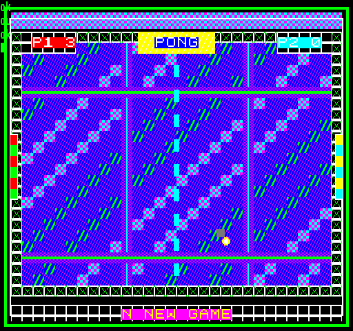

## EGG_C8 (C8h / 200) – інтерактивний WOW pong

Це демо є візуально прокачаною версією класичного Pong із [C7](egg_c7.md). Ігровий процес повністю збігається з класичним Pong, але демо свідомо перенасичене різноманітними додатковими графічними елементами, які легко реалізувати за допомогою [2DPT](../2-4_2dpt-introducing.md). Я називаю це візуальним експериментом — практично нестерпно аляпуватим, хоча це можна розглядати і як «advanced level pong»…

У ньому, окрім трьох [спрайтів](../2-3_sprite-subsystem.md), також використовуються [шрифт](../2-9_2dpt-fonts.md), [тайлмап](../2-11_2dpt-tilemaps.md), [патерни](../2-10_2dpt-patterns.md), тексти та різні [2D-графічні примітиви](../2-6_2dtp-graphics-primitives.md). У це можна пограти за допомогою програми на BASIC, описаної в [C7](egg_c7.md), якщо ви любите челенджі…

Одна із частин фону — це анімований тайлмап. На «Enterprise» він складається з **39**×**22** комірок, а на TVC — з **30**×**24** комірок; одній комірці, як і раніше, відповідає один байт, що містить номер тайла для відображення в цьому місці. Відповідний набір тайлів використовує вісім тайлів. Вміст тайлової карти заново генерується при кожному оновленні кадру. Окрім рамки, горизонтальних та вертикальних «декоративних елементів», змінюється також положення певних тайлів, завдяки чому фон здається постійно рухомим. Сам набір тайлів, звісно ж, заново не завантажується — змінюється лише карта розміром у кількасот байтів. Дескриптори [DEFINE_TILESET](define_tileset.md) та [DEFINE_TILEMAP](define_tilemap.md) увесь час вказують на одну й ту саму область RRAM.

Демо також використовує чотири візерунки [PATTERN_FILL](2dpt-pattern_fill.md). З них формуються верхня та нижня анімовані смуги, а також панелі навколо рахунку та по центру. Вибір візерунків змінюється в часі, що створює додатковий рух на тлі без потреби завантажувати нові графічні дані під час роботи.

Для написів у RRAM завантажується повний набір вузького шрифту **8**×**8** пікселів. Один символ займає вісім байтів, тож загальний розмір шрифту становить **1024** байти. Рядки «PONG», «P1 0», «P2 0» та «N NEW GAME» розміщені в окремих областях RRAM. При здобутті очок немає потреби створювати нову команду [DRAW_TEXT](2dpt-draw_text.md) у 2DPT: ми просто перезаписуємо символ цифри в рядку «P1» або «P2» в RRAM, завдяки чому команда [DRAW_TEXT](2dpt-draw_text.md), яка вже є в 2DPT, завжди посилається на один і той самий рядок.

Окрім команд [TILEMAP](define_tilemap.md) та [PATTERN_FILL](2dpt-pattern_fill.md), 2DPT будується з інструкцій [RECT](2dpt-rect.md), [FILL_RECT](2dpt-fill_rect.md) та [DRAW_TEXT](2dpt-draw_text.md). Вони вимальовують рамки ігрового поля, центральну лінію, написи, інші елементи та простий ефект «шлейфу» за м'ячем.

Після здобуття очок це демо також струшує зображення, але у більш вражаючий спосіб, ніж у [C7](egg_c7.md). Фон, намальований за допомогою 2DPT, та спрайти отримують дві окремі анімації струшування. Координати фону отримують спільний зсув за допомогою [SET_XY_OFFSET](2dpt-set_xy_offset.md), тоді як SPB-координати ракеток та м'яча змінюються незалежно від нього з трохи іншими значеннями. Завдяки цьому вся сцена дрижить разом, але не рухається як застигла картинка.

Гра при кожному оновленні (50 Гц) вираховує новий стан гри, формує та завантажує поточний тайлмап, за потреби оновлює рядок рахунку, перебудовує фоновий 2DPT та налаштовує поточні SPB трьох спрайтів. Великі графічні ресурси — спрайти, шрифт, тайлсет та банк візерунків — при цьому весь час залишаються в RRAM без змін.

**Підсумок:** порівняно з [C7](egg_c7.md) тут добре видно, що ту саму дуже просту ігрову логіку можна оточити складнішим екраном без потреби для самого комп'ютера малювати що-небудь попіксельно.

**Динаміка часу рендерингу:**

| **Час рендерингу EP** | **Час рендерингу TVC** |
|:---------------------:|:----------------------:|
|    1,56 мс (7,8%)     |     1,42 мс (7,1%)     |