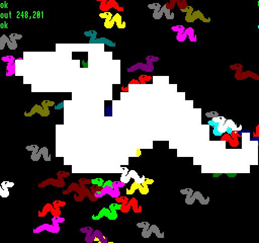

## EGG_C9 (C9h / 201) – «Вторгнення хробаків!»

Це демо використовує виключно спрайти, проте майже одразу всі можливі. Спочатку на лівому, правому та нижньому краях екрана один за одним з'являються голови хробаків, а після короткого очікування всі **63** виповзають на екран. Наприкінці справа вилазить головний хробак: він використовує **64**-й слот спрайтів, тож у цей момент активні вже всі **64** можливі спрайти.

Звичайний хробак має розмір **64**×**16** пікселів, тобто одна його анімаційна фаза займає **512** байтів, а всього він має вісім різних анімаційних фаз. Через це повна анімація одного кольору займає **4 кБ** в RRAM. Демо готує ці самі вісім фаз для всіх **15** доступних кольорів (індекс кольору 0, як і раніше, відповідає за прозорість), тому сукупна пам'ять для анімацій звичайних хробаків становить **60 кБ** в RRAM. Однак це не означає, що **63** спрайти мають власні окремі графічні дані! Усі **63** хробаки використовують спільні дані анімації на **15** кольорів у RRAM. Для кожного окремого екземпляра ми змінюємо лише початкову адресу RRAM в SPB залежно від того, який саме колір та анімаційна фаза йому відповідають у даний момент. Кожен хробак випадковим чином отримує один із **15** кольорів, а швидкість анімації також може відрізнятися. Для хробаків, які рухаються справа наліво, немає окремо збереженої віддзеркаленої графіки. Вони використовують ті самі дані зображення, просто в SPB вмикається трансформація **Xflip**.

Головний хробак, який з'являється як **64**-й спрайт, створений на основі цієї ж анімації, але в RRAM він збережений вже заздалегідь збільшеним у чотири рази. Таким чином, одна фаза має розмір **256**×**64** пікселі, тобто **8192** байти, а вісім фаз загалом — **64** кБ. При відображенні, крім цього, в його SPB також вмикаються біти трансформації **Xdouble** та **Ydouble**, тому реально видимий спрайт має розмір **512**×**128** пікселів. Оскільки головний хробак рухається справа наліво, у його SPB також увімкнено **Xflip**.

**Підсумок:** демо демонструє оптимізацію ресурсів, яку можна застосовувати для спрайтів: для **63** об'єктів, що рухаються незалежно один від одного, мають різні кольори, швидкість анімації та напрямок руху, не обов'язково мати **63** окремі анімаційні набори. Дані зображення є спільними, під час роботи фактично змінюються лише адреси, позиції та дані трансформації в SPB.

**Динаміка часу рендерингу:**

| Сцена                            | Час рендерингу EP | Час рендерингу TVC |
| -------------------------------- | ----------------- | ------------------ |
| **Повзає шістдесят три хробаки** | 2,11 мс (10,55%)  | 2,07 мс (10,35%)   |
| **Уся команда разом**            | 4,21 мс (21,05%)  | 3,97 мс (19,85%)   |