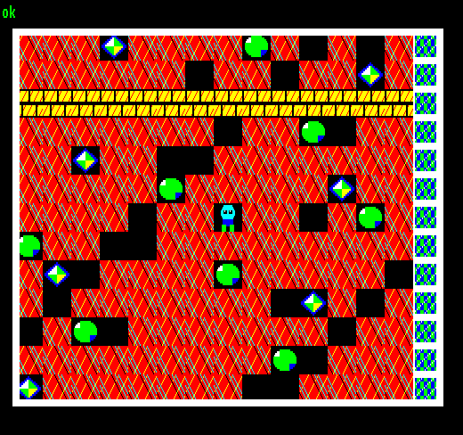

## EGG_CA (CAh / 202) – Boulder Dash від 2dfx

Це демо є розширеною версією простої демонстрації [TILEMAP](2dpt-tilemap.md) з [C6](egg_c6.md): тут ми рухаємося картою, яка значно більша за видимий екран, за допомогою плавного попіксельного скролінгу. Фігурка гравця залишається по центру, а весь світ рухається за нею.

Повна карта складається з **160**×**100** тайлів, тобто містить загалом **16 000** комірок тайлмапа. Оскільки одна комірка займає один байт, самий лише повний опис карти займає **16 000** байтів простору RRAM. Набір тайлів складається з **29** різних тайлів розміром **16**×**8** пікселів кожен, загальний розмір тайлсета становить **1856** байтів.

Графічні об'єкти насправді будуються з **2**×**2** тайлів, тобто один ігровий елемент має розмір **32**×**16** пікселів. Так формуються земля, стіна, цегла, камінь, діамант та вихід.

Повна карта ([DEFINE_TILEMAP](define_tilemap.md)) створюється та завантажується в RRAM лише один раз під час запуску демо. Під час скролінгу самі дані тайлмапа взагалі не змінюються і заново не завантажуються.

На «Enterprise» видиме вікно одночасно формують **38**×**25** тайлів, а на «TVC» — **30**×**26** тайлів.

Суть плавного скролінгу полягає в тому, що позиція камери (область перегляду / viewport) відстежується не лише в тайлах, а й у пікселях. З поточної позиції **X** та **Y** розраховуються два типи даних: з одного боку, який саме тайл має бути першою коміркою-джерелом для команди [TILEMAP](2dpt-tilemap.md), а з іншого — на скільки пікселів ми зміщені всередині цього тайла.

Поки ми ще не досягли межі наступного 16-піксельного тайла, початковий тайл залишається тим самим, але координата **X** виведення всього [TILEMAP](2dpt-tilemap.md) зсувається на кілька пікселів ліворуч. Коли ми перетинаємо межу тайла, координата **X** початкового тайла збільшується на одиницю, а попіксельне зміщення починається заново. Те саме відбувається й у вертикальному напрямку, тільки там висота тайла становить **8** пікселів. Тут є невелика хитрість: якщо зсунути тайлмап, наприклад, на **15** пікселів ліворуч, з правого краю вже почне визирати наступний тайл. Тому демо завжди вимальовує один додатковий стовпчик та один додатковий рядок.

Таким чином, для «Enterprise» замість видимої області **38**×**25** виводиться **39**×**26** тайлів, а для «TVC» замість області **30**×**26** — **31**×**27** тайлів.

Зайво виведені краї маскуються з боків чотирма слотами [FILL_RECT](2dpt-fill_rect.md) у 2DPT, після чого слот [RECT](2dpt-rect.md) малює рамку навколо видимого вікна. Завдяки цьому ззовні ми бачимо лише viewport фіксованого розміру, тоді як за ним [TILEMAP](2dpt-tilemap.md) малює трохи більшу область і рухається всередині неї.

Гравець — це окремий спрайт розміром **32**×**16** пікселів (обсягом **256** байтів), який весь час залишається в одній і тій самій позиції на екрані; ілюзію руху насправді створює тайлмап, що скролиться за ним.

При кожному оновленні (50 Гц) демо перебудовує фоновий список 2DPT, включаючи в нього актуальні координати джерела та призначення для [TILEMAP](2dpt-tilemap.md). Однак дескриптори [DEFINE_TILESET](define_tileset.md) та [DEFINE_TILEMAP](define_tilemap.md) задаються лише один раз при запуску демо, оскільки самі дані в RRAM не змінюються. Головне, що до **16 кБ** даних карти під час скролінгу взагалі не потрібно звертатися чи змінювати їх.

Траєкторія камери свідомо наближається до правого та нижнього країв карти, завдяки чому видно: якщо налаштувати [TILEMAP](2dpt-tilemap.md) так, щоб виведена область виходила за межі оригінальної карти, на цьому місці не з'являється інша сторона поля чи якесь «сміття» — мікроконтролер (MCU) коректно обробляє цей вихід за межі.

**Підсумок:** найважливіший висновок із цього демо полягає в тому, що для плавного скролінгу великого тайлмапа не потрібно рухати або перезавантажувати самі дані карти. Достатньо модифікувати комірку-джерело та екранну позицію команди [TILEMAP](2dpt-tilemap.md), а також виводити додатковий рядок і стовпчик по краях. Карта на кілька тисяч комірок завдяки цьому може весь час залишатися в RRAM без змін, без потреби щоразу перезавантажувати її з боку «Enterprise» або «TVC».

**Динаміка часу рендерингу:**

| **Час рендерингу EP** | **Час рендерингу TVC** |
|:---------------------:|:----------------------:|
|    1,64 мс (8,2%)     |     1,46 мс (7,3%)     |