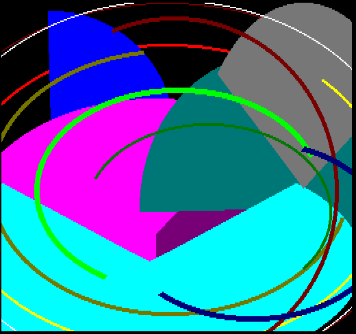

## EGG_CB (CBh / 203) – демонстрація перевищення часу рендерингу (render overrun)

Це демо свідомо формує такий [2DPT](../2-4_2dpt-introducing.md), рендеринг якого в режимі **50 fps** суттєво перевищує доступний часовий ліміт у **20 мс**. Для цього поверх зображення малюються два великі [ELLIPSE](2dpt-ellipse.md), шість заповнених [PIE](2dpt-pie.md) та вісім примітивів [ARC](2dpt-arc.md) із різною товщиною ліній — два останні є найбільш вимогливими до обчислювальних ресурсів примітивами.

Метою є не стільки презентація [ARC](2dpt-arc.md) та [PIE](2dpt-pie.md), скільки демонстрація того, що відбувається, коли рендерер не встигає вчасно підготувати кадр.

У разі виникнення render overrun п'ятий біт [регістру статусу](../1-10_status-register.md) (`OR 20h`) перемикається в нуль і залишається в цьому стані доти, доки його не буде скинуто командою [CLEAR_RENDER_OVERRUN](clear_render_overrun.md). Якщо тим часом настає час наступного оновлення кадру, а попередній рендеринг усе ще триває, на екрані залишається вже готовий попередній фреймбуфер.

<div style="text-align:center;">
</div>

На демо **CB** можна також легко випробувати команду [SET_RENDER_OVERRUN_VISUAL](set_render_overrun_visual.md) на практиці. Після запуску демо увімкніть візуальну індикацію:

```basic
OUT 248, 82
OUT 249, 1
```

Почавши блимати, у центрі екрана поверх нормальних графічних шарів з'явиться знак оклику, який змінює свій колір.

<div style="text-align:center;">
</div>

Стан липкого оверрану (sticky overrun) у цей момент хоч і можна скинути командою [CLEAR_RENDER_OVERRUN](clear_render_overrun.md), але оскільки демо продовжує бігти та без зупинки малює той самий кадр, у наступному ж кадрі знак оклику з'явиться знову.

**Динаміка часу рендерингу:**

| **Час рендерингу EP** | **Час рендерингу TVC** |
|:---------------------:|:----------------------:|
|   43,1 мс (215,5%)    |    43,1 мс (215,5%)    |