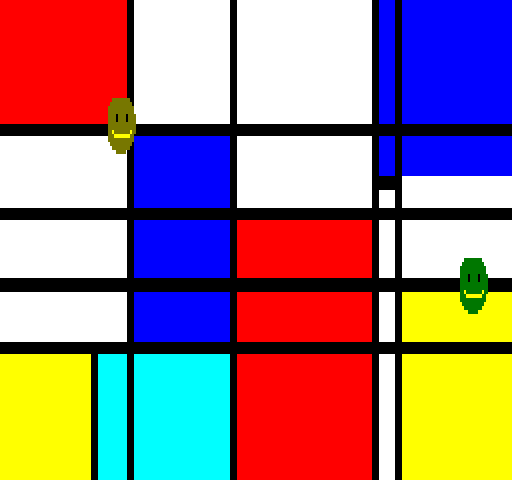

## EGG_CD (CDh / 205) – повноекранний BLIT

Це демо створене для вимірювання швидкості рендерингу [BLIT](2dpt-blit.md). Один bitmap заповнює майже всю область рендерингу [2dfx](../../../hardware/hv-2dfx.md): на «Enterprise» це **744**×**288** пікселів, а на «TVC» — **704**×**256** пікселів. Це відповідає **107 136** байтам растрових даних для «Enterprise» та **90 112** байтам для «TVC».

Мондріаноподібне точкове зображення ґенерується та завантажується в RRAM лише один раз під час запуску демо. Зображення не використовує нульовий, прозорий індекс кольору. Після однієї команди [DEFINE_BITMAP](define_bitmap.md) видається лише одна команда [BLIT](2dpt-blit.md) у [2DPT](../2-4_2dpt-introducing.md). Під час роботи ні сам бітмап, ні команда [BLIT](2dpt-blit.md) не змінюються.

Демо складається з двох сцен тривалістю по 20 секунд кожна, які чергуються між собою:

**Повноекранний BLIT** – у цій частині рендерер навантажений лише [BLIT](2dpt-blit.md)-ом великого бітмапа, що дозволяє безпосередньо виміряти час копіювання бітмапа розмір якого майже дорівнює повному обсягу фреймбуфера.

**Повноекранний BLIT + два спрайти** – тут повноекранний [BLIT](2dpt-blit.md) залишається без змін, але додатково з'являються два [спрайти](alter_spb.md)-смайли розміром **16**×**16** пікселів. На обох увімкнено трансформації **Xdouble** та **Ydouble**, тому вони відображаються у розмірі **32**×**32** пікселі. Це дозволяє добре виміряти, наскільки збільшується час рендерингу при виведенні двох спрайтів поверх і без того великого [BLIT](2dpt-blit.md).

**Динаміка часу рендерингу:**

| **Сцена**                        | **Час рендерингу EP** | **Час рендерингу TVC** |
| -------------------------------- | --------------------- | ---------------------- |
| Повноекранний BLIT               | 2,22 мс (11,1%)       | 1,86 мс (9,3%)         |
| Повноекранний BLIT + два спрайти | 2,29 мс (11,45%)      | 1,94 мс (9,7%)         |
