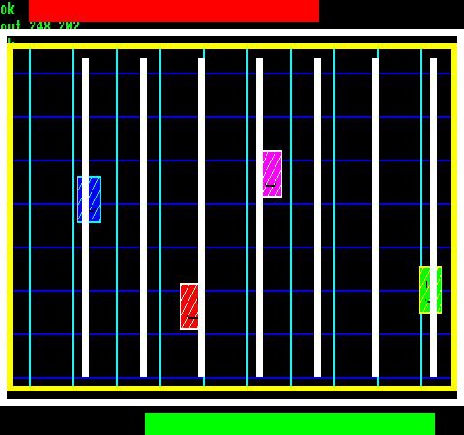

## EGG_CE (CEh / 206) – «В'язниця»

Це демо демонструє повний порядок шарів 2dfx: **2DPT back**, **спрайти**, **2DPT front**.

На екрані стрибають чотири **32**×**32** піксельні спрайти всміхнених в'язнів. Позаду них **2DPT back** малює ґрати та рамку, а перед ними в **2DPT front** виводяться вертикальні прути ґратів, зовнішня рамка та дві HUD-смуги.

Графічні дані чотирьох спрайтів завантажуються в RRAM один раз при запуску демо. Під час роботи змінюються лише координати **X**/**Y** у [SPB](alter_spb.md), коли спрайти стрибають екраном. **2DPT back** також готується один раз, оскільки ґрати позаду спрайтів є статичними. Натомість **2DPT front** перебудовується при кожному оновленні кадру, тому що вертикальні прути ґратів постійно рухаються. Коли спрайт опиняється за таким прутом, **2DPT front** просто перекриває його (малює поверх), тоді як лінії ґратів на тлі (**2DPT back**) завжди залишаються позаду спрайтів.

**Підсумок:** демо показує, що для графічних елементів, які малюються поверх спрайтів, немає потреби у використанні окремих спрайтів чи модифікації їхніх зображень. У грі таким самим чином можна створювати, наприклад, HUD, віконні рамки, ворота, ґрати, предмети оточення на передньому плані чи будь-яку іншу графіку маскування.

**Динаміка часу рендерингу:**

| **Час рендерингу EP** | **Час рендерингу TVC** |
|:---------------------:|:----------------------:|
|    1,04 мс (5,2%)     |       1 мс (5%)        |