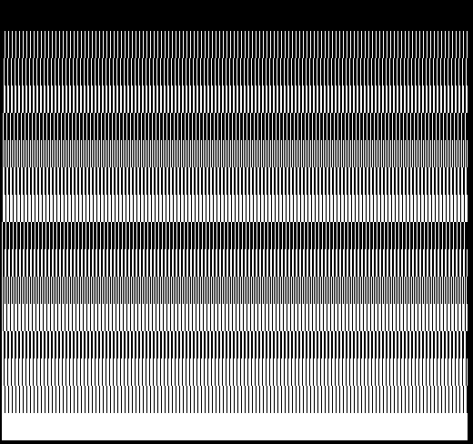
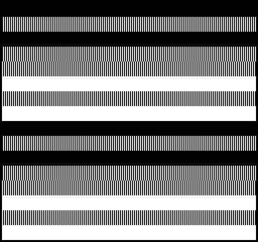

## EGG_CF (CFh / 207) – тест дискретизації зовнішнього кольору «TVC»

Це демо призначене виключно для використання на «TVC» та демонструє важливе обмеження обробки вхідних сигналів зовнішнього кольору в «TVC»; час рендерингу тут не має значення.

[2dfx](../../../hardware/hv-2dfx.md) передає на «TVC» зовнішні сигнали кольору **EC0**..**EC3** з тактовою частотою **12,5 МГц**, досягаючи таким чином максимально можливої горизонтальної роздільної здатності. Однак «TVC» вибірково зчитує ці дані з такою повною швидкістю лише в режимі `GRAPHICS 2`. У режимах `GRAPHICS 4` та `GRAPHICS 16` відеосистема опитує входи **EC0**..**EC3** вдвічі повільніше, тобто через кожен другий піксель 2dfx.

Демо відображає **16** горизонтальних смуг, які показують різні бітові шаблони від **0** до **15** через кожні чотири пікселі, змінюючи сам бітовий шаблон для кожної смуги. У першій смужці кожен піксель має значення **0**, у другій смужці чергуються групи з трьох пікселів зі значенням **0** та одного зі значенням **15**, і так далі. У режимі `GRAPHICS 2` усі **16** смуг відображаються коректно й чітко відрізняються одна від одної.

Натомість в інших відеорежимах добре видно наслідки зменшеної вдвічі частоти дискретизації. Такий швидкозмінний шаблон, як, наприклад, `1010`, з боку 2dfx передається правильно, але «TVC» зчитує лише кожен другий піксель. Через це оригінальний візерунок певних смуг повністю зникає, а черговий шаблон `0101`, наприклад, виглядає як суцільний білий блок `1111`.

Тестове зображення розміром **604**×**240** пікселів формується як bitmap у пам'яті RRAM, після чого виводиться на екран однією командою [BLIT](2dpt-blit.md) у [2DPT](../2-4_2dpt-introducing.md).

З цього демо стає чітко зрозуміло, чому при використанні 2dfx на «TVC» необхідно обирати саме режим `GRAPHICS 2`, якщо є потреба задіяти максимальну горизонтальну роздільну здатність.