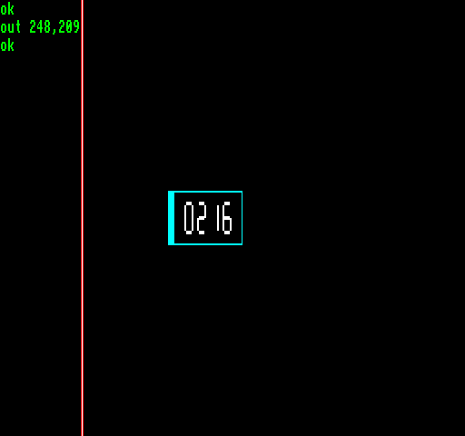

## EGG_D1 (D1h / 209) – координати видимої області екрана

Це демо призначене для порівняння системи координат [2dfx](../1-6_geometry.md) (**X**/**Y**) з реально видимою областю екрана.

Спочатку вертикальна лінія товщиною в один піксель проходить через увесь діапазон **X**, а потім повертається назад. Після цього горизонтальна лінія проходить через координати **Y** в обох напрямках. Поряд із світлою вимірювальною лінією розташовані сусідні лінії, які допомагають легше відстежувати її позицію на телевізорі або іншому моніторі.

У центрі екрана чотиризначний індикатор постійно показує точні координати поточної досліджуваної точки в системі координат 2dfx.

Кожна координата залишається на екрані протягом чотирьох кадрів, а в кінцевих точках робиться коротка пауза, що дозволяє спостерігати, де саме з'являється або зникає з екрана певне значення **X** чи **Y**.

За допомогою цього демо можна продемонструвати налаштовану користувачем видиму область екрана на «Enterprise» або «TVC» під час проектування власних програм. Це дозволяє передавати 2dfx такі графічні координати для малювання, які дійсно знаходяться всередині (або, навпаки, за межами) видимої області кадру. Саме це демо я використовував для створення точних креслень видимих координат у розділі «[Геометрія](../1-6_geometry.md)» цього посібника.

