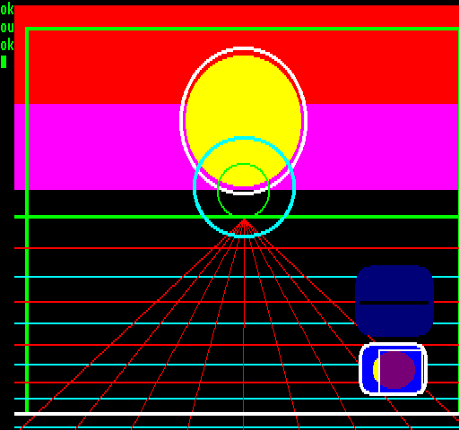

## EGG_D2 (D2h / 210) – анімований 2DPT та демонстрація SET_XY_OFFSET

Це демо використовує презентацію примітивів [2DPT](../2-4_2dpt-introducing.md) з демо [C2](egg_c2.md) у незмінному вигляді, з тією лише різницею, що вся графіка постійно рухається екраном.

Першим елементом 2DPT тут є команда [SET_XY_OFFSET](2dpt-set_xy_offset.md). Усі наступні залежні від позиції слоти 2DPT (лінії, прямокутники, еліпси, заливки тощо) автоматично отримують це зсунення **X**/**Y**. Тобто координати самих графічних команд ми не змінюємо.

Зсуви **X** та **Y** змінюються незалежно один від одного: по горизонталі в межах **±24** пікселів, а по вертикалі в межах **±10** рядків. Внутрішні анімації з [C2](egg_c2.md) (наприклад, рухома горизонтальна лінія, кола зі змінним розміром та нижній рухомий прямокутник) під час цього продовжують працювати так само. Команда [SET_XY_OFFSET](2dpt-set_xy_offset.md) лише додає до них додатковий спільний зсув.

Час рендерингу [C2](egg_c2.md) та **D2** можна порівняти напряму, оскільки графічний вміст обох демо однаковий; у **D2** до нього лише додається робота [SET_XY_OFFSET](2dpt-set_xy_offset.md). З таблиці чітко видно, що [SET_XY_OFFSET](2dpt-set_xy_offset.md) практично не додає часу до рендерингу і забезпечує майже нульовий додатковий накладний час при використанні.

**Підсумок:** функція [SET_XY_OFFSET](2dpt-set_xy_offset.md) добре підходить, наприклад, для переміщення всієї частини екрана чи HUD, ефекту трясіння камери, переходів або для будь-якої іншої ситуації, коли потрібно перемістити кілька елементів 2DPT в одній спільній системі координат.

**Динаміка часу рендерингу в демо D2:**

| **Параметр** | **Час рендерингу EP** | **Час рендерингу TVC** |
| ------------ | --------------------- | ---------------------- |
| Мінімум      | 0,96 мс (4,8%)        | 0,87 мс (4,35%)        |
| Максимум     | 1,2 мс (6%)           | 1,11 мс (5,55%)        |

**Динаміка часу рендерингу в демо C2:**

| **Параметр** | **Час рендерингу EP** | **Час рендерингу TVC** |
| ------------ | --------------------- | ---------------------- |
| Мінімум      | 0,95 мс (4,75%)       | 0,87 мс (4,35%)        |
| Максимум     | 1,18 мс (5,9%)        | 1,11 мс (5,55%)        |