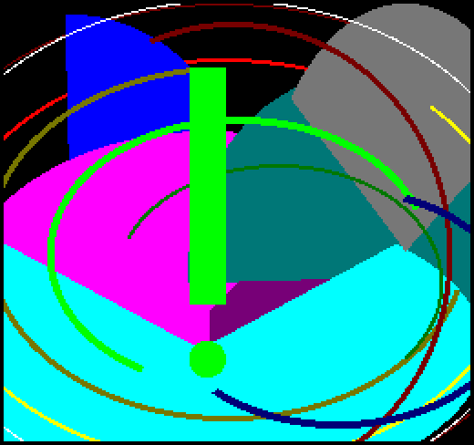

### SET_RENDER_OVERRUN_VISUAL (52h / 82)

Команда, корисна насамперед під час розробки. 2dfx постійно вимірює, скільки часу займає формування поточного кадру. У [режимі 50 fps](set_fps.md) на це відводиться **20 мс**, а в [режимі 25 fps](set_fps.md) — **40 мс**. Якщо рендеринг хоча б один раз перевищує поточний часовий ліміт (наприклад, через велику кількість великих спрайтів та складне 2DPT back/front малювання), біт статусу **RENDER_OVERRUN** змінюється на **0** і залишається в цьому стані. Цей біт можна зчитати з регістру статусу з користувацької програми, але під час розробки зручніше ввімкнути візуальну індикацію: у цьому випадку 2dfx малює на найвищому шарі великий кличний знак, колір якого змінюється з кожним кадром.

У готових користувацьких програмах вмикати **SET_RENDER_OVERRUN_VISUAL** зазвичай не рекомендується.

При запуску початкове значення цієї функції дорівнює **0**, тобто вона вимкнена.

| **Назва параметра** | **7** | **6** | **5** | **4** | **3** | **2** | **1** | **0** | **Опис**                              |
| ------------------- |:-----:|:-----:|:-----:|:-----:|:-----:|:-----:|:-----:|:-----:| ------------------------------------- |
| **режим**           |   0   |   0   |   0   |   0   |   0   |   0   |   0   |   a   | слугує для налаштування режиму роботи |

- **a:**
    - **0** = вимкнено (*за замовчуванням*)
    - **1** = увімкнено
- **0** — обов'язково має бути встановлено в нуль.

