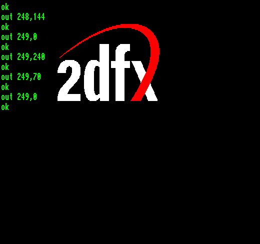

### SHOW_BUILTIN_LOGO (90h / 144)

Вимальовує на екрані за довільними **X**/**Y** координатами фіксований логотип 2dfx розміром **206**×**79** пікселів без спотворення пропорцій. Логотип з'являється на [четвертому шарі](../1-8_layers.md), тобто перекриває 2DPT back, спрайти та 2DPT front. Він використовує три логічні кольори: прозорий фон, основний колір напису 2dfx та колір акцентування вигнутої ніжки літери X. На «Enterprise» 2dfx не знає [поточної палітри NICK](../../../programming/system-info/info_colour-palette.md), тому в команді потрібно вказати, які саме індекси кольорів мають використовувати два видимі кольори логотипу. На «TVC» 16-кольорова палітра є фіксованою, але через кросплатформову форму команди байт індексів кольору потрібно передавати й там (середовище «TVC» його ігнорує).

Вбудований логотип зручно використовувати в меню ігор чи демок, якщо потрібно показати, що програма створена для 2dfx.

| **Назва параметра** | **7** | **6** | **5** | **4** | **3** | **2** | **1** | **0** | **Опис**                         |
| ------------------- |:-----:|:-----:|:-----:|:-----:|:-----:|:-----:|:-----:|:-----:| ------------------------------------- |
| **highbits**        | x     | x     | x     | x     | x     | a     | a     | b     | верхні біти координат            |
| **X_low**           | •     | •     | •     | •     | •     | •     | •     | •     | молодші вісім бітів координати X |
| **Y_low**           | •     | •     | •     | •     | •     | •     | •     | •     | молодші вісім бітів координати Y |
| **color_mapping**   | c     | c     | c     | c     | d     | d     | d     | d     | індекси кольорів логотипу        |

- **a** — верхні два біти координати X
- **b** — верхній біт координати Y
- **c** — індекс білого кольору логотипу 2dfx
- **d** — індекс червоного кольору логотипу 2dfx
- **x** — ці біти ігноруються 2dfx

 <i>Виведення логотипу на екран з TVC Basic</i>

----

Див. також: [HIDE_BUILTIN_LOGO](hide_builtin_logo.md)