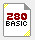
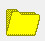
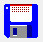
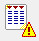
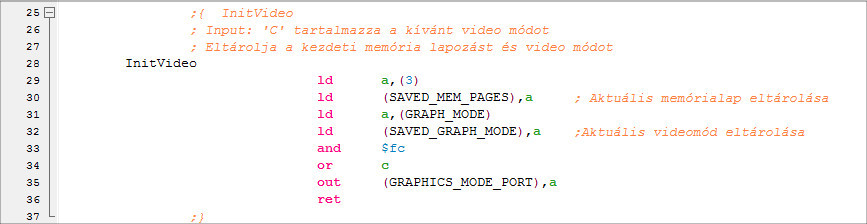
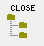
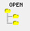
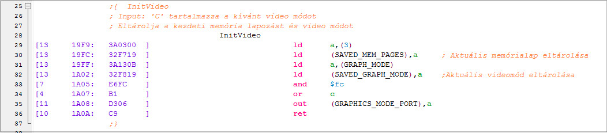

# Робота з компілятором асемблера

Під час роботи можна відкрити кілька — до 16 — списків вихідних кодів асемблера, які відображаються на вкладці в програмі. Кожна вкладка показує назву поточного файлу асемблера.

Сторінку асемблера можна відкрити, створивши новий файл асемблера або прочитавши asm-файл.

## Створення нових asm-файлів

Існує три способи створення нового файлу:

1. Новий Asm-файл — початкова адреса BASIC

Шаблон, який з'являється у вікні, що відкриється, містить заголовок, який дозволяє завантажити завершену програму як просту базову програму BASIC.

2. Новий Asm-файл

Створення простих asm-файлів. Компілятор асемблера створює шаблон, який містить лише оператор ORG та END.

3. Новий Asm-файл підключається

Ми отримуємо абсолютно нову — майже «голу» початкову сторінку, де ми можемо почати писати власний модуль.

Важливо! Відкриття нового файлу (будь-який варіант) не означає, що цей файл фактично буде створено на жорсткому диску! Це станеться лише за умови збереження програми!

## Завантаження asm-файлу

Завантаження асемблерних файлів можливе простим перетягуванням файлу, який потрібно відкрити. Він завжди відкривається в новій вкладці.

Збереження asm-файлів
Є два способи збереження наших asm-файлів:

1. Збереження asm-файлу

Asm-файл, відкритий у поточному вікні, зберігається в місці, вказаному під час його створення, з заданим ім'ям.

2. Збереження asm з іншим ім'ям

Перед збереженням ви можете вказати, де та з яким ім'ям програма повинна зберігати файл у заданому вікні. Це нове вказане місце та ім'я можуть відрізнятися від тих, що були вказані під час відкриття.

## Робота з компілятором асемблера

Програму можна написати в текстовому редакторі, який відкривається у заданій вкладці.

Для спрощення програмування текстовий редактор може відображати різні частини кожної інструкції різними кольорами (наприклад, мнемоніку, регістри, коментарі, числа, рядки тощо).

Ці кольори можна встановити за бажанням у пункті меню "Інше / Налаштування".

Звичайно, різак можна використовувати як завжди у Windows під час роботи.

Відповідні гарячі клавіші:

Копіювати: ctrl-insert, ctrl-c

Вирізати: ctrl-x

Вставити: shift-insert, ctrl-v

Під час роботи програма, використовуючи синтаксис програм z80, автоматично форматує заданий рядок щоразу, коли ви натискаєте Enter, перш ніж курсор перейде на новий рядок. Формат рядка неможливо встановити, але автоматичне форматування можна вимкнути в пункті меню "Інше / Налаштування".

Важливо зазначити, що ctrl-enter змушує програму переформатувати рядок, в якому знаходиться курсор. Навіть якщо автоматичне форматування рядка вимкнено.

Також можливо повністю переформатувати, що призведе до переформатування всього списку джерел, що відображається у вікні, незалежно від того, чи ввімкнено автоматичне форматування чи ні:

меню "Редагувати / Форматувати Asm" або за допомогою наступного значка:

У текстовому редакторі також можна керувати так званими папками.

Початок папки в програмі визначається рядком символів ";{ comment", а кінець — парою фігурних дужок ";}". Якщо папку закрито, коментар все ще видно в першому рядку.

Відкрити папку:

Закрита папка:

Також можна закрити або відкрити всі папки.

Папку можна закрити з меню "Редагувати / Закрити папки" або за допомогою наступного значка:

Папки можна відкрити з меню "Редагувати / Відкрити папки" або за допомогою наступного значка:

## Компіляція та оптимізація завершеної програми

Звичайно, у нас є можливість скомпілювати нашу завершену програму в код z80 та зберегти її у стандартному форматі TVC "cas". Файл "cas" розміщується в папці, яку ви вказали як папку за замовчуванням на панелі "Налаштування" ("Інше / Налаштування"). Якщо ви тут нічого не вказали, файл "cas" буде розміщено в папці Інструменти розробника.

Програму можна скомпілювати за допомогою меню "Програма / Компіляція ASM" або натисканням на наступну кнопку:

Час циклу процесора та машинний код програми можна відобразити, щоб допомогти вам оптимізувати вашу програму. Ця інформація завжди відображається у квадратних дужках '[]' перед рядками програми. Повне форматування або перекомпіляція програми (див. вище!) видалить цю інформацію. Час циклу, необхідний для даної машинної інструкції, відображається спочатку у квадратних дужках, а потім адреса рядка програми в пам'яті. Адреса відокремлюється від самої інструкції машинного коду двокрапкою ':':

Примітка: Ця функція перекомпілює asm-файл перед відображенням даних (файл "cas" не генерується!), і інформація відображається лише в тому випадку, якщо компіляція пройшла успішно.

Оптимізацію можна розпочати за допомогою меню "Програма / Час циклу процесора, шістнадцятковий дамп" або за допомогою наступного значка:

