# Відладчик

TVCDeveloperTool версії 2 вже має функцію відладчика.
Для цього вам також потрібна версія відладчика WinTVC та dtdebug.dll.

Встановлення та налаштування відладчика дуже просте:

Скопіюйте WinTVC та dtdebug.dll у папку
- важливо, щоб вони знаходилися в одній папці! Це також може бути папка, де знаходиться TVCDeveloperTool.exe - ,
потім у полі "Емулятор" у налаштуваннях DevTool введіть WinTVC.exe. (Звичайно, версію відладчика).

Також рекомендується встановити опцію "Швидке завантаження" на WinTVC. В іншому випадку, після першого запуску з відладчика - якщо емулятор ще не запущено
- процес завантаження може не завершитися, поки Developer Tool почне переносити скомпільовану програму в пам'ять емулятора.

Меню налагоджувача:

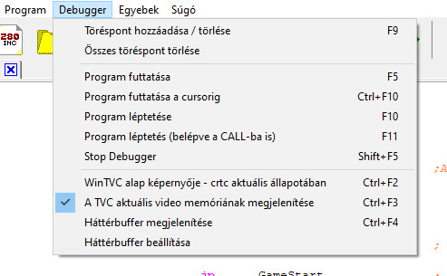

## Процес налагодження:

Налагоджувач доступний на кожній вкладці, що містить програмний код, меню "Налагоджувач" активується в меню.
Звичайно, це не працює на вкладці графічного сеансу.

Перед запуском кожної програми та будь-коли під час налагодження, коли DevTool бере на себе керування, тобто коли курсор налагодження - синя стрілка - активний у лівій сірій смузі перед заданим рядком у текстовому редакторі, можна створити або видалити нову точку зупинки.
Для цього нам потрібно лише розмістити текстовий курсор на рядку, де ми хочемо встановити або видалити точку зупинки, та вибрати пункт меню "Додати / Видалити точку зупинки" або натиснути "F9" або просто клацнути на заданому рядку в лівій сірій смузі.
Точка зупинки позначена великою червоною крапкою на цій смузі. WinTVC завжди перериває програму на рядку(ах), позначених таким чином, і повертає керування DevTool.

Ви можете використовувати будь-яку кількість точок зупинки. Важливо, що точку зупинки можна розмістити лише на рядку, який містить інструкцію z80.

Давайте подивимося, як ми можемо запустити програму!

У нас є два варіанти для цього одразу (див. нижче!)

По-перше, важливо зазначити, що програма завжди компілюється перед запуском, і можна запускати лише програми без помилок!

У випадку компіляції без помилок DevTool запускає WinTVC - або, якщо він вже запущено, він розміщує вікно емулятора зверху - а потім безпосередньо завантажує скомпільований код програми в пам'ять емулятора. (Тож cas не генерується!!)

Якщо програма запускається з базового заголовка, вона запускає її негайно на WinTVC.

А тепер давайте подивимося два способи запуску нашої програми:

### Пункт меню "Запустити програму" або "F5"

Програма запускається на WinTVC, зупиняється на кожній станції та зупинці (тобто на точках зупинки ;) ) і повертає керування DevTool.

### Пункт меню «Запустити програму до курсора» або «CTRL-F10»

Програма запускається, але зупиняється на рядку програми, вибраному текстовим курсором, і повертає керування до DevTool.

### Операції з точками зупинки:

Виконання програми на заданому рядку програми можна продовжити за допомогою двох команд, описаних вище (F5 проти CTRL-F10).

Ви можете переходити на один рядок за раз за допомогою пункту меню «Покрокова програма» (F10) або «Покрокова програма (також введення CALL)» (F11). В останньому випадку програма природно продовжує виконувати задану підпрограму, тоді як у першому випадку виконання програми зупиняється після інструкції CALL, ніби це інструкція в підпрограмі.

Примітка: Якщо ми вводимо підпрограму під час налагодження, а потім продовжуємо виконання програми (F5), то виконання знову зупиняється на інструкції, що йде після виклику CALL, за умови, що ми вводили підпрограму, переходячи рядок за рядком!

При кожній зупинці DevTool відображає вміст регістрів, оновлює вміст "Hex Dump" та "Variables".

### Hex Dump

На вкладці "Hex Dump" ми бачимо пам'ять TVC від початкової адреси до кінцевої адреси. Початкову та кінцеву адреси можна ввести, просто ввівши значення вручну, або початкову адресу можна ввести перетягуванням (див. нижче).

Якщо початкова адреса змінюється, кінцева адреса також змінюється - додаючи 128 до початкової - але якщо кінцева адреса змінюється, початкова адреса залишається незмінною.

### Змінні

У налагоджувачі можна зібрати будь-яку змінну на вкладці "Variables", значення якої ми хотіли б контролювати під час виконання. Це по суті не що інше, як таблиця адрес. Поточне значення кожних даних за вказаною тут адресою відображається на точках зупинки, і можна налаштувати програму на зупинку та перехід у режим налагоджувача при зміні значень певних змінних. (Керування точками спостереження).

### У таблиці даних відображаються найважливіші параметри змінних, які розташовані по порядку:

- Ім'я змінної: Це ім'я заданої мітки або константи
- Адреса змінної, що відображається у шістнадцятковій системі числення
- Тип змінної (чорно-білий). Він може приймати такі значення:

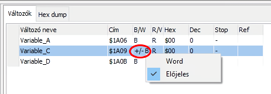

- B: байт (8 біт)
- W: слово (16 біт)
- +/-B: байт (8 біт зі знаком)
- +/-W: слово (16 біт зі знаком)

Тип можна змінити, клацнувши правою кнопкою миші на клітинці «чорно-білий» заданої змінної у спливаючому меню.

Сторінка пам'яті змінної (R/V). Записані значення:

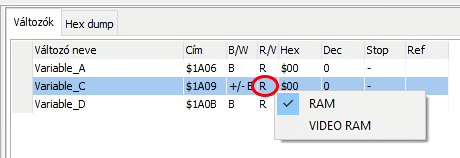

 - Сторінка пам'яті змінної (R/V). Записані значення:
 - R: RAM
 - V: Відеопам'ять

Модифікація можлива в меню, яке з'являється після клацання правою кнопкою миші на комірці 'R/V' заданої змінної.

- Значення змінної має бути в шістнадцятковому (шістнадцятковий стовпець) або десятковому (десятковий стовпець) форматах.

- Умова зупинки. Зупинити програму, якщо після запису змінної виконано відповідну умову. (Точка спостереження)

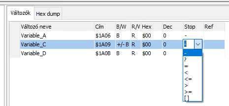

: Немає умови, програма не зупиняється
?: Зупиняється, якщо значення змінної змінюється
=: Зупиняється, якщо значення змінної = Посилальне значення
<: Зупиняється, якщо значення змінної < Посилальне значення
<=: Зупиняється, якщо значення змінної <= Посилальне значення
>: Зупиняється, якщо значення змінної > Посилальне значення
>=: Зупиняється, якщо значення змінної >= Посилальне значення
[]: Зупиняється, якщо змінюється адреса або адреса посилання

Встановлюється в клітинці «Стоп» заданої змінної

- Посилальне значення. Коли оцінюється точка спостереження, нове значення змінної порівнюється з цим значенням.

Встановлюється в клітинці «Посилання» заданої змінної:

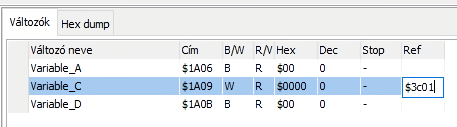

### Нову змінну можна додати до таблиці:

- Перетягуванням (див. нижче)
- Окремо вручну в таблиці даних «Змінні» за допомогою правої кнопки миші та спливаючого меню.

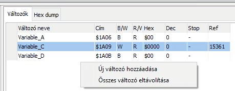

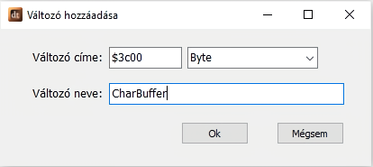

### Видалення змінних зі списку

- Щоб видалити змінну, виберіть її в таблиці даних і натисніть кнопку «del»!
- Усі змінні можна видалити зі списку за допомогою правої кнопки миші в таблиці даних «Змінні» за допомогою спливаючого меню.

Перетягування активується клацанням правою кнопкою миші в текстовому редакторі, а також клацанням лівою та правою кнопкою миші в таблиці даних, що містить мітки та константи. Якщо клацнути на рядку, що містить мітку, в таблиці, що містить мітки та константи (таблиця внизу праворуч), і перемістити мишу над сіткою даних «Змінні», утримуючи праву кнопку миші, ця мітка (ця адреса) буде додана до таблиці. Значення елемента в таблиці змінних може бути байтом або словом.
Під час додавання його до таблиці DevTool намагається визначити його тип на основі вихідної програми.

Перетягування також можна запустити з вихідного коду. Для цього клацніть правою кнопкою миші на потрібному рядку програми в текстовому редакторі (рядок програми повинен містити мітку!) та перетягніть її до сітки "Змінні", утримуючи кнопку миші. Таким чином, локальні мітки також можна додати до нашої колекції змінних.

Введення шістнадцяткового дампу за допомогою перетягування з вихідного коду:

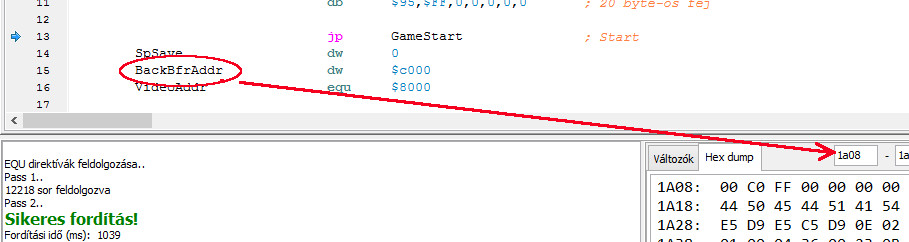

Введення шістнадцяткового дампу за допомогою перетягування з таблиці "Мітки":

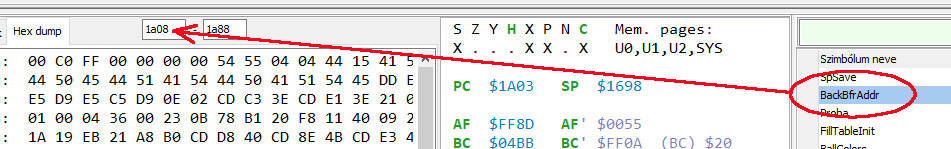

Додавання змінної за допомогою перетягування з вихідного коду:

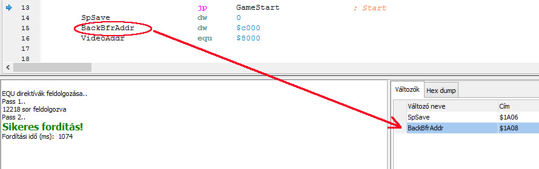

Додавання змінної за допомогою перетягування з таблиці "Мітки":

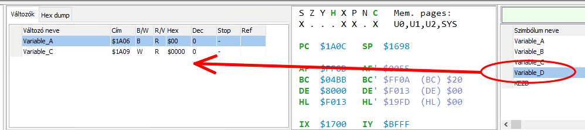

Особливий випадок - це коли ми хочемо вставити визначення структури серед змінних. Розглянемо наступний фрагмент коду:

визначення структури 'POINT'
struct POINT,
X,
Y.w

Виділення масиву POINT з 4 елементів

Прямокутник
ds sizeof(POINT) * 4

Далі виконаємо операцію перетягування:

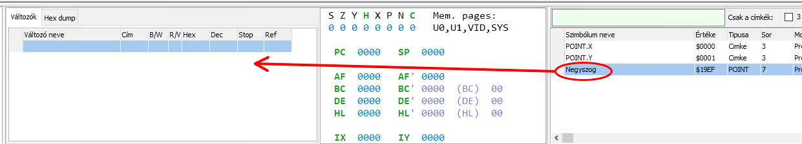

Програма розпізнає, що ми хочемо відстежувати структуру POINT, тому, коли ми відпускаємо мишу, ми отримуємо наступне діалогове вікно:

Тут у нас є два варіанти (див. малюнок нижче!):

Спочатку давайте подивимося, що станеться, якщо ми виберемо «Ні». У цьому випадку «Прямокутник» буде включено як мітка серед змінних

Однак, якщо ми виберемо «Так», варто спочатку ввести в поле «Індекс масиву» елемент масиву POINT, який ми хочемо додати до змінних. (У попередньому розділі ми зарезервували масив із 4 елементів, тому індекс масиву може приймати значення від 0 до 3)

Якщо індекс масиву = 0 і ми натискаємо кнопку «Так», то всі елементи із заданим індексом (тепер нехай він буде 0) будуть додані до сітки даних «Змінні».

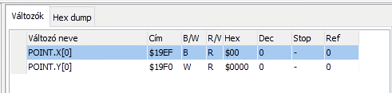

### Зупинка налагоджувача

Налагоджувач можна зупинити за допомогою пункту меню «Зупинити налагоджувач» або комбінації клавіш «SHIFT-F5».

На цьому етапі панель налагоджувача в DevTool відключається, а вікно WinTVC повертається до початкового режиму, тобто режим «завжди видимий зверху» виключається.

## Фільтрація в сітці даних, що містить мітки та константи

Під час компіляції програми DevTool збирає мітки та константи з вихідного коду та відображає їх у сітці даних, видимій у правому нижньому куті екрана.

Для кожної мітки, коли ви наводите курсор на константи в таблиці, курсор переходить до місця у вихідному коді, де визначено задану мітку/константу.

Цю таблицю доповнено функцією фільтра, яка включає два елементи:

Саму панель фільтра, яка має світло-зелений базовий колір, та прапорець з написом «Тільки мітки».

Ви можете ввести фрагмент слова в панель фільтра. Тоді в сітці даних відображатимуться лише ті рядки, які починаються з рядка символів, зазначеного в рядку фільтра.

Якщо ви поставите символ `*` перед рядком символів, який потрібно шукати в рядку фільтра, то в сітці даних відображатимуться лише елементи, які містять заданий рядок символів будь-де у своїх назвах.

Встановивши прапорець «Тільки теги», ми можемо ще більше звузити фільтрацію. В результаті константи зникають з таблиці, і відображаються лише рядки, що містять теги.

На наступному рисунку показано приклад пошуку фрагмента слова: Відображаються лише теги, що містять рядок символів «bfr»:

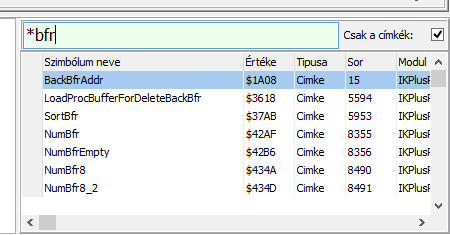

### Зміна відображення WinTVC у точках зупинки
Коли програма досягає точки зупинки на емуляторі та керування повертається до Інструменту розробника, ми маємо можливість переключити режим відображення емулятора.
Ми можемо вибрати один з трьох режимів відображення:

#### Базовий екран WinTVC - поточний стан crtc (Ctrl-F2)

У цьому режимі ми бачимо зображення на емуляторі, яке електронний промінь намалював на моніторі в момент зупинки програми. Він дуже рідко використовується під час розробки.

#### Відображення поточної відеопам'яті TVC (Ctrl-F3)
Найчастіше використовуваний параметр відображення. По суті, ми бачимо зображення, яке наразі зберігається у відеопам'яті. Його можна використовувати, наприклад, для тестування графічних програм, оскільки ми можемо крок за кроком, байт за байтом, бачити, як наша програма змінює зображення.

#### Відображення фонового буфера (Ctrl-F4)

Майже ідентичний попередньому режиму відображення. Різниця полягає в тому, що можна вказати попередньо встановлену адресу пам'яті. Він відображає дані, починаючи з цієї адреси, так, ніби вони знаходяться у відеопам'яті.
Це корисно для програм, де зображення редагується у фоновому буфері пам'яті і лише пізніше, коли все зображення готове, копіюється у відеопам'ять (зазвичай в іграх).
Стан за замовчуванням - це адреса оперативної пам'яті, що виводиться на верхній сторінці, тобто $c000.
Звичайно, цю адресу можна змінити. (див. нижче!)

#### Налаштування фонового буфера

Адресу відображення фонового буфера, описаного в попередньому пункті, можна встановити. Адресу можна вказати в десятковій або шістнадцятковій формі, але в останньому випадку адреса повинна мати префікс '$'.

## Компіляція програми

За допомогою клавіші F12 ми можемо скомпілювати нашу програму для тестування. Результат відображається в нижній панелі повідомлень. Якщо компіляція була невдалою, ми можемо виправити помилки.
У разі успішної компіляції, якщо ми запросили збереження бінарного файлу або файлу списку (GENBIN(ARY), GENLIST) у програмі, то будуть створені вказані файли. Якщо ми натиснемо SHIFT разом з F12, то у разі успішної компіляції вміст файлу списку буде виведено в панель повідомлень незалежно від того, чи ми запросили генерацію файлу списку (GENLIST) у вихідному коді.