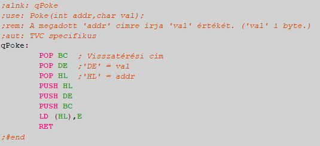

# Зв'язок між C та асемблером

Під час компіляції компілятор C зазвичай вставляє малу літеру 'q' перед іменами символів та змінних у згенерованому вихідному коді asm та максимізує довжину цих імен до 48 символів. (Можна використовувати довші імена, але зберігатимуться лише перші 48 символів).

Під час компіляції не перевіряється, чи існує задане ім'я в таблиці символів компілятора C. Сам компілятор залишає цю перевірку компілятору асемблера. Ця функція значно полегшує інтеграцію частин програми, написаних на асемблері, оскільки компілятор C розглядає будь-яку мітку asm як свою власну, якщо перший символ мітки - мала літера 'q', незалежно від того, чи ця мітка asm ідентифікує змінну чи ім'я процедури.

Чи використовує компілятор C \#asm або Вихідний код між директивами \#endasm вважається програмою на асемблері та копіюється один за одним у згенерований код асемблера під час компіляції. Це також дуже допомагає при заміні вихідного коду C безпосередньо кодом асемблера в місцях, де чутливі швидкість або розмір.

## Передача параметрів функції з C до коду asm-програми

Компілятор C передає параметри процедурам через стек. Важливо, щоб процедура не змінювала розмір стеку під час введення, оскільки пам'ять, виділена на стеку, буде звільнена компілятором C після викликаної процедури!

Коли ми хочемо взяти параметри в нашій asm-процедурі, ми повинні витягнути їх з вершини стеку. Першим витягнутим значенням буде адреса повернення, а потім параметри, інтерпретовані у зворотному порядку в рядку параметрів, заданому в оголошеннях функцій, через природу стеку.
Параметри (char, int, покажчики) зберігаються в 16 бітах, крім типу з плаваючою комою (double), оскільки він знаходиться в 6 байтах.

Дуже гарним і простим прикладом передачі параметрів є реалізація інструкції Poke:

Ми бачимо, що на початку процедури ми акуратно поміщаємо адресу повернення або параметри у відповідні регістри за допомогою інструкцій 'POP', а потім поміщаємо їх назад у стек ('PUSH'), звертаючи увагу на порядок.

У цьому компіляторі C не обов'язково вказувати тип значення, що повертається функцією. Якщо ми його не вкажемо, а викличемо з обробленим параметром повернення, то в результаті отримаємо вміст регістра 'HL'.