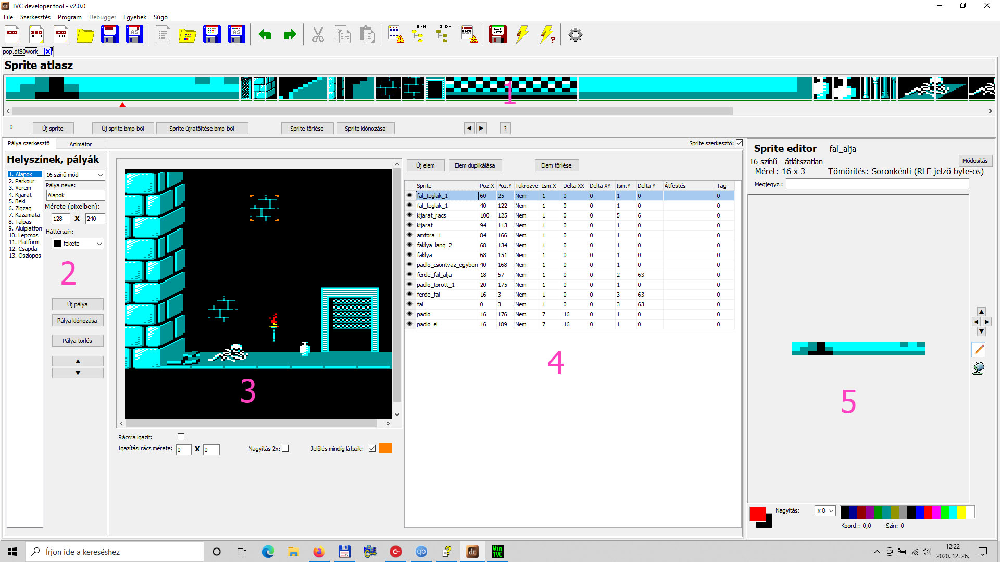
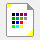
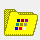
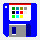
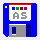
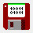
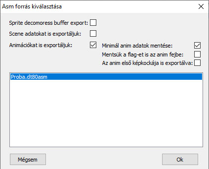

# Графічний робочий стіл
Оскільки DevTool був створений в першу чергу для сприяння розробці ігор, він повинен полегшувати графічну роботу над ігровими програмами.

Це завдання покликаний виконувати вбудований в програму «графічний робочий стіл» (worksheet).

Його завдання, серед іншого, полягає в сприянні створенню будівельних елементів гри — спрайтів, їхньому управлінні, плануванні різних ігрових полів, експорті графічних даних в модуль asm.

Графічний робочий стіл відображається на одній з вкладок, так само як і текстові редактори асемблера, але на відміну від асемблера, з графічного робочого столу можна відкрити тільки один файл одночасно.

Давайте подивимося, як це виглядає на практиці:

1:  [Атлас спрайтів](dt-graphics-sprite-atlas.md)
сюди потрапляють спрайти, спроектовані в програмі або імпортовані з іншої програми для малювання. В атласі є місце для 255 спрайтів

2-3-4:    [Редактор сцен (scene editor)](dt-graphics-scene-editor.md).
Як бачимо, він складається з трьох частин:

 - 2: Список рівнів – сцен.  За допомогою цього ми можемо керувати рівнями в цілому. Тут ми можемо створити новий рівень, тут ми можемо вибрати, який рівень ми хочемо редагувати 
 - 3: Вигляд цього рівня. (scene view) Саме так буде виглядати спроектований рівень на TVC. 
 - 4: Редагування конкретного рівня. У таблиці даних відображаються «елементи» траси, вибраної у списку трас. 

5: [Редактор спрайтів](dt-graphics-sprite-editor.md).
За допомогою нього ми можемо намалювати новий спрайт або змінити, виправити вже імпортований спрайт.

 
Усі компоненти графічного робочого столу ми розглянемо окремо нижче, але спочатку давайте подивимося, як почати з ним працювати.

 

Новий графічний робочий стіл можна створити за допомогою пункту меню «Файл / Новий графічний робочий стіл» або відповідної піктограми:

Програма запитає місце та ім'я файлу графічного робочого столу, який потрібно створити. Якщо в конфігурації встановлено папку за замовчуванням для файлу робочого столу, програма, звичайно, запропонує її, але її можна змінити.

Важливо, що після відкриття робочий файл не буде створений відразу! Щоб він був збережений, після закінчення роботи його потрібно зберегти!
 

Вже існуючий робочий стіл можна відкрити за допомогою пункту меню «Файл / Відкрити графічний робочий стіл» або відповідної іконки:

 

Просто потрібно знайти робочий файл, який потрібно відкрити.

Зберегти робочий стіл можна за допомогою пункту меню «Файл / Зберегти графічний робочий стіл» або за допомогою наступної іконки:

 

Програма збереже робочий стіл у тому місці та під тією назвою, під якою ми його відкрили / створили.

 Збереження робочого столу під іншою назвою Можна за допомогою меню «Файл / Зберегти графічний робочий стіл під іншою назвою» або за допомогою наступної іконки:

 

Ця функція запитує назву та шлях до файлу, який ви хочете зберегти. Він може відрізнятися від того, який ви відкрили / створили.

Експорт даних графічного робочого столу до джерела asm
Після того, як ми розробили графіку нашої гри, ми повинні мати змогу якимось чином використовувати її в програмі, яку створюємо. Отже, нам слід якимось чином перенести графіку до джерела збірки у вигляді даних.

Ми можемо легко зробити це за допомогою значка нижче:

Це дуже просто у використанні. Відкрийте модуль збірки поруч із графічним робочим столом, на який ми хочемо імпортувати дані. Потім поверніться на вкладку графічного робочого столу та натисніть значок вище!

Ви можете встановити властивості експорту за допомогою прапорців у спливаючій панелі.

Експорт буфера розпакування спрайтів: виділяє пам'ять, що відповідає розміру найбільшого стиснутого спрайта у джерелі asm. (необов'язково)
Ми також експортуємо дані сцени: Дані сцени імпортуються в adm лише якщо це ввімкнено.

Ми також експортуємо анімацію: Дані анімації імпортуються лише якщо це ввімкнено. Якщо це ввімкнено, можна вказати додаткові параметри для експорту анімації. (Параметри є функціями програми, яка відтворює анімацію!!)

Зберегти мінімальні дані анімації: Якщо це ввімкнено, дані контрольних точок та байт прапорця, що належить анімації, не будуть включені до анімації.
Зберегти прапорець також у заголовку анімації: Байт прапорця, що належить анімації, не буде включено до даних анімації. (Контрольні точки можна включити!)
Перший кадр анімації також експортується: перший кадр експортується в asm лише якщо це ввімкнено. Логічно, що якщо це не позначено, перший кадр не буде включено до даних анімації в редакторі анімації. Це важливо, коли, наприклад, кілька анімацій починаються з однієї й тієї ж фази анімації. (Наприклад, у грі в боротьбу ми включаємо фазу анімації, яка представляє базову позицію, в редакторі анімації, щоб полегшити редагування, але це необхідно лише для того, щоб ми могли порівняти наступну фазу анімації з чим. Однак ця фаза не потрібна в грі, оскільки всі рухи починаються з базової позиції)

Виберіть, до якого модуля ми хочемо експортувати дані, а потім натисніть кнопку «ОК».

Якщо операція виконана успішно, вибране джерело asm стане активним, а дані графічного інструментарію з'являться у двох папках db внизу модуля (графіка спрайтів, таблиця переміщення спрайтів та сцен тощо). Наразі експорт можливий лише у форматі «db». Важливо залишати дані у згенерованих папках, оскільки якщо ми змінимо графіку, функція може оновити дані в модулі asm на основі цього.