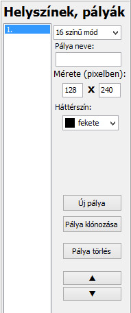
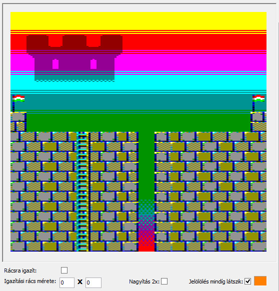
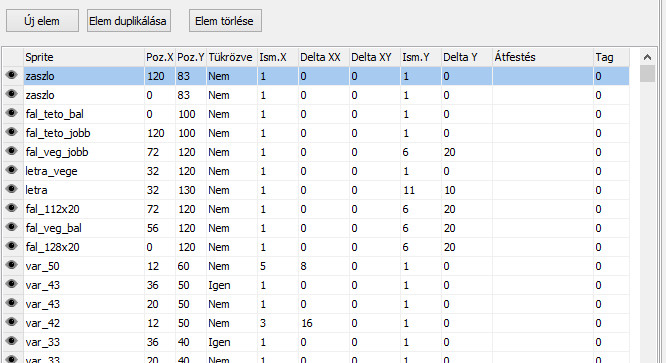
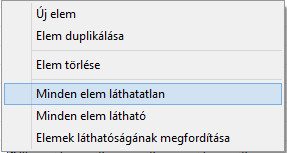

# Редактор сцен

Редактор сцен займає найбільше місця на робочому столі. За замовчуванням Інструмент розробника має вбудований редактор сцен типу «Інтегратор». Його особливості полягають у тому, що елементи (спрайти), що складають сцену, можуть бути будь-де на екрані, на відміну, наприклад, від екранів типу «плиткоподібна карта», де елементи розташовані на рівній відстані один від одного - на фіксованій сітці. Недоліком редактора сцен типу «Інтегратор» порівняно з «плиткоподібною картою» є те, що він вимагає більше пам'яті для зберігання елемента, але він набагато гнучкіший. Порядок малювання елементів сцени можна встановити довільно під час проектування, тому, наприклад, маскуючи окремі елементи, ми можемо навіть створювати приховані частини.

Редактор рівнів можна розділити на три чітко помітні частини:

1: Список рівнів (2)
2: Вигляд рівня (3)
3: Список елементів (4)

## Список рівнів

Займає ліву частину екрана. Він допомагає переглядати вже відредаговані рівні.

Тут ви можете додати новий рівень (кнопка «Новий рівень»), змінити його дані або дані існуючого розташування – наприклад, назву, розмір, графічний режим, колір фону або палітру в 4-кольоровому режимі.

Зміни завжди застосовуються до рівня, вибраного у списку.

Ви також можете видалити будь-які рівні, які могли бути пошкоджені або стати непотрібними. (кнопка «Видалити рівень»).

Ви можете клонувати вибраний рівень (кнопка «Клонувати рівень»). Це спрощує створення локацій зі схожими структурами. Спочатку ми створюємо шаблон доріжки, який містить елементи, що повторюються на всіх доріжках, потім ми клонуємо його та модифікуємо клони до їх остаточної форми.

І останнє, але не менш важливе: ви можете змінити порядок доріжок, переміщуючи вибрану доріжку вгору або вниз у списку доріжок за допомогою двох нижніх кнопок зі стрілками.

## Перегляд доріжки

Він має дві основні функції: по-перше, ми можемо бачити, як виглядатиме доріжка, яку потрібно редагувати, на екрані, а під час редагування ми можемо переміщувати вибрані елементи у відповідне положення за допомогою миші.

Пов’язані елементи керування під ним:

Прапорець «Прив’язка до сітки»:

Якщо його ввімкнено, то після відпускання миші переміщений елемент треку буде вирівняно з логічною сіткою розміру, зазначеного нижче («Розмір сітки вирівнювання»). (Хоча редактор не є системою «плиткоподібної карти», іноді корисно мати можливість розташовувати елементи на фіксованих відстанях.)

Прапорець «Масштаб 2x»:

Логічно, він збільшує вигляд вдвічі. Це допомагає точно розташувати елементи, які потрібно вирівняти один з одним.

Прапорець «Позначення завжди видимим»:

Якщо його ввімкнено, вибір завжди буде видимим на даному елементі, коли його вибрано в сітці даних. Однак, якщо цей прапорець вимкнено, вибір зникне в поданні треку, коли елемент вибрано в сітці даних. (За винятком випадків, коли ми клацаємо на клітинці позиції елемента в сітці даних, оскільки це повторно активує вибір у поданні треку)

«Цільовий перехрестя» – це завжди колір, який видно поруч із полем вибору. Цей колір можна змінити, клацнувши на кольорі.

## Список елементів

Це, по суті, сітка даних. Вона призначена для відображення елементів, що складають доріжку, вибрану у списку доріжок. Вона визначає порядок, у якому елементи малюються. Порядок малювання йде знизу вгору на сітці, тому найвищий елемент охоплює всі елементи під ним.

Двічі клацнувши на відповідній комірці сітки даних, ви можете змінити задану властивість елемента доріжки. (Див. нижче!!)

Самій перший сірий стовпець сітки даних має особливу роль: клацнувши на ньому, ви можете приховати або зробити видимим елемент, вибраний у сітці, з перегляду доріжки. Якщо даний елемент видимий, то на цій маленькій сірій комірці видно крихітне око. (Увага! Він все одно залишиться компонентом доріжки, але ви можете зробити його невидимим, щоб полегшити редагування, наприклад, щоб точніше розташувати елемент під ним)

Клацнувши на цьому першому стовпці та утримуючи кнопку миші, ви можете переміщувати елементи доріжки вгору або вниз по сітці за допомогою перетягування, таким чином змінюючи порядок їх малювання.

У списку елементів є ще три кнопки.

«Новий елемент»:

Натискаючи цю кнопку, вибраний спрайт з атласу спрайтів з’явиться у вікні перегляду доріжки та буде додано до елементів.

«Дублікувати елемент»:

Елемент, вибраний у сітці даних, буде продубльовано.

«Видалити елемент»:

Звичайно, ви можете видалити вибраний елемент із сітки даних за допомогою цієї кнопки.

Клацання правою кнопкою миші на сітці даних відкриє наступне плаваюче меню, де ви також можете вибрати ці функції, а також керувати видимістю всіх елементів у вікні перегляду доріжки:

Подвійним клацанням на клітинці вибраного елемента сітки даних можна змінити такі елементи:

 - «pos x» та «pos y» – це позиції спрайта на екрані
 - «mirrored» – це горизонтальне дзеркальне відображення спрайта (так/ні)
 - «ism.x» – це кількість повторень спрайта по горизонталі
 - «delta xx» – це горизонтальна відстань між повторюваними елементами
 - «delta xy» – це горизонтальна та вертикальна відстань між повторюваними елементами
 - «ism.y» – це кількість повторень спрайта по вертикалі
 - «delta yy» – це горизонтальна відстань між повторюваними елементами
 - «recoloring» (зміна кольорів, спочатку використаних спрайтом, на інші кольори)
 - «tag» – це значення, призначене елементу треку, яке може використовувати дана програма (наприклад: 0: трек не змінюється, 1: рухомий/просунутий елемент, 2: ворог тощо)