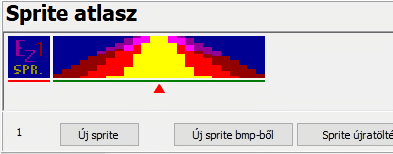
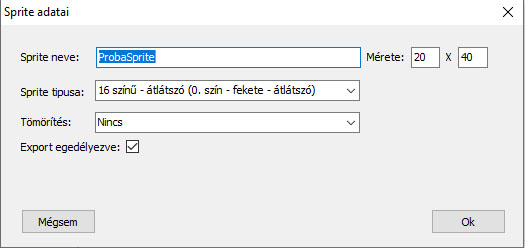
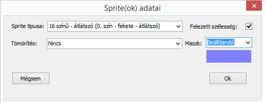

# Атлас спрайтів

Атлас спрайтів містить прокручуваний список спрайтів, які будуть використовуватися в грі.

Одночасно можна вибрати лише один з них. Активний елемент позначено червоним трикутником, що з'являється під спрайтом.

Відповідний спрайт вибирається мишею, але також можна вибрати новий елемент, рухаючись вперед або назад за допомогою клавіш «page-up» / «page-down».

Функції атласу спрайтів призначені для забезпечення управління.

## Новий спрайт
Це дозволяє нам додати новий порожній спрайт до атласу. Натискаючи кнопку, відкриється панель «Дані спрайта», за допомогою якої ми можемо встановити властивості нового елемента:

 - Назва спрайта.
 - Ми будемо називати його цим ім'ям у редакторі рівнів або навіть в асемблері. Воно має бути унікальним!
 - Тип спрайта.
 - Наразі дозволено 6 різних типів:
 - 16 кольорів – 0 прозорих
 - 16 кольорів – непрозорі
 - 4 кольори, що використовуються в 16-кольоровому режимі – 0 прозорих
 - 4 кольори, що використовуються в 16-кольоровому режимі – непрозорі
 - 4 кольори – прозорі (згенерована маска)
 - 4 кольори – непрозорі
 - Стиснення
 - Немає
 - Повне стиснення
 - Порядкове стиснення*
 - Розмір спрайта (у пікселях!)
 - Експорт увімкнено. Тільки спрайти з увімкненим цим прапорцем матимуть свої дані, включені до файлу збірки під час експорту. Відповідно, в атласі спрайтів під спрайтами є зелений або червоний маркер: зелений колір позначає спрайти, дані яких будуть експортовані.

*Наразі повне стиснення також буде виконано для порядкового стиснення

## Новий спрайт з bmp

Ця кнопка спочатку відображає вікно браузера, де ми можемо вибрати спрайти формату bmp, які ми хочемо імпортувати. Можна імпортувати ще більше одночасно. Під час вибору застосовуються правила Windows: утримування клавіші «shift» дозволяє вибрати діапазон, натискання клавіші «ctrl» дозволяє вмикати/вимикати файл bmp, вибраний мишею.

Після того, як ми вибрали файли для імпорту, тут з'являється панель «Дані спрайтів» – дуже схожа на ту, що обговорювалася в попередній функції.

Оскільки можна вибрати кілька файлів, імена спрайтів, природно, будуть іменами вибраних bmp (без розширення). На цій панелі ми також повинні вказати тип спрайта, розмір та стиснення. Дані, введені тут, будуть дійсними для всіх вибраних спрайтів.

Однак ця панель відображає (може відображати) два параметри, яких не було на раніше обговорюваній панелі, і обидва потребують невеликого пояснення.

У 16-кольорових режимах (а також у 4/16-кольоровому режимі) з'являється прапорець «Половина ширини».

Що це означає?

Як ми знаємо, у 16-кольоровому режимі TVC зменшує роздільну здатність по горизонталі вдвічі порівняно з 4-кольоровим режимом. В результаті піксель стає вдвічі ширшим по горизонталі. Однак малювати таким чином у зовнішній програмі для малювання незручно, оскільки тоді намальований спрайт «розтягується» по вертикалі. Набагато зручніше малювати його так, ніби ми бачимо його в оригінальному співвідношенні сторін – можливо навіть так, щоб кожен піксель з’являвся двічі по горизонталі. Під час читання в Інструмент розробника, якщо цей прапорець «Півширина» увімкнено, лише кожен другий піксель з оригінального bmp буде включено по горизонталі.

Ще один такий параметр, який може з’явитися на панелі під час імпорту bmp, – це розкривний список «Маска».

Він має три основні стани:

1. Немає (-)
2. Верхній лівий піксель – у цьому випадку всі пікселі того ж кольору, що й верхній лівий кут bmp, будуть прозорими.
3. Встановити – це означає, що пікселі того ж кольору, що й колір, що відображається у розкривному списку, будуть прозорими.

Зверніть увагу, що за допомогою цієї функції розмір спрайта визначається розміром bmp.

## Перезавантажити спрайт з bmp

Це працює так само, як і раніше обговорювана функція, тільки тут імпортований спрайт не додається до атласу спрайтів, а спрайт, вибраний в атласі, буде замінено на bmp.

## Видалити спрайт
Вибраний спрайт можна видалити з атласу. Якщо спрайт вже використовувався один раз на відредагованому рівні, програма попередить вас про це, і якщо ви все ще хочете його видалити, він буде видалений з усіх елементів рівня.

## Клонування спрайта
Ви можете дублювати вибраний спрайт за допомогою цього. Спрайт з'явиться двічі, але оскільки ім'я нового спрайта потрібно вказати під час клонування, клонований та оригінальний спрайти матимуть різні назви.

## Переміщення спрайтів в атласі
Атлас спрайтів також має дві кнопки з горизонтальними стрілками.

Їх можна використовувати для зміни положення - порядку - вибраного спрайта в атласі.