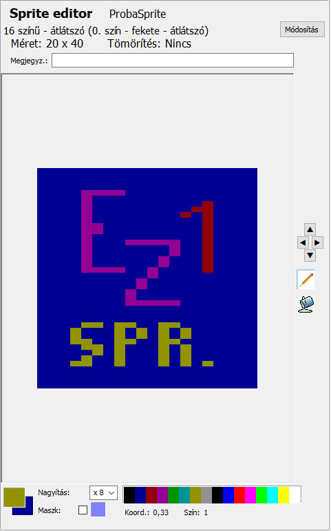
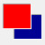

# Редактор спрайтів (5)

В основному він використовується для корекції та зміни спрайта, вибраного в атласі спрайтів, але ви також можете намалювати новий спрайт, якщо створите новий порожній спрайт в атласі. Проста програма для малювання може зробити майже нічого, крім розміщення пікселя іншого кольору або кольору фону в місці розташування курсора миші, залежно від того, чи натиснуто ліву чи праву кнопку миші.

Параметри спрайта, вибраного в атласі спрайтів, відображаються в заголовку редактора спрайтів. Тут також є кнопка з написом «Змінити», яка допомагає вам змінити ці параметри. Те саме стосується зміни даних, як і функції «Новий спрайт» в атласі спрайтів.

Елементи під областю малювання розташовані по порядку

Кольори переднього плану та фону

Ви малюєте цими кольорами, натискаючи ліву або праву кнопку миші.

Ці кольори змінюються по-різному в режимах 4 (4/16) та 16 кольорів:

У режимах 4 та 4/16 елемент палітри з 4 кольорів праворуч копіюється в колір переднього плану, коли ви клацнете лівою кнопкою миші на цій палітрі, а колір, на який ви клацнете правою кнопкою миші в малій палітрі, копіюється в колір фону.

Кольори цієї палітри з 4 кольорів можна змінити на відповідний елемент палітри з 16 кольорів внизу редактора, вибравши відповідний колір з 16 кольорів лівою кнопкою миші та перетягнувши його у відповідний елемент палітри з 4 кольорів, утримуючи ліву кнопку миші.

У режимі 16 кольорів ця мала палітра не має жодної ролі (вона не видно). Щоб змінити кольори переднього плану або фону, просто клацніть лівою або правою кнопкою миші на відповідному кольорі в палітрі з 16 кольорів внизу.

Внизу редактора спрайтів, окрім палітри та кольорів переднього та заднього плану, ми знаходимо ще два елементи: Збільшення – це зрозуміло – і прапорець з написом «Маска» та відповідний колір маски. Цей колір повністю відрізняється від кольорів, що використовуються в TVC (RGB 8080ff). Активуючи прапорець, інакше прозорий колір з’явиться в плоттері з цим кольором. Це також важливо, оскільки TVC використовує 2 різні чорні коди. У 16-кольорових прозорих спрайтах чорний 0 є прозорим. Однак у плоттері ми не зможемо розрізнити ці два різні коди, а лише різні функції чорного.