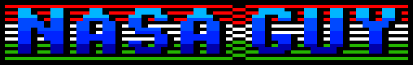

# Nasa & Guy

Штатними співробітниками ['a' Studio](../../../companies/a-studio.md) були [Ігнац Фетсер](../../hu/pers_ignac-fetser.md) та [Ференц Штенглер](../../hu/pers_ferenc-staengler.md), які утворили команду **NASA & Guy**. Універсальним керівником був [Вільмош Копачі](../../hu/pers_vilmos-kopacsy.md) — він і був тим самим «Guy» (а також співвласником ['a' Studio](../../../companies/a-studio.md)). Першими роботами цієї команди стали демки NasaGuy. Вони були створені приблизно у 1988–1989 роках для мережі магазинів [Centrum](../../../companies/centrum.md). Мета полягала в тому, щоб на виставочних комп'ютерах постійно крутилося щось цікаве та видовищне. Досить швидко ці демо з'явилися на стороні «Б» програмних касет із довшою стрічкою. При їх створенні керувалися принципом «швидко зробити щось ефектне», тому більшість спецефектів була запозичена з різних джерел.

