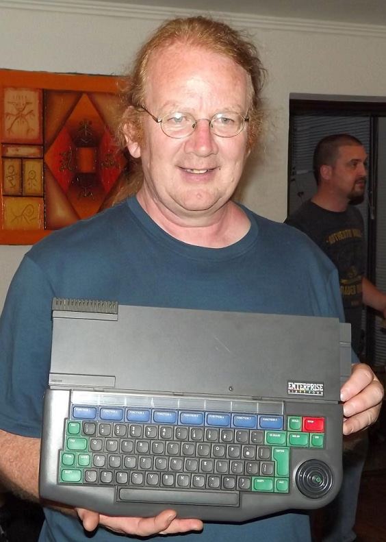

# Bruce Tanner

Працював програмістом у [Intelligent Software](../../companies/intelligent-sofware-ltd.md).  
Працював над  [IS-BASIC](../../programming/is-basic.md), [IS-FORTH](../../programming/is-forth.md), large parts of [EXDOS](../../software/ss-exdos.md) and [IS-DOS](../../software/ss-is-dos.md), TVC BASIC, VT-DOS

`BT` in [status](../../programming/system-info/exos-variables/exos_var26.md)