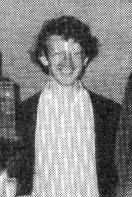
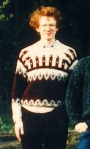
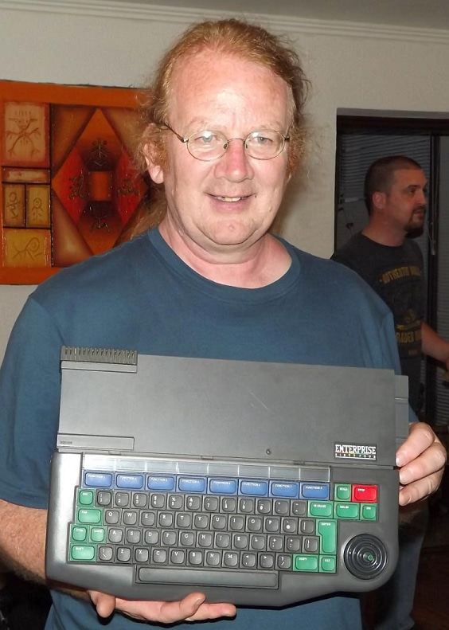

# Bruce Tanner

 
 
 

Працював програмістом у [Intelligent Software](../../companies/intelligent-software-ltd.md). Після банкрутства компанії разом деякими іншими програмістами перейшов у [Madge Networks](../../companies/madge-networks.md).   

Працював над [IS-Basic](../../programming/is-basic.md), [IS-Forth](../../programming/is-forth.md), великими частинами [EXDOS](../../software/ss-exdos.md) та [IS-DOS](../../software/ss-is-dos.md), після чого займався створенням ПЗ для комп'ютера Videoton TVC: TVC Basic, VT-DOS.

`BT` in [status](../../programming/system-info/exos-variables/exos_var26.md)