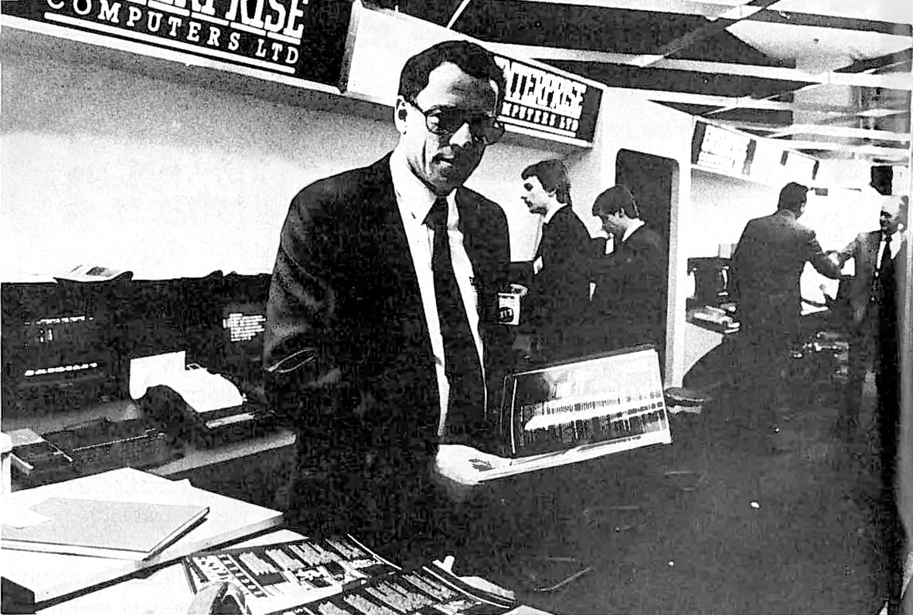

# Charles Macadam

 
 

Січень 1984 — Січень 1986: працював у [Enterprise Computers Ltd](../../companies/enterprise-computers-ltd.md) менеджером із продажів (General Sales Manager)

> [!З власного резюме:]
> Відповідав за створення оптових каналів дистрибуції для домашнього комп'ютера Enterprise 128k.
> 
> - Сформував лояльну базу профільних/спеціалізованих користувачів.
> - Зіштовхнувся з конкуренцією під час виходу на ринок великих мереж побутової техніки через випуск Commodore 64: хоча той і був дещо слабшим продуктом, його масштабні маркетингові ресурси та програми стимулювання роздрібних продавців виявилися недосяжними для приватного консорціуму, що стояв за Enterprise.