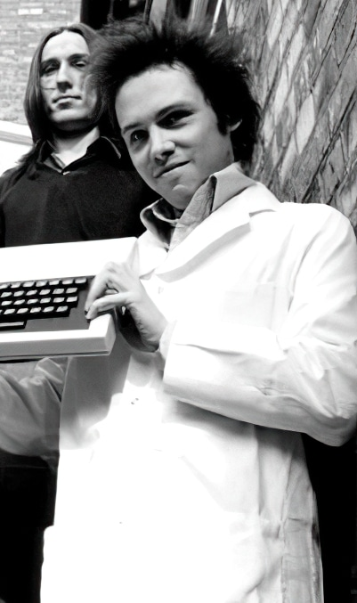
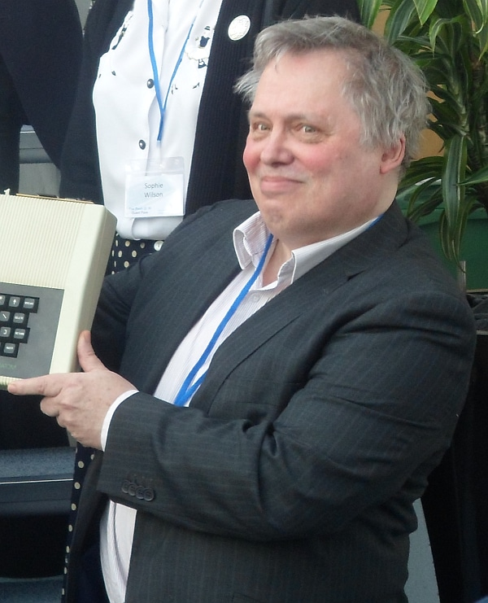

# Nick Toop

 

Розробник чипа [Nick](../../hardware/hm-nick.md) та системи менеджмента пам'яті, яка пізніше увійшла до чіпу [Dave](../../hardware/hm-dave.md).

Наприкінці 1970-х років він розробив апаратне забезпечення першого домашнього мікрокомп'ютера Acorn. На той час це був справжній прорив у побутових технологіях. Упродовж кількох років він працював пліч-о-пліч із Клайвом Сінклером та Крістофером Каррі, яких вважають засновниками кембриджської революції мікрокомп'ютерів. 

Під час роботи у Science of Cambridge створив, як мінімум 2 модуля для мікрокомплекту [MK14](https://en.wikipedia.org/wiki/MK14): [касетний та відеоінтерфейс](https://static.nosher.net/archives/computers/images/pcw_1980-01-00_021_sincmk14-m.webp). [>](https://binarydinosaurs.co.uk/Museum/Science/index.php)

Окрім роботи над мікрокомп'ютером Acorn Atom, Нік Туп (Nick Toop) також розробив апаратне забезпечення для комерційного шахового комп'ютера — чемпіона світу Scisys Y5, а також апаратну частину та графічний чіп для мікрокомп'ютера Elan Enterprise. [>](https://web.archive.org/web/20230606204410/http://heloisetoop.com/artwork/3390191_Nick_Toop_Micro_Man.html)

