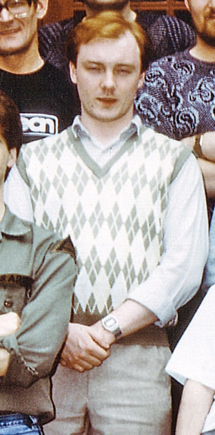
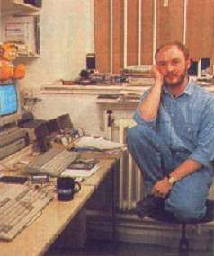

# John Brandwood

aka **Elmer**

У 80-х створив версію гри [Cauldron](../sf-games/c/cauldron.md) для Ентерпрайза (використовуючи редактор [VEdit](https://github.com/johnsonjh/VEDIT) у [IS-DOS](../software/ss-is-dos.md)), а пізніше, працюючи у софтверній компанії OCEAN на тій же системі створював версії ігор для Amstrad CPC ([Renegade](https://www.cpc-power.com/index.php?page=detail&num=146) та [Short Circuit](https://www.cpc-power.com/index.php?page=detail&num=1931))

Сторінка на [MobyGames](https://www.mobygames.com/person/144094/john-brandwood/).