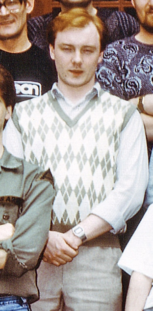
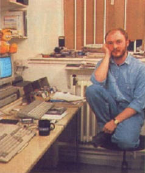

# John Brandwood

aka **Elmer** (Elmer Fudd)

 
 

У 80-х створив версію гри [Cauldron](../sf-games/c/cauldron.md) для Ентерпрайза (використовуючи редактор [VEdit](https://github.com/johnsonjh/VEDIT) у [IS-DOS](../software/ss-is-dos.md)), а пізніше, працюючи у софтверній компанії OCEAN на тій же системі створював версії ігор для Amstrad CPC ([Renegade](https://www.cpc-power.com/index.php?page=detail&num=146) та [Short Circuit](https://www.cpc-power.com/index.php?page=detail&num=1931))

Сторінка на [MobyGames](https://www.mobygames.com/person/144094/john-brandwood/).

> **До речі, за легендою, він насправді був фанатом Enterprise і йому довелося перейти на інші машини лише тому, що Enterprise не мав достатнього рівня продажів…**
> 
> В Ocean він мав власну систему розробки на базі Enterprise. Здається, вона працювала під управлінням CP/M, і частково його приваблювало те, що це було «професійне» програмне забезпечення, а не щось, написане «на коліні» хлопцем із сусіднього кабінету. Він був єдиним серед нас, хто вивчав комп’ютерні науки в університеті. Ми часто кепкували з нього через те, що він був дуже педантичним у своїй роботі, але ми також багато чого в нього навчилися.
> [>](https://www.retromaniacmagazine.com/2023/04/me-encanto-trabajar-en-ocean-adoraba.html)