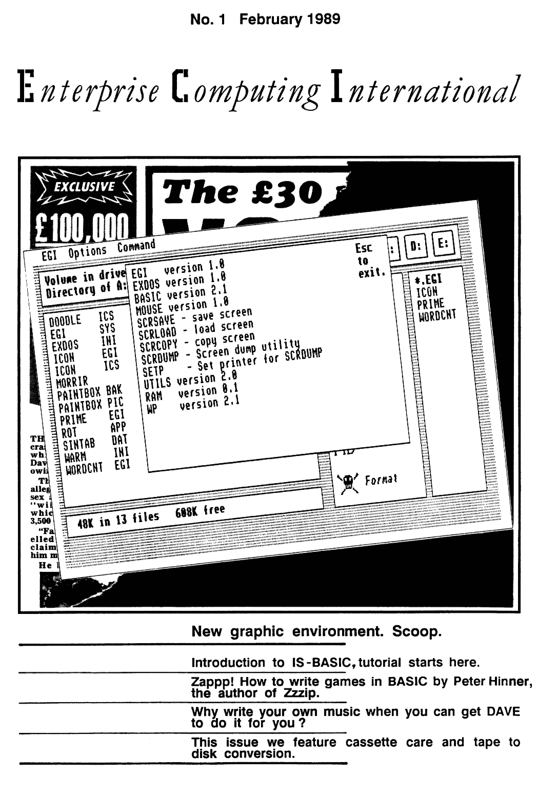

# Enterprise Computing International #1 (лютий 1989)

[Оригінальний PDF](http://enterprise.iko.hu/magazines/ECI_No1.pdf)

## Зміст

Editorial  
News  
"Birmingham". The Show  
An Introduction to IS-Basic  
Troubleshooters Guide to Tape Handling  
Correspondence  
Club Page  
Basic Animation  
Auto Music  
Reviews: Paintbox, Out of this World  
Converting Tape-based Software to Disk  
Sorcerers Apprentice  
How to Build Your Own SCART Monitor Cable  

BoxSoft ad
Dataquip Electronics ad
BUG Tronics ad

----
