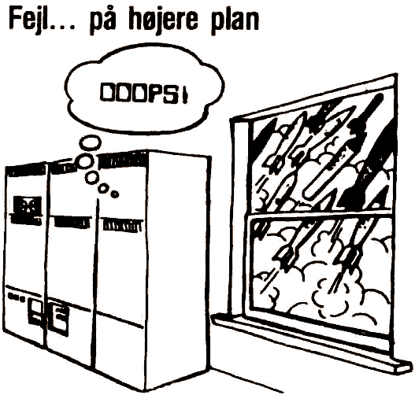

# BUGS

Der har, som i alle nye computere, også indsneget sig nogle bugs, altså fejl, i enten [BASIC](../../../../programming/is-basic.md), [WP](../../../../software/st-wp.md) eller [EXOS](../../../../software/ss-exos.md)'en i Enterprisen. Det kan ikke undgås og den eneste måde, at få dem rettet på, er ved at DU skriver til ENTER og fortæller, hvad du har fundet ud af og eventuelt hvordan de kan omgås, så også andre kan få glæde af dine opdagelser. Herefter vil vi selvfølgelig skrive om dem, samt rette henvendelse til [Semicap Data](../../../../companies/semicap-aps.md), som vil sørge for at [Enterprise Computers](../../../../companies/enterprise-computers-ltd.md) bliver gjort opmærksom på fejlene, så de kan blive rettede i senere udgaver.

Til dette nummer har vi fundet følgende bugs omkring strengbehandling:

Ved sammenligning af to strenge, **A\$** og **B\$**, har længden af de to strenge den højeste prioritet. Enhver der har været eller er skoleelev, og som har fulgt bare en lille smule med i dansk-undervisningen, vil vide, at når man skal ordne noget i alfabetisk rækkefølge, er det bogstavernes placering i alfabetet og ikke ordenes længde, der har den endelige betydning for hvilket ord, der kommer før et andet.

Eksempel :

```
100 LET A$="abekat"
110 LET B$="hund"
120 IF A$<B$ THEN
130   PRINT A$;" FØR ";B$
140 ELSE
150   PRINT B$;" FØR ";A$
160 END IF
```

For at undgå problemet, bliver man nødt til at sørge for at de to strenge er lige lange. Det kan gøres ved, at tilføje mellemrum til den korteste streng, indtil de to strenge man vil sammenligne bliver lige lange.

En anden af de slemme fejl er, at tegnene `æ`,`ø`,`å`,`Æ`,`Ø` og `Å` ikke bliver konverteret af funktionerne [LCASE$](../../../../manuals/is-basic-man-en/functions/man_fn-lcase.md) og [UCASE$](../../../../manuals/is-basic-man-en/functions/man_fn-ucase.md) Problemet løses på følgende måde:

```
DEF UCASE2$ (A$)
  B$=""  
  FOR I=1 TO LEN(A$)
    B$=B$(1:I-1)&CHR$(ORD(B$(I:I)) BAND 223)&B$(I+1:)
    IF A$(I:I)=" " THEN
      B$=B$(1:I-1)&" "&B$(I+1:)
    END IF
  NEXT
  UCASE2$=B$
END DEF
```
```
DEF LCASE2$(A$)
  B$=""
  FOR I=1 TO LEN(A$)
    B$=B$(1:I-1)&CHR$(ORD(B$(I:I)) BAND xxx)&B$(I+1:)
    IF A$(I:I)=" " THEN
      B$=B$(1:I-1)&" "&B$(I+1:)
    END IF
  NEXT
  LCASE2$=B$
END DEF
```

Den sidste bug forekommer kun i det danske modul. Ved bindestreg bliver der ikke delt ved indskrivning og ved justificering af marginen. Dette er meget irriterende, hvis man vil have et ord delt et bestemt sted, for at der ikke skal blive for store mellemrum i teksten ved lige højremargin. Her bliver man altså nødt til at gøre som man skulle med det engelske modul isat, finde et andet tegn i stedet for bindestregen, justere marginen og derefter erstatte tegnet med en bindestreg.

Har andre fundet nogle fejl, beder vi dem skrive om dem til os, da vi og andre måske ikke har opdaget dem.

----

<div style="text-align:center;">
<br><i>Fejl… på højere plan</i></div>