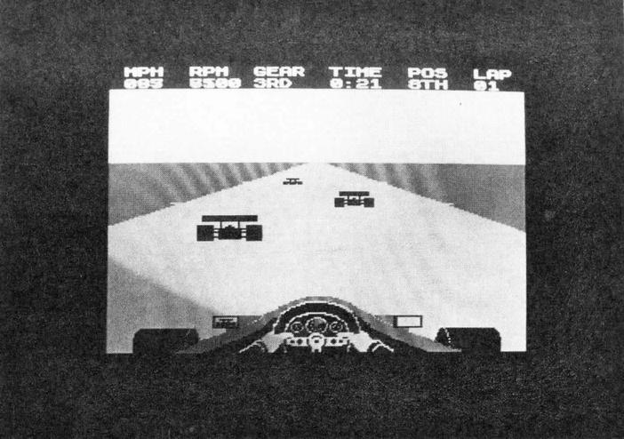

Стаття з журналу [ENTER Vol 2 #1](../enter-v2n1.md).

# RACE ACE

Dette spil minder noget om Pittstop, det meget populære spil til commodore 64 (undskyld jeg bander), altså en racerbil-simulering.

Før man kan komme til at køre, skal man bestemme hvilken af otte internationale racerbaner man vil køre på. Der er baner som Monza, Monaco, Kyalami og Silverstone. De ligner selvfølgelig de rigtige baner og de er alle af forskellig sværhedsgrad. Nogle har lange lige strækninger og andre har mange og skarpe sving.

Efter den svære beslutning det er at skulle vælge racerbane, får man lov til at bestemme om formel 1 raceren skal have manuelt eller automatisk gear. Det anbefales begyndere at starte med automatisk gear, hvorimod den øvede racerkører nok vil få mest glæde ud af manuelt gearskifte, da bilen vil accelerere hurtigere end med automatgear. Endelig skal man vælge hvor mange omgange et løb skal bestå af, enten 4 eller 8 omgange. Før man starter, bliver man informeret om det er en våd eller tør bane man får at køre på.

Nu kan testkørslen starte. Der køres fø en omgang på tid. Dels så man kan se banen og prøve den og dels bliver startplaceringen beregnet udfra tiden.

Nu sidder du i din racervogn og kigger ud. Nederst kan du se rattet, forhjulene og dine hænder, og øverst selve banen, der enten er lys eller mørk, alt efter om den er tør eller våd. Oven over himlen, der er trefarvet, er dit instrumentpanel placeret. Det er fuldt digitaliceret. Længst ude til venstre er speedometre, der måler i MPH, dernæst en omdrejningstæller, der næsten er uundværlig når man kører med manuelt gear. Herefter sidder en indikator for hvilket gear man kører i, 5 ialt. De tre sidste felter viser den brugte tid, din placering i feltet og endelig hvor mange omgange du har kørt.

Mens vi venter på starten, kan de sidste nerver nå at lægge sig. Pludselig starter motoren og stopuret begynder at tælle sekunderne. Joysticket presses fremad, motoren begynder at brøle og vejen sætter sig i bevægelse. Farten stiger og er nået til omkring 100 mph ved det første sving. Jeg flår joysticket, som også fungerer som ret, til højre, hænderne på rettet, og hjulene drejer til højre. Drejes der med høj fart, hviner dækkene og er farten alt for høj, kan man ikke blive på banen og man kører galt. Jo hurtigere man kører, jo hurtigere kommer banen og svingene mod en. Undervejs kommer der nogle små vejskilte ude i kanten og man kan herved se hvilken vej svinget drejer. Det første skilt viser om det er et skarpt eller blødt sving.

Efter utallige uheld kommer man efterhånden til det endelig løb. Her er der også andre biler på vejen. Fik du en god tid i testkørslen får du en god placering, men du skal godt nok have kørt hurtigt, hvis du skal blive placeret som nummer et. Du kan se positionen øverst til højre. Denne ændre sig med tiden hvis du overhaler andre eller selv bliver overhalet. En snedig detalje er sidespejlene. Her kan du se om du er ved at blive overhalet og kan herved blokere for din modstander. Hvis du er ved at gennemføre løbet skal du sætte farten meget op henimod slutning af løbet, da de andre kørere sætter deres hastighed meget kraftigt op.

Der er ingen af os, der har prøvet spillet, der er kommet ind på en af de tre første pladser, så derfor kan vi ikke rigtigt sige hvad der sker, men en placering længere nede i feltet giver ingen større festivitas.

Alt i alt synes vi, det er et endog meget godt og flot spil, der absolut kan anbefales. Dog synes vi der mangler en indikering for hvor langt man nåede på banen.

|               |     |
| ------------- |:---:|
| Grafik        |  9  |
| Lyd           | 10  |
| Fængslende    | 11  |
| Pris/kvalitet | 10  |

