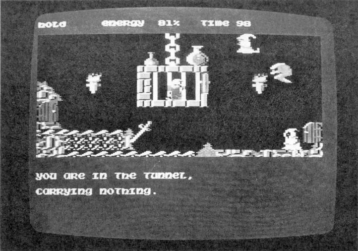

# SORCERY

For de fleste vil SORCERY nok være en gammel kending. I hvert fald for de medlemmer, der kender lidt til programmerne til både commodore 64 og armstradt.

Spillets handling er:

Jorden er vendt tilbage til den mørke middelalder. Den onde Åndemager og hans djævelske tjenere hersker overalt; de holder folket i trældom og udfører ubeskrivelige gerninger i hans navn.

Men der er stadig et lille gran af håb - DIG! I årevis har du, som den sidste af de store troldmænd, Sorcerne, arbejdet med hemmelige og mystiske problemer, i et tågeomkranset slot - beskyttet af magi mod Åndemanerens lavere livsformer.

Men nu kan du ikke længere holde jorden skæbne ud fra dine tanker. Otte af dine sorcere-frænder holdes fanget, blandt andet ved Stonehenge, hvor de er udset til at være ofre for grusom og djævelsk blodsudgydelse, der vil give Åndemaneren endnu større kræfter - kræfter der endog vil overgå dine. For at dette ikke skal ske er det nu din opgave at befri dine venner fra denne grusomme skæbne.

Spillets grafik er meget god og detaljeret. På lydsiden derimod, har producenten, Virgin Games Ltd., sparet en del. Der er kun de sædvanlige ZURP og ZAP lyde når man tager noget og slår en anden ihjel. I indledningen er der dog en udmærket lille melodi.

Redaktionen fik mulighed for at teste spillet på både en 64 og en 128. Det viste sig, at spillet er lige hurtigt, uanset hvilken maskine du spiller det på.

Prisen for Sorcery er 140 kr.

KARAKTER:  

|               |     |
| ------------- |:---:|
| Indhold       |  9  |
| Grafik        | 10  |
| Lyd           |  7  |
| Pris/kvalitet |  9  |

