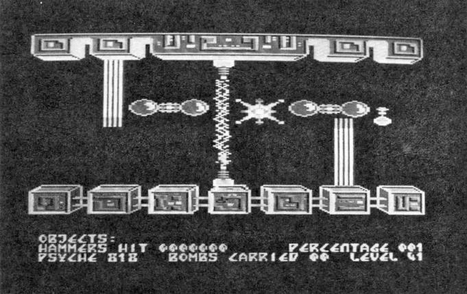

# THE ABYSS

**The Abyss** er et mærkeligt spil. Det tager sin tid at finde ud af hvad spillet egentlig går ud på.

En atomkrig efterlod jordens overflade ubebolig. Men dybt nede under overfladen, overlever menneskene i et virvar af labyrinter, kaldet «The Abyss».

Engang var hjertet af planeten næsten lige så god som overfladen. Der var lys, planter og smukke bygninger. Efter en tid var der nogle få stykker, der opdagede, at dette lys var kunstigt.

Men dette krævede en enorm organisation og derfor stolede man mere og mere på en supercomputer, kaldet RULER, the Result of Ultimate Learning and Educational Refinement. RULER kunne tænke og lære, og mennesket kunne underholde sig selv. Så RULER lærte og mennesket legede, indtil RULER en dag overtog det hele, smed de fleste menneske ud og sendte en hær af følelsesforladte robotter efter de sidst tilbageblevne.

Mennesket overlevede kun med nød og næppe. Der er kun nogle få, små lommer tilbage man stadig kan bo i. Resten af Abyss er fyldt med giftig gas og utallige fælder, sat af RULER til at fange de sidste overlevne.

Det kan ikke vare længe inden RULER for bugt med de sidste mennesker, men de har en sidste trumpf, som de kan bruge til at slå tilbage med. De har bygget en lille helikopter, der kan flyve gennem gassen og mørket. Den kan kun medbringe een passager, nemlig DIG.

Din mission er at finde vej gennem Abyss og tilintetgøre den gale computer. Alt du ved, er at der er 42 niveauer og tre sektioner med hule sektionen øverst.

Med mere end 1000 rum, tunneller og huller at udforske, synes missionen umulig, men husk på: Menneske racen afhænger af dig !!!….

I brugsanvisningen kan man så læse, at space-tasten er 'fire' knappen. Man sidder derfor og trykker til man bliver gasblå i ansigtet, men lige meget hjælper det. Okay; et par tryk på Reset og spillet 'loades' ind igen. Heller ikke denne gang hjalp det. Nå; så går man i gang med spillet for, tænker man, de har jo nok skrevet forkert i vejledningen (læses: vildledningen). Spillet som sådan er utrolig hurtigt. Efter en halv til en hel time har man så nogenlunde styr over den lille 'himstegims'. Man fiser op og ned, frem og tilbage uden man kan finde, hverken hoved eller hale på det hele. Ind imellem trykker man stadigvæk, mere og mere febrilsk, på samtlige taster for at der skal ske et eller andet på skærmen. Pludselig ændre den lille 'himstergims' form, fra en helikopterligende tingest til et lilla æg med pæne striber på. Hvad pokker, var nu det for en tast man fik trykket på ???

Hele tasteturet gennembankes igen for at finde tasten. Pludselig begynder 'ægget' at skyde som en gal, med laserstråle i kulørte farver. Så var der måske en mulighed for at få udryddet alle de sataner, der fiser rundt på skærmen og tapper ens energi.

Efterhånden som man får ram på dem, dukker der, til ens irretation, bare endnu flere op. Og det ser ikke ud til at ens pointtal øges af den heftige beskydning, så det opgives hurtigt til fordel for udforskning af de mange huler.

Så for sa…!!!

Nu blev 'ægget' igen til den lyseblå helikopter og der kan ikke skydes mere. Man trykker igen på «I» og den ændre igen form. Aha…., det er altså tasten «I», der ændrer formen, men kun i dette specielle rum. På et tidspunkt kommer man ind i et rum, hvor der ligger en bombe. Den samles op med tasten «U».

I nogle af de andre rum, er der en streg, der farer op og ned. Den skal man ikke flyve ind i, så dør man. Forresten har man kun et liv.

Lydsiden er da meget god de første 30 sek., hvorefter du føler, at den går gennem marv og ben. Den kan dog heldigvis afbrydes. Grafikken er meget pæn, et stykke over middel.

Lyder denne test forvirrende ?

Det er spillet ihvert fald, men alligevel er det muligt at få adskellige timer til at gå med det.

KARAKTER:

|                    |     |
| ------------------ |:---:|
| Handling           |  ?  |
| Grafik             |  9  |
| Lyd                |  3  |
| Underholdning/pris |  7  |
 
