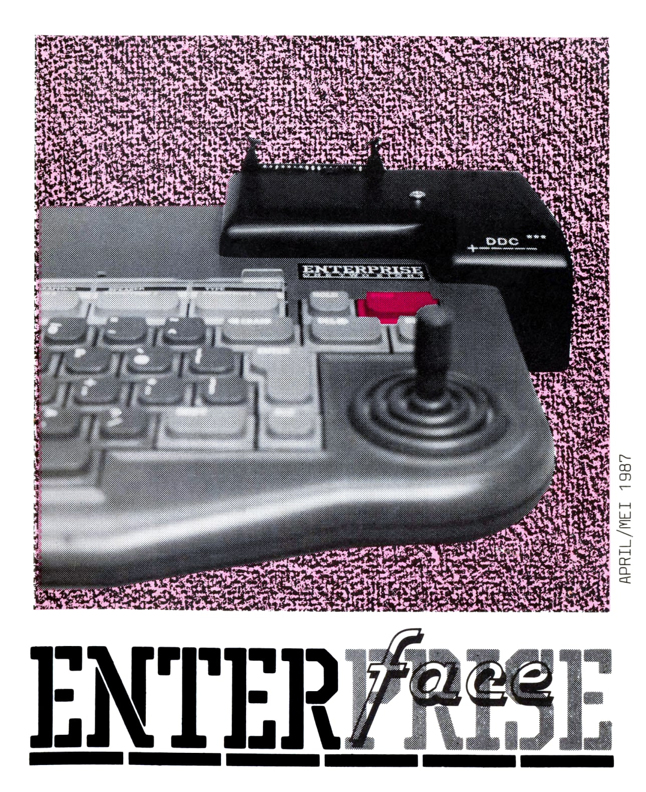

# ENTER*face* (1987.04-05)

[Оригінальний PDF](http://enterprise.iko.hu/magazines/ENTERface_198704-05.pdf)

## Зміст

Van de voorzitter  
Enter en Return  
Van het bestuur  
De Gelderse gebruikers  
GEN voor beginners  
De 60-dagenprijs  
Kwaliteit en Software-Library  
Nog een vergeten prijs  
Stichting Synthese Studio  
Spock  
VDUMP opnieuw  
Modem  
Tape: Index  
Programma bescherming  
Software overzicht  
Adressen  
Bericht van de penningmeester  

## Чернетка вмісту

"page-000.jpg" ------------------------------------------------------------ 
Warder

EEE Er

APRIL/MEI 1987
"page-001.ppm" ------------------------------------------------------------ 
INHOUDSOPGAVE

VOORPLAAT ............ 1 SPOCK nne. 13-14
INHOUDSOPGAVE …....... 2 VDUMP OPNIEUW .….…........ 15
COLOFON ....   .....n. 2 MODEM ..........nn 16
VAN DE VOORZITTER..... 3 TAPE: INDEX 17
ENTER&RETURN .…....... 4 PROGRAMMA BESCHERMING 18-19
VAN HET BESTUUR ....…. 5 SOFTWARE OVERZICHT .. 20-22
GELDERSE GEBRUIKERS .. 6 DRESSEN ne 23
GEN voor BEGINNERS ….. 7 VAN DE PENNINGMEESTER .. 2á
60-DAGENPRIJS ......…. 8
KWALITEIT EN SWL ..... 9 EXTRA
EEN VERGETEN PRIJS .. 10 JAARVERSLAG EN FINANCIEEN
SYNTHESE STUDIO &.... 11-12 aen NIETJES
GEBRUIKERSDAG-ALGEMEEN .….… - 16 MEI

H.F. Witte dorpshuis, Henri Dunantplein 4. DE BILT
bus 57 vanaf CS, haìte Nobellaan, Nobellaan in, 3e weg links

GEBRUIKERSDAG--ZUID - - 13 JUNI

Stichting Synthese Studio. Dorpsstraat 9, 6227 BK MAASTRICHT
op 0043-617623 vragen naar Rene terHorst of Jos Mulders

COLOFON

De ENTERFACE is het officiele orgaan van de Dutch Enterprise User
Group en verschijnd eens per twee maanden.

REDAKTIE .......i. Robin Ketelaars. G 2611 VN DELFT, 015-1264202

®
D
a
&
®D
WW
J

MEDEWERKENDEN .... Peter, Sonja. Eric, Stan, Spock, Patrick, Richard,
Rene, Jos, Gerrit, Jaco, Jan. Roelof

VOORPLAAT .…....... Het prototype van een Gelderse aktiviteit.
Een Disk Drive Controller die niet kan schuiven!

KOPIJ ............ Inzenden op DISK: of TAPE: tot 25 mei
Kopij niet op disk: of tape: betekent geen plaatsing
Gebruik alleen de ENTER-toets aan het eind van een
alinea, niet bij elke regel die toets indukken.
SAVEn met F2, <filenaam>.WP8. Geen kleur, geen Just.

OVERNEMEN ..…...... van de gehele of gedeeltelijke inhoud toegestaan
DRUKWERK ......... DRUK.TAN HECK, Pluympot 1 2611LX DELFT
BESTUUR .......... zie bladzijde 23, bellen op de aangegeven tijden!
SOFTWARE .…........ Inzenden naar: Reigerskamp 690, 3607 JP MAARSSEN

Aanvragen alleen schriftelijk met voldoende retour-
porto, anders ophalen op 16 mei in de bilt

2
"page-002.ppm" ------------------------------------------------------------ 
VAN DE WOORZITDTTER

De afgelopen gebruikersdag heeft een iets rustiger beeld gegeven dan we
normaal gewend zijn.

Voor het eerst is er van een presentie-lijst gebruik gemaakt. Zowel voor
de leden als voor het bestuur bieek het bijzonder nuttig te zijn. Namen
komen bij de gezichten en als je de naam leest spreek je makkelijker mer
de maker van een program.

Voor het bestuur was het zuiden wat ondervertegenwoordiad. Allee mensen,
het carnaval was aì lang voorbij en bovendien, ge behoeft Uw roes toch
niet thuis uit te siapen.

In de loop van de middag heeft de hardware-sectie over verdere mogelijk-
heden van de machines met elkaar van gedachten gewisseid. Er werd gezocht
naar een merhode om het video geheugen dat door NICK wordt aangesproken
verder uit te breiden.

Aan de gezichten te zien lag een optossing niet zomaar voor het oprapen.
Maar ja. je laat je toch niet ringeloren door een computer ook al is het
een ENTERPRISE! Waar een wil 1s.....

Bij de bibliotheek had Patric een communicatie-board in een ‘voltooid’
stadium liggen.

Wie mocht denken dat het overgooien van een byte van de ene computer naar
een andere computer simpel, is moer het zeif maar eens samen met een
vriend proberen. Neem dan wei een rauw ei, want als je een byte verkeerd
opvangt zit je ook met de brokken.

Van het software-front zijn een paar dingen te melden. Het is bijzonder
prettig om de goede ontwikkelincen voor wat betreft het gestructureerd
programmeren. bij de verschillende ENTERPRISE gebruikers op te merken.
Meestal zijn de latere programma's vele kwaliteiten beter dan de eerste
uitgaven. ,

Ook ik (en wie niet?) kijk wel eens mijn oude programma's terug. Daarbij
realiseer ik me dat het inzicht in de computer en\of de software pas is
gekomen met het zeif maken van orogramma's. De REM KILL-routine die ik
deze keer bij de bibliotheek heb ingeleverd is nog alles behaìlve perfect,
maar voorlopig werkt het wei!

Al doende leer je het gereedschap van BASIC, LISP, EXDOS en EXDOS steeds
beter gebruiken.

Wie zich niet wil neerleggen bij de grenzen van de systeem-software
broedt op ontsnappingsmogelijkheden. nietwaar Hennes? Een computer is en
blijft de dienaar van de mensen en niet andersom!

De bevestiging van de bovenstaande stelling bieek uit het werk dat Sonja
Labordus door de ENTERPRISE laat doen.

Van de vele patronen die zij met haar plotter uit de machine weet te
halen waren enkele gerealiseerde voorbeelden als fotokopie te zien. Een
fraaie combinatie van oud ambachtelijk handwerk en moderne technieken.

Sa

"page-003.ppm" ------------------------------------------------------------ 
ENTER EN RETURN

Dit is de VRAAG en ANTWOORD-rubriek van de ENTERFACE. In deze rubriek
zullen we vragen van lezers aan lezers opnemen. Als we zelf een antwoord
weten zullen we dit gelijk melden. Stuur je vragen naar de redaktie of
bel tussen 19 en 20 uur naar 015-126422.

VRAAG van heer Liebenstein op 058-882499
Ik heb een TAXAN Junior RGB-monitor, maar het dins doet het nie
ik den opzoek naar een GO-spel of mensen die daar mee bezig zi

ANTWOORD van de EXPERTS
De exoerts 1m

de opiossing, want

VRAAG van Hans Roelofs (zie bestuur)
Kan het niet gemaakt worden dat je meteen in de WP komt met 80 tekens?
Wie kan er een lichtpen maken voor onze computers?

ANTWOORD van de EXPERTS

ve zou in de HPB mode : EET ee: DE ELAL En

oraaramma dat in de
wael de bron=t nebben, anders 1e

lela) rij zouden deze

VRAAG van SPOCK
Kijkt er eigenlijk wel eens iemand naar BRANDPUNT-IN-DE-MARKT?
Wel doen hoor, en ook het jeugdjounaalweerbericht en de verkiezingen!

ANTWOORD van de REDAKTIE
Ja, maar kopij blijft welkom. zend ze in geschreven onder de WP in 80
tekens. De rechter-kantlijn een TAB naar links. SAVEn met F2. NIET
PRINTEN, want dan werken de funktietoetsen niet meer goed bij het
EDITen. Je houdt geen alinea's meer over alleen maar regels. Net zo
als je bij elke regel op ENTER drukt. De WP heeft trouwens woord-
omslag, dus je tikt vanzelf verder op een nieuwe regel.

VRAAG over de ENQUETE
Kun je ze nog opsturen? Wanneer komt de ledeniijst in de ENTERFACE?

ANTWOORD van de REDAKTIE
Je kunt ze nog opsturen, de volgende ENTERFACE in juni bevat de
uitslag. Tevens zal hier ledenlijst instaan.

VRAAG van de REDAKTIE
Heb je vragen of problemen, schrijf ze aan de rubriek ENTER en RETURN
en dan zullen de EXPERTS ze proberen te beantwoorden.
Heb je ANTWOORDEN op vragen geef ze dan direkt door aan de betreffende
personen en aan de redaktie als kopij voor het volgende nummer.

OP DE GEBRUIKERSDAG OP 16 MEI
KRIJGT IEDER LID 2 KONSUPTIEBONNEN

Eed
"page-004.ppm" ------------------------------------------------------------ 
VAN HET BESTUUR

AANKONDIGING LEDENVERGADERING

Hierbij nodigen wij U gaarne uit tot bijwoning van de algemene ledenver-
gadering die gehouden zal worden op de gebruikersdag van 16 mei a.s., om
13.30 uur. in een zaal in het H.F.Witte Dorpshuis ze De Bilt.

Agenda
1 OPENING EN MEDEDELINGEN.
2 KEURING NOTULEN DD 21-06-86 (zie Enterface dec.” 86)
3 VASTSTELLEN AGENDA
4 JAARVERSLAG DOOR DE VOORZITTER
5 VERSLAG VAN DE KASKOMMISSIE
5 KANDIDAATSTELLING/HERVERKIESBAARSTELLING BESTUURSLEDEN
7 PAUZE
8 VERKIEZING NIEUW BESTUUR EN NIEUWE KASCOMMISSIE
9 VERSLAGEN VAN DE HARD- EN SOFT-WARE SECTIE'S
10 VERSLAGEN VÄN DE KONTAKTPERSONEN VAN DE EEGIONALE GROEPEN
11 VERSLAG VAN DE AFDELING ENQUETES
12 TOEKOMSTIGE AKTIVITEITEN
13 BEGROTING EN VOORSTEL KONTRIBUTIE 1988.
14 RONDVYVRAAG
15 SLUITING

HUISHOUDELIJKE MEDEDELINGEN

KONTAKTPERSONEN voor zeeland en limpurg hebben zich nu ook gemeid. Dit
Zijn voor Zeeiand: Ben Sinke en voor Limpbura de Synthese Studio. Op de
een na laatste pladzijde staan hun adressen:

Rectificatie: In het vorige nummer stond niet de goede naam voor kontakt
brabant vermeid. dit moet zijn: Rob Hanssens (sorry Rob!)

Wie geeft zich op voor regio Oost? d

Door een misverstand is in de vorige ENTERFACE nog geen verzoek tot
overmaking van de KONTRIBUTIE “87 a f 45,- gedaan. daarom verzoeken ik
de leden. die nog geen voor “87 geìdige lidmaatsschapskaart hebben ont-
vangen. het bedrag voor 15 mei over te maken op POSTBANK 5689669 t.n.v.
Penningmeester Dutch ENTERPRISE User Group te ZOETERMEER.

Voor de AANMOEDIGINGSPREMIE is de keuze deze keer gevallen op de
auteur: .…... met . Van harte gefeliciteerd .... met dit resultaat!

zie verder in Zik ziat. Pede}

Graag verwelkomen we dit maal de volgende NIEUWE LEDEN:

UW SEKRETARIS ERIK BERENDS

"page-005.ppm" ------------------------------------------------------------ 
DE SELDERSE GEBRUIKERS

De gelderse gebruikersgroep bestaat op dit moment uit zeven aktieve
ENTERPRISE gebruikers, die in huiselijk verband, ongeveer om de twee
maanden, tussen de landelijke gebruikersdagen, bij elkaar komen.

Op vrijdag 3 april was het alweer de zesde keer dat er een avond werd
gepraat over hard- en software. Probiemen werden opgelost en er werd
nagedacht over onze nieuwe diskinterface.

Deze gedroeg zich ais ramdisk prima, maar het dataverkeer met de floppy-
drive verliep echter minder goed.

‘Een boreiìiing met een groeistuipje'. zoals Jan Versteeg, de printontwer-
per van onze nieuwe DISK DRIVE CONTROLLER opmerkte.

De spoorbezetting van de DDC-interface is gelijk aan die van de oude
ENTERPRISE-controller, en naar wij hopen ook compatible met het back-
plane, waar wij nooit iets van horen.

Gaarne meer informatie hierover.

Het is de bedoeling om voor de DDC een professionele print te laten
maken, die voor de geinterresseerden op de eerstvolgende gebruikersdag is
te bestellen.

Een vraag aan ingewijden: wie kan aan betaalbare connectors komen voor
aan de computer? Wij vinden zestig gulden voor een cardedge plus een
stukje bandkabel eigenlijk te duur.

Op de voorkant van deze ENTERFACE kun je vast een idee krijgen van de
uitvoering van de interface. Tot ziens in De Bilt!

Peter van Helvoirt, Nieuwedijk 3, 6669 DE DODEWAARD, 08885-2186
LAATSTE NMIEUWIJES A44 11

Het gerucht gaat dat de duitsers 16000 ENTERPRISE-computers aan POLEN
hebben verkocht. Zij gaan zelf Duitse versies maken, met Duitse tastatur.

COMPUTER noemen ze het in ENGELAND. dit betekent REKENAAR
SPEIGERN noemen ze het in DUITSLAND, dit betekent OPSLAAN
ORDINATEUR noemen ze het in FRANKRIJK, dit betekent ORDENAAR
WAAROM noemen we het in NEDERLAND eigenlijk niet ORDENAAR?
Wat doen we er dan anders mee dan het op een goede volgorde zetten van
alle machineinstrukties, al dan niet in een hogere taal?

Na de ledenvergadering op 16 mei zal worden ingegaan op de struktuur van
IS-BASIC.

Er zijn drie lege ENQUETES teruggekomen, wie heeft er GEEN gekregen?

In BELGIE is nu ook een gebruikersgroep opgericht, en in ENGELAND blijkt
er toch ook nog aktiviteit te zijn onder ENTERPRISE gebruikers!

"page-006.ppm" ------------------------------------------------------------ 
GEN VOOR BEGINNERS
Tot nu toe heb ik op de ENTERPRISE voornamelijk in hogere programmeerta-
len gewerkt, zoals BASIC, PASCAL en FORTH.
Sinds de laatste Gebruikersdag heb ik echter een ‘TECHNICAL MANUAL'
waarin de werking van EXOS wordt toegelicht. Met huip hiervan ben ik aan
het experimenteren gesiagen met machinetaal. Dit is een verslag van mijn
ervaringen. Het is wellicht een hulpmiddel voor degenen die dit ook eens
willen proberen.

De assembier die ik gebruik is GEN. GEN is een assembier geschreven voor
de ENTERPRISE. De bijgeleverde hnandieiding is helaas niet veel bijzon-
ders. Met name de specifieke ENTERPRISE-zaken komen niet voldoende aan de
orde. Hier biedt de TECNHICAL MANUAL uitkomst.

Mijn doel was het schrijven van een programma om de funktietoetsen te
definieren. Ik wilde dit programma ais systeemextensie kunnen laden.

Voor de duidelijkheid: een systeemextensie is een programma dat permanent
(in eìk geval tot de serstevolgende koude start) in het geheugen geladen
wordt en daarna aan te roepen is aìs 'dubbele-punt-kommando'.

GEN bijvoorbeeid is zeìf ook een systeemextensie.

Het aanroepen van een systeemextensie gaat gepaard met een zogeneten
action-code. Deze geeft aan wat de extensie moet doen. bijvoorbeeld
informatie geven na :#ELF of het geven van sen foutmeiìding.

Het schrijven van de software die dit organiseert is niet nodig; in de
softwarebibliotheek van de club is een standaard 'HEADER' te vinden,
geschreven door Richard Sargeant en Patrick van Voorn. Er zit echter

geen toelichting bij.

Deze header kan als kader worden gebruikt waarbinnen het eigenìijke
programma wordt geschreven. De versie die momenteeì in de bibiìiiotheek zit
heeft helaas een gemeen foutje. Als hij in GEN geladen wordt en je geeft
een list-kommando, loopt de ENTERPRISE vast bij het afdrukken van de
laatste regeì. Dit foutje zit niet in de tekst van de header. maar in een
aantal controì-karakters aan het einde van de file. Dit laatste is goed
zichtbaar ais vanuit IS-DOS het kommando TYPE XR SEAT : wordt gege—
ven: aan het einde van de listing verschijnen enkele puntjes.

De WORD PROCESSOR biedt een oplossing:
= ga naar de WP in 80-koloms mode
— laad XR HEAD.GEN in de WP
— toets F3 (PRINT) en dan GEEN <ENTER> maar XR_HEAD.GEN <ENTER>

De header kan nu wei foutloos geladen worden.

In de volgende ENTERFACE vertel ik over het gebruik van de header en
het maken van je eigen system-extensie in GEN.

Jaco Dubbeldam, van Poelgeestiaan 59, 2352 TB LEIDERDORP, 071-892368

"page-007.ppm" ------------------------------------------------------------ 
DE SO-DAGENPRIJS

Wat mij op viel bij de beoordeling van de bij de SoftWare Library
binnengekomen nieuwe programma's is, dat de meeste aandacht uitgaat naar
de uitstekende grafische eigenschappen van de ENTERPRISE en maar heel
weinig aandacht wordt geschonken aan de, toch ook niet slechte, muzikale
mogelijkheden.

Dit is een dus verka
voral de geluidsmoge

oragramma’s, waarhij
ns

oren tat het insture
eten oo de VET an

Het programma wat ik het beste vond is OXYGENE. BAS.
Dit is geschreven door Kees Bevaart uit Zuidland.

Dit programma laat het nummer Oxygene horen, geschreven door Jean
Michelle Jarre.

Als men het programma runt. krijg je eerst een bizar en onheiispellend
openingsbeeld te zien. Dit bestaat uit een wereldbol met daar over heen
een doodshoofd.

Daarna wordt de muziek van Jarre heel goed weergegeven.Wanneer de muziek
via de hoofdtelefoon wordt beluisterd komt deze het best tot zijn recht,
omdat nu het stereo-effekt goed hoorbaar is.

Het programma is geschreven in BASIC.

Daar dit vrij overzichtelijk gebeurt is. is het voor diegenen onder, ons
die graag mogen spitten in andermans programma's om te kijken naar het
hoe, wat en waarom, niet al te moeilijk om daar achter te komen.

Al met al is dit een goed voorbeeld dat zelfgemaakte programma's niet
hoeven onder te doen voor profesionele programma's.

Gerrit Idsardi, de Baander 57, 9356 CL Tolbert

NOOT VAN DE EXPERTS

In dit programma is goed gebruik gemaakt
maar er is nog iets wat sommigen nief Weten. ij :
Je hoeft de aanroep CÔiL niet na het declareren van een DEF=statenent te
gebruiken, het mag er ook voor staan. (hij KEEE staan ze erna)

Dit kont omdat het programma eerst helemaal gelezen worat door de BASIC
interpreter en alle DEF's dus al bekend zijn voordat en echt iets van bet
programma uitcevoerd gaat worden.

Bij KEES kant het er or neer dat je dat een nog mooier gestrukturserder
erogranra krijgt wanneer je dit doefs

100 PROGRAM "zing" 140 DEF FARTI 180 DEF FARTE
110 CALL PARTI 150 SOUND | vaaer jacan 190 SOUND ! alle eendies
120 CAL PFARTE 140 END DEF i ZOO END DEF

126 END . 170 } \ 2i0 !
"page-008.ppm" ------------------------------------------------------------ 
OVER DE KWALITEIT DER SWL

De kwaliteit van de nieuw binnen gekomen programma's, welke door mijn
persoontje beoordeeld zijn, is me over het algemeen heel erg meegevallen.
Er zit voor iedereen wel iets voor zijn gading bij.

Zo is er een programma geschreven in Pascal (Quasar?) en eentje waar men
onder IS-DOS zelf de funktietoetsen kan benoemen.

Verder zijn er veeì programma's waar vooral de grafische kant van de
ENTERPRISE naar voren komen. Heel fraai is een tekening van "de computer’
zelf. Ook een weer-simulatie en een ruimtevlucht-simulatie mogen er zijn.
Jammer dat er geen geluid bij zit, hier door was het resultaat nog beter
geweest .

Ook de edukatieve programma's ontbreken niet. Hier is veel zorg aan
besteed. alleen zijn ze nog niet 100 procent foutvrij en heb je niet de
mogelijkheid om via het hoofdmenu te stoppen. Dit moet nu via reset
gebeuren.

De spelletjes die zijn binnengekomen zijn over het algemeen redelijk
gebruikersvriendelijk. Hiermee bedoel ik dat je niet eerst de listing
moet doorwroeten om er achter te komen wat er van je verlangt wordt.
Zelfs een programma beveiligen en het opbellen met behulp van het
toetsenbord is mogelijk.

‘Er is slechts 1 programma waar de muziek de boventoon voert.

Al met al is er voor 'elck wat wils' en stuur ook jou zelfgemaakte
pfogramma's op naar de SoftWareLibrary.

Gerrit Idsardi, de Baander 57, 9356 CL Tolbert

DE SWL OVER DE KWALITEIT

In de periode van 17 januari tot 13 februari hebben wij voor elke groep
wat binnen gekregen.

Jammer genoeg moesten wij (zoals meestal) een aantaì inzendingen gelijk
weggooien, omdat wij totaal niet wisten wat de bedoeling van het
programma was. bijivoorbeeig gat net orogramma start met

Er zijn ook een paar pregramma's afgekeurd omdat er te weinig uitleg bij
zat. Al dan niet in een document file.

Ook kwam het voor dat een programma te veel 'BUGS' of algoritmische
fouten bevatte.

De laatste tijd wordt er strenger geselecteerd op de binnen gekomen
software. Dit wordt gedaan omdat de gemiddelde kwaliteit gestegen is, en
de bibliotheek nu een dusdanige omvang begint te krijgen dat niet alle
programma's meer geplaatst worden alleen om de bibliotheek wat uit te
breiden.

"page-009.ppm" ------------------------------------------------------------ 
NOG EEN VERGETEN PRIJS

Gelukkig blijven er voldoende leden die bereidt zijn hun programma's
kosteloos aan ons ter beschikking te stellen. In sommige van deze
programma's zit heel wat werk, en zijn keurig afgewerkt aan ons
afgeleverd.

Bijvoorbeeld de BUISINESS-programma's GRT_BOEK.BAS en HUISHBOE.BAS

Dit keer hebben wij ook weer een muzikaìs inzending gekregen, nl DURAN-
DURAN.BAS. dit staat onder DEMO in de SWL.

Ook voor de teken fanaten zijn er twee nieuwe teken programma's, waarbij
de meegeleverde demo van SUPER-DRAW erg indrukwekkend is.

Voor de CP/M programmeurs is er nu een handige utility om het keyboard
aan te passen. (Ook de function keys zijn niet vergeten.)

Zoals u ziet voor elk wat wils |!

Omdat er over deze periode nog geen 60-DAGENPRIJS is gevalien hebben
wij de programmeur van AVONTUUR .BAS (PROGRAMMING),
Koen van Eijk uit Hilvarenbeek gekozen aìs winnaar voor januari/februari.

“Dit programma zorgt er voor dat iedereen zonder programmeer
kennis in staat is een adventure te maken Ik

Zo begint de meegeleverde documentatie voor dit zeer uitgebreide
programma. Maar als dit niet genoeg was, is er binnen het programma de
mogelijkheid een handleiding oniine te raadpiegen | (schitterend)

Door gebruik van verschillende menu's kan een vrij uitgebreid adventure
gemaakt worden. Die ondermeer verschillende personen en voorwerpen bevat.

Het programma heeft een keurige lay-out hoewel de kleuren keuze misschien
aangepast moet worden voor sommige monitoren.

Af en toe schiet de error handling te kort, en krijgen wij de vreemde
melding 'Insufficient memory.'

Tijdens het laden van een font of een adventure ( en andere tijdrovende
dingen) zou het prettig zijn als er een teken van de computer komt dat
deze wat aan het doen is.

Ondanks deze twee laatste opmerkingen is het programma voor iedere
adventure/games liefhebbers aan te bevelen. En wachten wij op uw
eigengemaakte adventures !

De vrijwilligers van de SOFTWARE LIBRARY

Richard Sargeant & Patrick van Voorn.

2o
"page-010.ppm" ------------------------------------------------------------ 
STICHTING SYNTHESE STUDIO

Als horen en zien vergaan,
zo ver gaan dat je hoort wat je ziet
en ziet wat je hoort,
weet dan : het tijdperk van synthese breekt aan.

De STICHTING SYNTHESE STUDIO bevordert kreatieve samenwerking in proiek-
ten waarbij geiuid =n beeld op zinvolle wijze worden samengevoegd. Daarom
organiseren we diverse kursussen. workshops, lezingen. demonstraties,ex-
posities, performances. konserten. publikaties enzovoorts (voor meer in-
formatie zie onze brochure bij de SWL).

In dit kader passen ook ENTERPRISE gebruikersdagen. De eerste is gepland
op zaterdag 13 juni van 12.00 tot 17.00 uur. In onze kennissenkring be-
vinden zich reeds vier gebruikers die met hun Enterprise aanwezig zullen
zijn. Verder is natuurlijk iedereen weiìkom.

We gebruiken onze ENTERPRISE aìs instrument voor audio-visuele

synthese. Het ligt voor de hand om graphic statements te kombineren met
sound-statements. COLOUR WHEELS, een eenvoudige BASIC-compositie, is via
de SWL te bestellen.

In de compiete studio verzorgt de ENTERPRISE de graphics bij onze muziek,
gespeeld op een zooitje anaioge synthesizers, een ritmeboxen sinds kort
ook een MIDi-keyboard.

INTERFERING, een vereenvoudigde versie van een graphic programma. waarbij
de interface met de synthesizers is weggelaten, kan ook via de SWL worden
besteid.

Onze edukatieve activiteiten zijn ook gebaseerd op de ENTERPRISE. Aan de
hand van blokschema's, tekeningen en teksten op de t.v. en geprint op
papier verduidelijken we de inhoud van de kursussen, bijvoorbeeld de
wisseïiwerkingen tussen de synthesizers, kombuters en andere audio- en
video apparatuur. Vanwege de gestruktureerde BASIC gebruiken we hem ook
voor sortware kursussen. Als laatst is nog te vermelden dat onze zwaar
overwerkte ENTERPRISE (hij protesteert alleen als we hem uitzetten) ook
de administratie van de stichting verzorgt.

KOMMUNIKATIE MET ANALOGE SYNTHESIZERS EN RITMEBOXEN

De acht datalijnen van de PRINTER-uitgang gebruiken we als TRIGGER-
UITGANGEN. In BASIC maak je met de instruktie OUT 182.0 alle uitgangen
laag (O Volt) en met OUT 182,1 t/m 255 een of meerdere uitgangen hoog (4
Volt).

INGANGEN voor het inlezen van triggersignalen kunnen op de JOYSTICK-poort
worden gemaakt met de volgende schakeling op de volgende bladzijde.

In de 74LS126 zitten vier buffers die op deze manier de schakelaars van
de joystick simuleren. In BASIC kunnen deze vier signalen ingelezen
worden met de functie JOY(1), (zie manual blz. 197)

11
"page-011.ppm" ------------------------------------------------------------ 
S.-S.-S. VERVOLG

Wanneer je het onderstaande testprogramma runt, kun je aan de getailen.
die samenvaìlen met de joystickrichtingen, afiezen welke signalen je
binnenkrijgt.

100 DO
ii ER

iz6 LCOP

Enkele toepassingen zijn bijvoorbeeld het besturen van een graphics
programma met synthesizers, het uitsturen van trigger patronen en
synchroniseren van audio-visuele processen.

Met MIDI ‘Music Instrument Digitai Interface) kunnen synthesizers en
computers op een veel hoger nivau communiceren. Een artikel over de

aanpassing van de seriele poort en de bijbehorende software is in
voorbereiding.

Mochten er over het bovenstaande vragen rijzen neem dan contact op met

STICHTING SYNTHESE STUDIO, DORPSTRAAT 9, 6227 BK MAASTRICHT, 043-617623

En vraag dan naar : Rene terHorst of Jos Mulders.

122
"page-012.ppm" ------------------------------------------------------------ 
SPOCK SEEET TIPS

Je kunt beeld en geluid opslaan op DISK: en TAPE: . Dit kan niet alleen
met 'EXTENSIONS' zoals VDUMP ed., het kan ook in gewoon BASIC. Je moet
alleen even weten hoe dat eigenlijk gaat.

Hetgeen je opslaat is de 'ESCAPE-SEQUENCE' die het eigenlijke beeld of
geluid vanuit BASIC maakt. Je hoeft deze dus alleen maar om te leiden.
CR dj in Mer ï ten op te slaan op je eigen medium.

We hebben nu niets gehoord, alieen het geluid van draaiend TAPE: of DISK:
Om het geluid, de melodie of het muziekstuk te horen kun je doen:

of doe

:
:
:
:
1
:

Onder IS-DOS kun je het geluid nu ook laten horen. Wanneer je nog niet in
‘BASIC bent geweest moet je eerst de geïuidsbuffer niet meer nul maken.
dan Xun je het geluid of de geluiden laten horen.

eerst dit hoeft maar een keer!
dan
of voor veel muziekplezier!

Dit zelfde kun je ook doen met een plaatje dat je in basic hebt gemaakt.

CT EL
176 EMD JEF

Je zag nu natuurlijk niets gebeuren. Wil je het plaatje zien dan doe je:

af 180 GRAFHICS

190 EXT “COPY

Onder ISDOS mist de mogelijkheid plaatjes te laten zien. Het moet volgens
de EXPERTS mogelijk zijn om ISDOS een grafisch scherm te geven dat je
naar believen kunt openen met bv. BHOFEN GRAPHIC (wie o wie).

1:53

"page-013.ppm" ------------------------------------------------------------ 
SPOCK SLAAT TEKENS OP

Hier een truuk om tekens op te slaan op DISK: of TAPE:
100 OPEN £52 "SPACE. CHR" ACCESS OUTPUT
110 SET EE:CHARACTER 85,62. 54, 64, 40,2, 2, 124
120 CLOSE £5

Wii je dit teken hebben dan doe je

onder BASIC IE EXT PE
onder EXDOS : COPY
onder ISDOS ArCOPY SFOC

Heb je bijvoorbeeld een programma waar een mooie of andere tekenset in
voorkomt en je wilt die graag een andere keer gebruiken dan is onder
staand programma erg handig om die tekenset op te slaan.

Je zet het programma in bijvoorbeeld PROGRAM 1 en je tikt

CHAIN 1 C*terans}

Je krijgt dan het file TEKENS.CHR dat je dus kunt laden zoals boven. Ook
onder de WORDPROCESSOR kun je deze tekens laden. je drukt F8 en tikt

COFY TEEENS, CHR VIDED:

Hier is het programma:

PRINT EE: CHR (SPEEK
NEXT
NEXT
0 CLOSE £Z

THAEN DEI)
0 END

Je zet dus de 'ESCAPE-SEQUENCE' voor een tekenverandering in een file.
Hier is dat ESCAPE K <tekennummer> en 9 bytes voor te definieren teken.
In BASIC dus: SET Enummer: CHARACTER tekennummer,a,b,c,d‚e,f,g,h,i

In rvegelnummer 200 staat CHAIN O(1) dit kun je gebruiken om direct weer
naar PROGRAM O0 te komen. Je programma runt meteen. Wil je dit voorkomen
dan tik je in:

100 PROGRAM "filenaam. BAS" (STOP)

110 IF STOP THEN STOP

120 i-- hieronder staat dus cauw oragramma
"page-014.ppm" ------------------------------------------------------------ 
VPUMP OPNIEUW
EE OON LEDW oo
Het VDUMP.XR programma is als een zg.'RELOCATABLE SYSTEM EXTENSION! in
omloop. Dit betekent dat van elk byte moet worden aangegeven of het een
absolute waarde voorstelt, danwel een relatief adres.

De methode die EXOS volgt is het interpreteren van extra bits bij het
inlezen van de bitstream.

Het absolute byte 10011001B-99H-153 zal worden vooraf gegaan door een
extra 9. In de bitsrream is dit O10011001B maar op de disk is het 4CH en
het laatste bit wordt het eerste bit van het volgende byte.

Met dit doorschuiven van bits blijft er weinig herkenbaars over.

Er is echter een lichtpuntje. het byte GOH met de extra 0 zal op schijf
minimaal 9 opeenvolgende nullen geven. De twee G-nibbles zijn terug te
vinden, al dan niet verdeeld over een of twee bytes.

Om een lang verhaal kort te maken: byte 272 van VDUMP.XR heeft de waarde
2DH-45. Voor de double density mode moet dit 31H-49 zijn.

Voor het veranderen van 8/72 naar 5/72 linefeed moeten twee bytes worden
gewijzigd, omdat essentiele bits aan een volgend byte zijn overgedragen.
Byte 623 heeft de waarde J4H-4 en moet O2H-2 worden. Daarna moet byte 624
veranderen van 3FH-63 in BFH-191.

Zonder disk-utility programma's kan ieder met een diskcontroler een
‘RAMDISK openen.

Doe dan: 12

Prik met # ;
7 zijn. Klopt dit, dan

h t juiste segment, dit moet de waarde
bent U aì een eind op weg.

testen op 45 en met SFOEE 5

Zijn de laatste twee bytes gewijzigd dan is :COFY Er &
het sluitstuk van de operatie. :

o
h
G
La)
7
<
mi
—ì
T-
Ti
ri

Onderstaand BASIC-programma doet eigenlijk hetzeifde:

ne
ti

tied EÌ

iT HBVTE 27E"

El PRINT “BYTE &
THEN BEECHREL LOI): PRINT “BYTE 424"

21 CLOSE Efi

"page-015.ppm" ------------------------------------------------------------ 
MODEM

Het gebruik van een MODEM via de serial/net aansluiting van de ENTERPRISE
valt nogal tegen, omdat EXOS te traag is om snel achter elkaar binnen-
komende karakters te ontvangen.

Ik heb een machinetaalprogramma geschreven, dat geen gebruik maakt van
EXOS en hierdoor veel sneller is.

De eigenschappen van dit communicatieprogramma zijn:

“__Baudrate 300/300. 1200/1200, 1200/75 en 75/1200. Met kleine wijzi-
gingen zijn andere baudrates mogelijk. tot 4800 baud (9600 op 128k-
6Mhz)

* 80 koloms scherm met scrolling. De schermbesturing is snel genoeg om
binnenkomende text bij te houden (XON-XOFF is niet nodig).

* Het modem moet aangesioten worden op de seriai/net connector.

* Het programma maakt communicatie mogelijk met met computers van
bedrijven, universiteiten, andere modemgebruikers en bulletinboards
zoals HCC-f ido.

* Het programma staat op cassette en wordt gestart vanuit Basic.

U kunt het programma bestellen door f 25.- over te maken op mijn gironummer

Een viditelprogramma en een programma om fiies over te sturen (XMODEM) is
in voorbereiding.

Op de gebruikersdag, 17 januari. demonstreerde ik een prototype van een
speciaal voor de ENTERPRISE ontwikkeid MODEM. Als er voläoende belang
stelling is, (ca. 5 personen) wordt voor dit modem een printplaat
ontwikkeld. Het gaat dan f 280.- kosten, kompleet met kastje, connectoren
en bovengenoemde software. Eigenschappen zijn (onder voorbehoud):

* V21 en V23 standaard (300/300, 1200/75 en 75/1200 baud, originate en
answer)

* modem IC AM7910

* gescheiden van het telefoonnet dmv optocouplers

* afmetingen 10 bij 5 bij 2.5 cm.(of iets groter. afhankelijk van het

printontwerp). Dit kastje wordt achter op de ENTERPIRSE gestoken in

de seriaì/net en control2 aansluitingen. De printeraansluiting blijft

vrij bereikbaar voor de printerkabel.

LED's voor: 300bd, 1200bd, receive, transmit, carrier, online.

autodial (modem beïit zeif op, geen telefoon nodig)

autoanswer (modem neemt zelf 'de hoorn van de haak')

bediening geheel softwarematig vanuit de ENTERPRISE

Voedingsspanning vanuit de ENTERPRISE ( 5 volt, 200 mA )

Ook met andere computers te gebruiken. (RS232 compatible)

XN 4 A Ot

Als U belangstelling heeft, schrijf dan even een kaartje. U krijgt dan zo
spoedig mogelijk bericht. De levering zal in April zijn.

Roelof J.Horst, Moienstraat Zé, FELË

"page-016.ppm" ------------------------------------------------------------ 
TAPE: INDEX

Hier een programmaatje dat een index maakt van wat er op een bandje staat.
Deze index wordt in eerste instantie op het scherm geprint en kan door
middel van het veranderen van de variabele LIJST op regel 140 naar de
printer worden gestuurd.

Het werkt aisvolat: In regeì 170 wordt de header van het eerste programma
binnengehaald. Daarbij wordt de naam van het programma in de statuslijn
gezet. Omdat de computer verder caat met de uitboering van het indexprog-
gramma blijft deze naam in de statuslijn staan.

In regel 190 gaan we letter voor letter op het scherm printen door middel
van een for-next-lus.

28: L
NATER IE

Nu ook nog een listing om een kopie van een heie tape te maken. Je hebt
dan weì twee cassette recorders nodig. Deze sluit je dan aan op INPUT en
REMI, en OUTPUT en REM2. De bestemming is natuurlijk ook te vervangen
door een disk, maar dié bezit ik helaas nog geen interface.

nnn

Es 5&bS DE DODEHAARD

127
"page-017.ppm" ------------------------------------------------------------ 
PROGRAMMA BESCHERMING

Er zijn een aantal redenen te bedenken om programmatuur te beschermen.
Een van deze redenen is dat je niet wilt dat iemand iets veranderd in het
door jouw geschreven BASIC-programma.

Wanneer in een programma geen enkele verwijzing naar een regelnummer
staat ‘nang sen goede mazen am PE ‚ dan kun
je met het programma REG _NUL.BAS al le regelìnummers op nul zetten.

Zelfs een 32k groot programma, zoals EXOS M28.8AS, kan werken met alleen
regelnummers nul.

Je kunt in 1S-BASIC geen regelnummers @ invoeren dus je kunt ook een
regel niet veranderen.

De LIST en RUN commando's worden door deze truuk niet beinvloed.
geeft onmiddelijk ak, want deze regel bestaat immers niet!
Slimme manipulati om het programma te verlengen door het toevoegen van
b.v 1D BET IMT? mt STOP OM werken ook niet, omdat het statement ZND
de laatste regeì staat (oops, vergeten! , nee toch!?).

en UB te gegen:

Nu jullie allemaal regeì @ willen hebben is de volgende truuk voor niet-
ingewijden wel leuk. Zoals trouwe lezers van dit blad zullen weten, is
het vijfde byte van de, in in de machine opgeslagen BASIC-regel, 60H-96.
Het zesde byte is de code voor het primary-keyword.

Uit dezelfde publikatie van Richard Sargeant valt te leren dat het
karakter ( een zelfde byte-waarde heeft als de code van het primary-
keyword LET nl. de waarde 28H-4g. Gelukkig kan het karakter ) ofwel 29H-
4l worden verkregen door een numerieke variabele van 9 tekens te decla-
reren. VIOLATION is er zo een!

Wie op de tweede regel zijn/haar naam zet en op de derde regel LET
VIOLATION=46 heeft ingetikt, kan na voltooiing van het programma in de
‘direct-mode' met FOEZ ADRES, 4& het vijfde byte van 96 in 46 veranderen.
De waarde van SDSEE kun je makkelijk vinden door met een nee
programma in PROGRAM 1 het adres van het 6@H-96 byte voor (:
PROGRAM Q te vinden.

Wie het LIST commando geeft wacht een aardige verrassing!

jLä in

((Tussen haakjes) (Wie kent er een andere computer in deze klasse die
meerdere programmaas toelaat))

Als kìiap op de vuurpijl is het = teken ook nog een addertje onder het
gras. De code van dit teken geeft 13H-19, dat is voor de meeste printer
een OFF-LINE teken.

Na LIST zijn deze printers met stomheid geslagen. LERINT CHRE(L7) brengt
de afdrukker weer tot leven.

Helaas voor de slechte programmeurs werkt bv. LIST 288 weer wel omdat
deze regel achter de beschermregel staat. Wie alle regels op 4 kan zetten
is voorlopig de spekkoper. Het programma kan geLOAD, geSAVEd en geRUNd
worden, zonder dat de niet-ingewijden er bij kunnen.

Na deze stap kun je. wat meer beschermd tegen ongewenst LISTten, je
programma voorzien van PASSwoorden. Doe dit dan niet met een INPUT
PROMPT, omdat dan het programma op het KEYBOARD wacht.

— 18 —
"page-018.ppm" ------------------------------------------------------------ 
PROGRAMMA BESCHERMING
Een betere methode is de ID-beveiliging, die in de PCM van september 1986
heeft gestaan en met INKEY$ werkt. Dit heeft als extra de mogelijkheid om
‘non-printing-control-characters' te gebruiken. Waterdicht is dit
natuurlijk nog niet. (SWL U.SB1.2E WACHTWRD. BAS)

Het wijzigen van het 'warm-reset-adress' naar een routine die een
ongewenste gebruiker op een dwaaispoor brengt kun je vervolgens
overwegen, In het uiterste geval kun je een koude-start genereren.

Zo zijn er nog een paar andere truukjes te bedenken. Ze hebben echter een
ding gemeen: ze wekken de nieuwsgierigheid op van juist die mensen tegen
wie je het programma wilt beschermen.

WK-records en beveiligingen zijn een uitdaging en roepen op om gebroken
te worden. Wie behoefte heeft aan nog wat geheime truc's moet me op de
gebruikersdagen maar eens aanspreken.

In de programmatuur-wereld ziet men vaak dat jatwerk of knoeiwerk achter
een bescherming wordt gecamoufleerd. We zijn per slot allemaal wat
gevoelig als ons ‘egootje' op het spel staat. Dat goede wijn geen krans
behoeft geldt evenzo voor software en de bescherming daarvan.

Wil je wat van een ander programma overnemen wees dan wei zo sportief de
oorspronkelijke maker/ster te vermeiden.

‘Hier is het programma REG_NULL.BAS speciaal:

i LET SEG=S+1
7 THEN LET SEG=S+E

PELAAR ET

19
"page-019.ppm" ------------------------------------------------------------ 
SOFTWARE LIBRARY

code tilenane ext

B‚001,0t SPELL DIR
B, 001,22 KRTN_BAK DIR
B,001.03 3D _ORAN JIR
8.001,04 COMPOSER DIR
B‚001,05 SPRSHEET DIR
B.001,06 ANNUITEL BAS
B,001,97 JAARGRAF BAS
B,001,08 ADRESSEN DIR
B.001,09 PACC DIR
B.001,10 ARCHIEF DIR
B,00t, 11 SUP DRAW DIR
B,001,12 CONCLy DIR

)ND B.001, 13 KALENDER BAS
)ND 8.001,14 GRT BOEK DIR
ND B.001,15 HUISHBOE DIR

0.001,01 NETWORK BAS
0.001,02 PICTURES DIR
0.001,03 ENVELOPE 245
0.001,04 FIETS BAS
0.001,05 RUN_NAN BAS
D.001,06 TIENTJE BAS
0.01.07 CLOCK _ 3A5
0.001,08 GRAPHICS BIA
1.001,09 MANDEL BAS
0.001,10 BOON BA
D.001,11 MISC _D_t DIR
0.001,12 MISC_D_2 DIR
0.001,13 PLOTTER DIR
0.001. 14 ONYGENE HAS
0.001,15 WEERDENO 345
0,001. 16 RUINTE BAG
0.001,17 ENTERP BAS
0.001,18 DURAN DIR

XX EDUCATION

E‚001,0t HOLLAND BAS
E.001,02 CENTEN BAS
E‚001,05 KEYBOARD BAS
E.001,04 KEYTUT BAS
€‚001,05 KLOKKIJK DIR
£€,001,06 LEZEN DIR
E.00f,07 VERTAAL BAS

bytes language description

EEK BUSINESS X&%X

12672
210k
5263
2118
3144

252i
5166

2
2292
3093
%k
Bk
20k

17990

10884
77

10450

&4k

kx

21076
15139
30739
11887
23k
3ik
8287

18-D0S
IS-BASIC Kaartencak systeen

‚ 18-BASIC Teken oregram voer Interiace

IS-EASIC Kuziek invoeren op rotenslad
iS-BASIC Elektroniscn rekenoiad

18-BASiC Lening bereken

IS-BASIC Maakt grafische jaaroverzichten
IS-BASIC Adressenboek

IS-BASIC Progranaa voor zend amateur
15-BASIC Database orooramna

[S-BASIC Suoer-oraw teken orogranaa
IS-BASIC Trekt conclusies van uw gegevens
IS-BASIC Disolays kalenger

18-BASIC Grootsoek orogranaa

18-BAS1C Kuisnouchoekje

EK DEMONSTRATIONS XXX

IS-BASIC Network deno

I8-BASIC Kires pictures

IS-BASIC Sound demo

18-BASIC Tekening

[S-BASIC Running aan

IS-BASIC Tekening

15-BASIC Analoge klok

[S-BASIC Figuren in INTERLACE

I8-BASIC MANDEL brood orogramaa

1S-BASIC Tekent een Doos

[S-BASIC Graonic aeno's deel |

IS-BASIC Graonic demo's deel 2

[3-BASIC Grapnic demo's voor (sony) plotter
18-BASIC Jean Micne! Jarre “OXYGENE art 11“
[8-BASIC Deao - het weer

IS-BASIC Demo = ruinteschip

[5-BASIC Tekening - ENTERPRISE

18-BASIC Duran Duran “Save a prayer"

IS-BASIC Ken je Nederland ?

IS-BASIC Leren rekenen net geld

IS-BASIC Geeft informatie over het toetsenbord
IS-BASIC Keyboard tutor

18-BASIC Leren klok kijken

18-BASIC Leren Lezen

1S-BASIC Vertaal oefening

— 20 _

received required

Soelling checker with Engiish dictionary 04 Aor 86 D/E

2 Aor 36 C
28 Jun 86 £
30 Jul 86
28 Jan 37
0% Sep 86
06 Sen 86
16 Nov 86
28 Jan 37
28 Jan 87
28 Jan 87
28 Jan 87
28 Mar 87
28 Mar 47
28 Mar 87

O1 Feb 86
O1 Aor 86 D/E
26 Aor 86
2â Apr 96
28 Jun 86
28 Jun 86
15 Okt 3ó
15 Okt 86
15 Okt 86
15 Okt 86
15 Nov 86
16 Nov 86
16 Nov 36
07 Dec 36
07 Dec 36
07 Dec 86
07 Dec 86
28 Jan 87

26 Apr 84
05 Sen 86
05 Seo 86
05 Sep 86
31 Dec 36
31 Dec 36
28 Jan 87
"page-020.ppm" ------------------------------------------------------------ 
code filename

SOFTWARE LIBRARY

ext bytes language description

ERK GAMES KEE

6,001,01 ZBOCHEES
6.001,02 OTHELLD
6.001,03 HOOPER
5,001.04 HAPSLANG
6,001,05 EXPERT
6.001,06 ROULETTE
6.001,07 AUTO
6.001,08 TRON
6.001,09 PATROON
6.001, 1Ù MERORY
6.001,11 BKE
6,001, 12 GALGJE
6.001,13 MENSERGJ
6.001,14 BINGO
6.001,15 ADVENT
6,001, 16 GEVAAR
6, 001,17 TTTT
6.001,18 CUBOTD
6, 001,19 MASTER

6.001,20 REAKTIE
6.001,21 MENORY!

6.001,22 GENIEUW
Ë, 601,23 GOALROF
6,001, 24 HARKIEL
6, oon. 25 GALG
6,001, 26 GROTTEN
6.001,27 SNELLEL
IND 6.001,28 TARGET 2

03 13k 15-005 Chess

BA3 17201 IS-EASIC Otheilo (reversi}

BAS 16455 1S-5AGIC Snailetse net soricas

BAS 3368 IS-BASIC Eet oe vliegen

BAS _ Ji62 [S-BASIC De coaputer raad net !

BAS 5867 15-BASIC Kouiette spel

BAS 867 1S-BASIC Rij rond circuit

BAS _ 4998 I5-BASIC Spel met motors en muren

BAS 939 IS-BASIC Het onthouden van oatranen
BS 6057 [S-BASIC Zoek twee oezeltoe oiaatjes
BAS 5892 IS-BASIC Boter kaas en eteren

BAS _ 5422 IS-BASIC Het spelletje Galgje

BAS 11371 IS-BASIC Mens, erger je niet

BAS 3137 [S-BASIC Genereert nuamers (75) voor bingo-soel
DIR 18% [5-D0S Vitgreoreid 'Coiossal Cave’
BAS 22743 1S-BASIC Nederlanastalig Adventure
BAS _ 7019 IS-BASIC Tic Tac Teo Tor

BAS 11957 IS-BASIC QiBert

DIR ék [S-BASIC Raaa het nuamer van de coaouter
BAS 1120 [S-BASIC Reaktie test

BAS _ 7643 IS-BASIC loek twee dezeifde niaaties
Dik  29k IS=EASIC Als je opnieuw geboren marek
BAE A25h [S=HÄEIC Daalhat uitorintsn

BAS 7811 IS-BASIC “Markiez van Bergen op Zooa”
BAS 9678 13-BASIT Galgje

BAS 16063 15-BASIC Avontuur

BAS 3659 [S-BASIC Lees snel en raad het woord
DIR bk 15-BASIC Raak de target ’

KRK PROGRAMMING XXX

P‚001,01 BASICODE
P‚001,02 NPS CBL
P‚001,03 AVONTUUR

AIR lék 1S-BASIC Basicooe
DER G2k IS-DOS NPS Kicro Cobol ver 2,1
DIR Sik 1$-BASIC Maak uw ergen avontuur

K*K ROUTINES XEX

R‚ 001,01 CONVERT

R‚ 001,02 SORT
R. 001,03 ALLOCATE
R‚001,04 XR_HEAD
R. 001,05 INV_PROC
R.001,06 FUNC

BAS 1780 1S-BASIC Hek/Decinal/Binary convertion routines
BAS 1559 IS-BASIC Sort routine

BAS 334 [$-BASIC Allocate bug work-a-round

GEN _ 1792 DEVPACK Standard Header for systen extensions
PAS _ 3557 PASCAL Invaer routines (Quasar Pascal ?)

BAS 13034 [S-BASIC Basisprogramna voor Fkey besturing

received required

Ol Aor 86 D/E
25 hor 86

26 Apr 84

26 Aar 86

26 Aar 86 C
24 Jun 86

28 Jun 86

24 Jun 86

25 Aug 86

25 hug 86

25 Aug 86

06 Sep 86

0b Seo 36

15 Okt 86

Ol Aar 86 D/E
13 Apr 86

07 Dec 3%

07 Dec 3b

07 Dec 36

07 Dec 86
07 Dec 86
13 dee d&

28 Jan 87
28 Jan 87
28 Jan 87
28 Jan 87
28 Jan 87
28 Mar 87

26 Aor 86
01 Apr Bé D
28 Jan 87 D/E

01 Feb 86
01 Feb 36
O1 Feb 86
Ot Feb 86
07 Dec 8á
28 Jan 87
"page-021.ppm" ------------------------------------------------------------ 
SOFTWARE LIBRARY

code filenage ext

bytes language descriotion

ExK TEXTFILES K&%

TOOL, Ci MEM MAP nP9
7.001,02 BASIC 4 HPB
1.901,93 CHAR SET HPA
T,001,04 BASFCUT PB
7.001,05 GE PRINT 4P8
7.001,06 BASIC 2 DIR
T,001,07 AANSLUIT PB

3088 «Pp Systen variaoles etc

372 HP Hoe BASIC ongeslagen wordt

476 KP Character zet taoie

2180 aP Fouten in BASIC 2,0

11530 úP Besturing van GE TXP-1000 orinter
Ik up Basic variaoelen & keywords

4435 HP Enterorise aansìuitingen

kx UTILITIES K%%

U, 001,9t CBO DIR
U,001,02 SDIR BAS
U.901,03 CATA GEN BAS
Y.001,04 LU DIR
U,001,05 SQUEEZE DIR
U,001,96 LOCK DIR
U,901,07 VELD DIR
U,001.08 BASIC2O DIR
ur „001,09 MONITOR DIR
4.001,10 DISSASM BAS
U. 00, 1L FONTSY DIR
{001,12 KBRD DIR
U,001,13 SDUKP DER
U,001, 14 HEXDUAP BAS
U,001, 15 ANGLOSAX BAS
U,001,16 DOWNLOAD BAS
U.001,57 SUPERKEY BAS
U.001,18 KLEURKO BAS
U,901,19 DUMPER BAS

U,001,20 SCHRIFT BAS
U,001,21 ESCAPE DIR

U,001,22 STOPTIKE BAS
1.001,23 WACHTHRD BAS
U, 001,28 OPBELLEN BAS
U.001,25 FKEY DIR
U.001,26 TIJD 64 BAS
U,001,27 TIJD 128 BAS
U,001,28 KLEURMIX BAS
U.00t,29 SETKLEUR BAS
U,001,50 CHAR SET DIR
U,001.31 KEYBOARD DIR
òND U,001,32 CHARDEF2 DIR
òND U,001,335 REK KILL BAS

dk DEVPACK Veranaerd EDITOR naar 30 coiuans

5058 1S-BASIC Sorted directory naar FX-80
2196 [5-3ASIC Dara statement generator
20k 18-008 Liarary Utility

bék IS-D0S File squeezer

2ák 15-DOS File Lock/Unlock

Ik 18-BASIC Video Save/Laad/Dumg utiiities

ik IS-BASIC Memory man - 18-BASIC 2,0
J0k 19-BASIC Monitor

11266 1S-BASIC Disassennler

t2ik 18-008 Banner orint utility

dk DEVPACK Keyboard translator for worastar

Ik DEVPACK Screen duao naar EPSON
11477 18-BASIC Hex dump

11658 1S-BASIC Angiosaksisch voor grafische orinter
18072 18-BASIC Zeif def,cnar.set voor printer/Enterorise
1270 1S-BASIC Verandert kevwora PRINT in ancer kevword

7808 1S-BASIC Eiectranica utility

1607 1S-BASIC Geett een memory duao In suoscriot

3352 IS-BASIC Maakt een anger letter type

2k [S-BASIC Maakt escape seouences voor NICK

2280 1S-BASIC Stopwatch
3415 15-BASIC Hacntwoore utility
5102 IS-BASIC hutodial utility

tek °C’ Define function keys under 15-005

1571 1S-BASIC Klok in status line
1572 IS-BASIC Klok in status line
1112 1S-BASIC Kleur aixer

1960 1S-BASIC Zoek kleur kade

Ik IS-BASIC Load/Save character sets
18lk DEVPACK Keyooard overlay
1ik I8-BASIC Character definer

received reauired

Òl Fen 36
O1 Feb 86
ùi Fen Zò
24 Jun 86
07 Dec Zá
97 Dec 86
07 Dec 86

Ot Fen 36 £
28 Jan 87 D/P
01 Feb 86

01 Apr 86 D/E
13 Apr 36 D/E
13 Apr 36 D/E
13 Apr 86

26 Apr 86

28 Mar 37

il Apr 26

25 Aar 36 D/P/E
26 Apr 36 D/E
2 Aar de P
02 Hei 26

10 Sep 86 ?
10 Sep 86 P
15 Okt 26 £
15 Okt 36

15 Okt 86 P

15 Okt 36
15 Ckt 86

15 Okt %
16 Nov 36
ib Nov 36
16 Nov dé D
07 Dec 86
07 Dec 86 £
07 Dec 85
07 Dec 86
07 Dec 86
28 Jan 87
28 Mar 87

2995 1S-BASIC Verwijdert REMarks uit BASIC orogramaa's 28 Mar 87

"page-022.ppm" ------------------------------------------------------------ 
HET BESTUUR
tE IES

VOORZITTER ..... Stan Tuinder, ........ tevens tijdelijk penningmeester
Willemstraat 170,
2713 AJ ZOETERMEER
079-1695239 ma-vr 18.00-22.00 uur

SECRETARIS …...…. Erik Berends. ......…. ledenadministratie enz.
Kroonkruid 40,
2914 BN NIEUWERKERK a/d YSSEL

01803-17051 ma-vr 20.30-23.00 uur
PENNINGMEESTER . Stan Tuinder ........…. zie voorzitter
LID-A ........…. Menno Bins, expert spelen

Dollardstraat 92,
7523 GS ENSCHEDE
053-3510453

LID-B .......... Hans Roelofs, ......…. expert educative software
Calsplantsoen 47,
1945 SL BEVERWIJK
02510-46630 ........…. ma-vr 20.00-22.00 uur

BIBLIOTHEEK .... Richard Sargeant, .... beheer en aanvraag software
Reigerskamp 690,
3607 JP MAARSEN
03465-65086 ........……. ma-vr 19.00-22.00 uur

REDAKTIE .….....…. Robin Ketelaars, .…... adviseur/redacteur
Geerweg 2,
2611 VN DELFT
015-126422 tussen 19.00 en 23.00 uur

De regio's kennen de volgende kontaktpersonen:

NOORD-NEDERLAND ………....... Kees van der Dong .............. 05945-16736

Peter Hofstee eeen. 0350-775850
OOST-NEDERLAND …........…. Zie LID-A .......…. verder geen aktiviteiten?
WEST-NEDERLAND ……........…. Zie bestuur! .…......eeen behalve LID-A
GELDERLAND .............. Peter van Helvoirt .…......... 08885-2186
ZEELAND ee. Ben Sinke .........veve.. eee 01185-2525
NOORD-BRABANT ........…. … Rob Hanssens sven 01651-11245
LIMBURG ee Stichting Synthese Studio ........ 043-617623

vraag naar Rene terHorst of Jos Mulders
nnee

23
OEE EEE ee
"page-023.jpg" ------------------------------------------------------------ 
BERICHT VAN DE PENNINGMEESTER

LELLEELELLELELLEELLEEELLELLLELELLEELLELEEL
Hierbij verzoek

—
==} E _ _. Ds | _,
Ik de leden die

voor 1957
CONERIBU
zl

45 gultcden
nog niet hebben
voldaan, dit zo
spoedig mogelijk

over te maken

mat

ten mame van de
DUTCH ENTERPRIS
US Ea GROUP

Le ZC „mee

Op giro 5689669

5 ct
_€D
hs,
