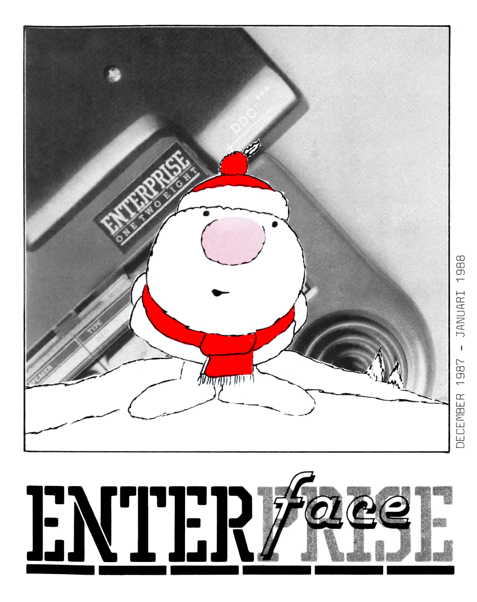

# ENTER*face* (1987.12-1988.01)

[Оригінальний PDF](http://enterprise.iko.hu/magazines/ENTERface_198712-198801.pdf)

## Зміст

Van de voorzitter  
Van het bestuur  
Software Library News  
Enter en Return  
Gelderse gebruikers praat  
De beste software opnieuw prijs  
Spock van weggeweest  
Mijn membraan is eraan  
Gebruikers Afdeling Noord  
((Hexa) Metrische) Klok  
De beste connector  
Mini DiskDrive Controller  
Opbellen in Lisp  
Software Library Updates  
Adressen om te weten  
Wat je moetonthouden  

## Чернетка вмісту

"page-000.jpg" ------------------------------------------------------------ 
886L IHYANYL - L88L HIEWIIJ0

"page-001.ppm" ------------------------------------------------------------ 
INHOUDSOPGAVE

VOORPLAAT ...........e.  1 MIJN MEMBRAAN IS ERAAN .. 14
INHOUDSOPGAVE .......... 2 GEBRUIKERS TEN NOORDEN .. 15
COLOFON en. 2              ((HEXA) METRISCHE) KLOK ... 16
VAN DE VOORZITTER .... 3-4 DE BESTE CONNECTOR ... 17-18
VAN HET BESTUUR ...... 5-6 MINI DISKCONTROLLER .. 19-20
SOFTWARELIBRARYNEWS .... 7 OPBELLEN IN LISP ........ 21
ENTER & RETURN ......... 8 SOFTWARE UPDATES ........ 22
GELDERSE GEBRUIKERS .... 9 ADRESSEN OM TE WETEN .... 23
DE BESTE SOFTWARE ...10-11 AGENDA GEBRUIKERSDAGEN .. 24
SPOCK IS TERUG ....…. 12-13

GEBRUIKERSDAG--AILGEMEEN 19 DEC, 6 FEB
H.F. Witte dorpshuis, Henri Dunantplein 4, DE BILT
bus 57 vanaf CS, halte Nobellaan, Nobellaan in, 3e weg links

GEBRUIKERSDAG--NOORD eee 30 JANWVARI
Midgetgolfbaan NIENOORD, Bosweg LEEK
kun je daar komen met openbaar vervoer?

COLOFON

De ENTERFACE is het officiele orgaan van de Dutch Enterprise User
Group en verschijnd eens per twee maanden.

REDAKTIE ......... Robin Ketelaars, Geerweg 2, 2611 VN DELFT, 015-126422

MEDEWERKENDEN .... Stan, Eric, Richard, Patrick, Jos, P, Jan, Hans,
Fons, Spock, Kees, Gerrit, J.H., en geen anderen.

VOORPLAAT ........ Wederom een prachtige foto van de MINI DISKCONTROLLER
stevig verankerd aan de ENTERPRISE

KOPIJ ............ Inzenden op DISK: of TAPE: tot 6 JANUARI 1988
Kopij niet op disk: of tape: betekent geen plaatsing
Gebruik alleen de ENTER-toets aan het eind van een
alinea, niet bij elke regel die toets indukken.
SAVEn met F2, <naam>.WP8. Geen kleur, LF bij 50 regels

OVERNEMEN .…....... van de getiele of gedeeltelijke inhoud toegestaan
DRUKWERK DRUK.TAN HECK, Pluympot la, 2611 LX DELFT
BESTUUR .......... zie bladzijde 23, bellen op de aangegeven tijden!
SOFTWARE ......... Inzenden naar: Reigerskamp 690, 3607 JP MAARSSEN

Aanvragen alleen schriftelijk met voldoende retour-
porto, anders ophalen op gebruikersdag in DE BILT

2
"page-002.ppm" ------------------------------------------------------------ 
VAN DE VOORZIDVER

Ondanks een licht gevoel van onvrede over het late verschijnen van de
ENTERFACE is de vorige gebruikersdag als vanouds weer redelijk druk
bezocht (45 leden).

Steeds meer mensen nemen hun ENTERPRISE mee en demonstreren hun
eigengemaakte programma.
Na de eerste testrun mag een ander het ook eens proberen. Oops!! een
crash! , daar gaat de ingehouden trots over eigen kunnen! Dan maar even
kijken in de listing.

"Zeg, wat betekent CALL L2 en wat is de functie van Z$?'

“Wel, even denken..... ik
Met een beetje geluk is het eerste antwoord binnen een paar minuten
gevonden maar nu die Z$ nog. Waarom gaat het thuis nooit fout en hier al
na de eerste input?

Het zijn de klassieke problemen van programma's in de ontwikkel fase. Het
program deed tot nu toe wat de maker er van had verwacht met de standaard
invoer die hij normaal ter beschikking had. Wie tikt er nu 8 in als er
maar tot 7 mag worden gegaan?

Vaak wordt de input afhandeling niet voldoende serieus genomen. Mensen
maken fouten, hebben minder type-routine of interpreteren een vraag van
het program anders dan de maker ooit had gedacht.

Een eerste hulpmiddel is een input ALTIJD als een string, bv ANTWOORDS,

in te lezen. (al dan niet in een subroutine). Een letter is dodelijk voor
een numerieke input! Test daarna hetzij de waarde met VAL(ANTWOORDS$) danwe
de textmatige inhoud van ANTWOORDS.

Let er daarbij op dat de waarde O kan zijn als ANTWOORD$ ongewild met een
niet-nummeriek begonnen is. Vertrouw er verder niet op dat U met een SET
6,1 voor eeuwig de CAPSLOCK hebt ingesteld. De "A" van JA zit vlak naast
de LOCK-toets en de volgende keer gaat U met "ja" de mist in.

UCASES (LTRIM$ (ANTWOORDS$) (1:1)) maakt van “ jA" een keurige "JJ".

Een tweede hulpmiddel bij een beperkte keuze input is een menuutje (al
dan niet op een eigen video channel) met cursor keuze en spatiebalk
bekrachtiging. Visueel is dit vaak erg geslaagd maar het vraagt een
ingewikkelder afhandeling dan de rechtstreekse input.

Wie tot slot zeer verfijnd te werk wil gaan doet het volgende voor
numerieke input:

LET VALUE=Or LET PLUNTVLAG==1
Do
Do
LOOK ELOSr KEY °
LOOF UNTIL (KEY247 AND KEY<58) OR KEY=46 OR KEY=1S
SELECT KEY
CASE 15 | ENTER
IF PUNTVLAG==1 THEN PIJNTVLAG=O

— elilz 3

"page-003.ppm" ------------------------------------------------------------ 
VAN DE VOORZITTER

EXIT DO
CASE 46 | FUNT
IF PUNTVL AG dl THEN PUNTVLAG=O
CASE ELSE ! CIJFERS
LET VAltlEs VALUER LOAKEY =48
IF PUNTVLAG PE) THEN PUNTVLAG=PUNTVLAG+ 1
- END SELECT
LOOP
LET VALUE=VALIE/ 1 0PUNTVLAG

Denk nu niet dat het een schande is als een program in andermans handen
crasht. FULL PROOF is nog niet altijd FOOL PROOF! Wie over de rand van
het toetsenbord kijkt weet dat in IS-BASIC 2.0 een aantal fouten zaten.
De makers waren toch echt geen amateurs. Met andere woorden een program
hoeft niet eerst twee jaar getest te worden voor het de bibliotheek in
kan.

Maar wat was er nu aan de hand met die Z$? De maker moet er erg lang over
denken en uiteindelijk blijkt het een DUMMY$ te zijn. Drie maanden
geleden werd die routine even gemaakt en nu weet de ontwerper niet meer
wat de betekenis van Z$ is.

Hier komt het aspect 'onderhoudbaarheid van het programma' om de hoek
kijken. : °

Een goede naamgeving van variabelen, constanten en def 's zijn daarbij van
groot belang. Declareer binnen DEF's local variabelen. Gebruik SELECT in
plaats van een eindeloze rij IF statements. De DO-LOOP met WHILE of
UNTIL is een zeer krachtige constructie. Realiseer je dat zelfs het beste
programma geregeld onderhoud nodig heeft.

Het verhelpen van de bovenstaande crash is daar een voorbeeld van.

Uitbouwen en aanpassen aan persoonlijke wensen van een bibliotheek
programma is ook zo'n moment waarbij van onderhoud sprake is.

Nu weet ik het ook wel, iedereen schrijft het programma voor zichzelf en
het gegeven paard moet men niet in de bek kijken. Toch wil er op wijzen
dat de waarde van een program, OOK VOOR DE MAKER, zeer sterk afhangt van
de onderhoudbaarheid in de ontwikkelingsfase en de 2 jaar daarna.

Het vinden van fouten in een programma is meer afhankelijk van het aantal
verschillende mensen die het testen dan van het aantal uren die de maker
er al aan besteed heeft.

Probeer thuis eens iemand onvoorbereid een run te laten uitvoeren en U
weet meteen waar de zwakke plekken zitten. Op de gebruikersdag zal het
dan hopelijk wat langer uithouden, alhoewel you don't to be fool to use a
computer but...

STAN

— eol 4
"page-004.ppm" ------------------------------------------------------------ 
VAN HET BESTUUR

ALGEMEEN

Er is op een brief naar Enterprise GMBH, handelend over copyright en
leverings programma antwoord ontvangen. In het kort komt dit er op neer
dat er een volledig copyright op alle verschenen hard/software berust bij
hen.Het eventuele kopieren van Rom's op Eproms valt hier dus ook onder,
indien de oorspronkelijke niet meer leverbaar zijn. Bestelling van ooit
uitgebrachte software/manuals e.d. dus uitsluitend aan hen. Het meeste is
nog steeds leverbaar evenals games die hier nooit uitgekomen waren.
Verder, informatie over duitse club, waarin blad werd aangekondigd maar
nog niet werd ontvangen, noch een antwoord op onze brief.

Zoals al vermeld is het kontakt met onze zusterclub overzee hersteld en
zijn daar ook evenals hier interessante ontwikkelingen gaande. Niemand
heeft nog, behalve de veelbelovende aankondiging, Kennis kunnen nemen van
deze zaken. Mogelijk komt binnenkort een vertegenwoordiging naar ons land
om het een en ander te demonstreren.

Aangezien de zaken daar anders georganiseerd zijn waarbij (bestuurs) leden
ook prive belang in hun eigen software onderneming hebben, kan het bestuur
dus niets promoten. Wij volstaan daarom met de adressen en een opsomming
van de spullen en zullen ons, als bestuur in de toekomst beperken tot het
geven van informatie.

Uiteraard staat het iedereen vrij zijn ervaringen te publiceren.

Wij beschikken over voorgaande nummers van van het clubblad op basis van
uitwisseling. leder geinteresseerd lid kan dat op GB-dag inzien, maar er
moet wel vermeld worden dat men kopijrecht claimt en gehele of gedeelte
lijke overname niet is toegestaan! ! Overigens is bij het antwoord aan de
voorzitter/redacteur wel hiervoor toestemming onder bronvermelding
gevraagd.

Verder is men bezig een SWL op te zetten naar analogie van ons. Er is

er een uitgebreide CP\M collectie op schijf tegen vergoeding beschikbaar,
Er zijn circa 1000 leden,maar ook daar hetzelfde beeld, er zijn maar
weinig aktieven die de kar trekken!

Omdat de indruk bestaat dat veel aktiviteiten zowel hier als daar dou-
blures inhouden en veel nachtelijk gezweet behalve misschien de voldoe
ning op je eentje een gigantische klus geklaard te hebben, is een goede
uitwisseling van (over) levensbelang in het geweld van IBM & compatables.
Wil deze machine nog een toontje meeblazen en niet ten onrechte als ach-
terhaald concept worden gebrandmerkt dan zullen dus "the missing links"
tussen enerzijds de grafische mogelijkheden en de nodigesoftware aanpas-
singen voor de moderne talen geimplementeerd moeten worden. Er zal toene
mend gebruik van modems voor onderlinge communicatie gemaakt gaan worden,
hiervoor moet ook nog het nodige gebeuren.

Dat vereist eerder teamwork en coordinatie van gebundelde krachten dan
versnippering, ondanks de oprechte bewondering voor de prestaties van
de individuele werker. De aanwezigen konden op de laatste GB-dag getuige
zijn dat de barriere van het MEGABYTE genomen is, een fraaie prestatie
enbovendien gestoken in een mooi jasje!

As

— Jeoliz 5
"page-005.ppm" ------------------------------------------------------------ 
VAN HET BESTUUR

HUISHOUDELIJK

Namens het voltallig bestuur allereerst de felicitaties aan Robin en
Fenje voor de geboorte van NINA! Hopelijk heeft het nachtelijks geschrij
nog niet teveel konsekwenties voor de energie van de jonge vader bij de
schrijverij. (edoch zij schrijt niet, zij levert kopije (red))

Met ekskuus aan Pim voor de verwisseling, maar het blijft gelukkig in de
familie!

Fons Kraakman die tot het bestuur toe trad, gaat geleidelijk een aantal
taken van mijn persoontje overnemen, voorlopig blijft de externe in/
uitgang nog bij Stan en mij.

Richard en Patrick hebben te kennen gegeven hun onvolprezen aktiviteiten
mbt de SWL te moeten stoppen per 1 januari. Wij zoeken dus geschikte
opvolger(s) die dit wil(len) overnemen. Het is te zwaar voor een persoon |!

Ten tijde van de HCC dagen zal uit iedere software catagorie een winnaar
worden gekozen. De updates/verbeterde inzendingen over de periode okt.
86/87 tellen ook mee.

Inzendingen na 10 okt. echter niet. Het beoordelen is een tijdrovende klus
en toch ook wel spannend in de trant van: 'Mag het een onsje meer zijn?'.
Het devies voor de HCC is:"Even er bij blijven voor het beste resultaat |"

Tot slot zijn er helaas een paar opzeggingen voor het komend jaar,de
redenen zijn veelal verandering van interesse of doorgroei naar.....

Eric Berends
BUITENLANDSE ADRESSEN

ENTERPRISE GMBH: Alle hard- & software van ENTERPRISE
Sonnenstrasse 3, algemeen copyright houder
8000 MUNCHEN 2, BRD

Tel.089-557561

INDEPENDENT ENTERPRISE USER GROUP: greatest Hits, progr. tapes,

Neil Blaber, POWERHOUSE: ROM based Wordprocessor,
Postbox 13 Crowborough, (Word-Master) Games en zakelijke

TN6 1QX EAST SUSSEX, UK software, CPM vols 750 disks

BOXSOFT : Screen utils, IS-Basic extensions (100)
Tim Box, ZZZip:Basic compiler. 5000 x sneller

12 Whitegates, Printer utils 13k ram buffer

100 Station RD, Paintbox & NEOS Muis op disk 5.25 & 3.5
EN5 1QB NEW BARNET HERTS, UK (uitsl.voor de 128 best. Postal Cheque)
DATAQUIP ELECTRONICS: Hardware adviezen, mini motherboard
A.S Burnham, Expansion Ram cards 256/512,Modems,mouse,
1 Woodside, Long Reach, intelligent joystick interface,

KT24 6NA WEST HORSLEY SURREY, UK IBM look alike system + keyboard ,„640K

— eolz 6
"page-006.ppm" ------------------------------------------------------------ 
SOFTWARE LIBRARY NEWS

De laatste VIER maanden is er weinig nieuws aan programmatuur binnen
gekomen. Wij ontvingen een update van Koen van Eijk van zijn programma
AVONTUUR. Dit programma heeft enkele maanden geleden al een prijs
gewonnen. Over update gesproken, ook van SPRSHEET, KRTBAK en FIETS zijn
er nieuwe (verbeterde) versies.

Ook de muzikalen onder ons kunnen weer even genieten van een uitvoering
van TUBULAR-BELLS na even rond gedwaald te hebben in een 3-dimensionaal
doolhof, 3D_DOOLH.BAS. of na het kijken naar het nieuw bewegende
demonstratie programma GOLF .BAS.

Zo als gewoonlijk zijn er enkel programma's niet in de bibliotheek
geplaatst, omdat hier bijvoorbeeld te winig commentaar bij meegeleverd
was en wij zodoende niet wisten wat we met de programma's konden doen.
Wij hopen dat de betrokken personen hier alsnog wat aan doen.

Vanwege het lage aantal inzendingen deze tijd, zijn alle programma's van
de laatste maanden samengevoegd bij de keuze van een programma van de
maand. Dit keer is de keuze gevallen op een extensie voor de ENTERPRISE
WORD-PROCESSOR WP2.RSX.

WP" voegt enkele nuttige commando's toe plus wat extra funktietoetsen.
Bijvoorbeeld het 'DELeten' van 8 regels in een keer. Hoewel onze
persoonlijke wensen meer uitgaan naar andere funktie zoals GOTO TOP/END
enz is dit een schitterend programma om op voort te bouwen. Voor ervaren
assembler programmeurs(m/v) is de broncode te begrijpen, maar wat extra
kommentaar zou het wat makkelijker maken. Ondanks deze laatste opmerking
heeft KOEN VAN EIJK de prijs zeker verdiend.

Richard Sargeant 03465-65086
Patrick van Voorn 03465-66876

ETET EEA RE Eek khen kekekeke hehe keleke kelen heeele eioeiedindinindiad

BELANGRIJKE MEDEDELING VAN DE SOFTWARE LIBRARY

Steeds minder vrije tijd (vanwege werk/studie) heeft ons doen
besluiten het beheer van de SOFTWARE LIBRARY over te. dragen
aan iemand anders.

WIE IS BEREID DEZE TAAK OVER TE NEMEN

%
*
%
*
%
%
%
%
bd
In de volgende ENTERFACE hopen wij een nieuw adres te kunnen A
vermelden, maar als niemand zich bij ons of bij het bestuur *
aanmeldt, zal dit onderdeel van de vereniging moeten verdwij- haf
nen. Dit laatste zou wel er jammer zijn! «
%
kad
%

VOOR AANMELDEN EN INFORMATIE BEL RICHARD OF PATRICK

*
%
*
*%
%
%
%
%
*
%
%
%
%
*
%
%
*

BEI keek

— olz 7
"page-007.ppm" ------------------------------------------------------------ 
ENTER EN RETURN

NOODKREET
Mijn man is. sinds hij een homecomputer heeft gekocht, nauwelijks meer
aanspreekbaar. ledere vrije dag en elk vrij uurtje zit hij op zijn
studeerkamer — vanwege het lawaai van de kinderen — en puzzelt en
vloekt wat weg. Zo gaan de avonden en weekenden zonder gezinsleven

e voorbij. Als ik er over begin, bromt hij wat terug en kan ik aan zijn
ogen zien dat hij alweer het volgende computerprobleem aan het
uitknobbelen is. Wat moet ik doen?

ANTWOORD VAN EEN EXPERT
Het is een steeds vaker gehoorde klacht: vrouwen voelen zich in de
steek gelaten doordat ‘de computer zo'n enorme aantrekkingskracht op
hun echtgenoot blijkt te hebben. Jouw man is beslist verslaafd. Je
moet hem dan ook niet voorzichtig, maar heel duidelijk zeggen dat hij
zijn vrouw en kinderen aan het verwaarlozen isen dat je dat niet
langer pikt. Hij heeft verantwoordelijkheden! Spreek bijvoorbeeld
vaste computeruren af. Het is onzin als jij in je eentje alles moet
doen. Je bent toch niet met een apparaat getrouwd?

VRAAG VAN JOS BOS OP 02290-16728
Ik heb nog steeds mijn ENTERPRISE in de kast staan, wie wil het
ding kopen, ik doe er toch niets mee! Ik heb ook nog een diskcon-
troller en een 80T2S2D-drive.

Of er moet iemand zijn die mij een programma aan de hand doet dat
weerkaarten kan maken!

ANTWOORD AAN JOS BOS
Dit keer lukt het hoor! Let maar op!

VRAAG VAN P WIGGERS OP 050-132556 NA 17.30
Ik heb proffessionele bekabeling te koop voor de ENTERPRISE computer
bestaande uit 1*NET+2*CONTROL+1*MONITOR+IXPRINTER voor slechts £70,-.

ANTWOORD VAN DE REDAKTIE

Dit is natuurlijk geen advertentieblad. maar toch fijn voor de
onhandigen onder ons.

VRAAG VAN ERIC OP 01803-17051 NA 20.30 VOOR 23.00
Ik heb een probleem met m'n voeding. Voordat het ding het begaf merkte
ik dat er spanning op de computer stond. Nu heb ik gehoord dat een
component daarvoor verantwoordelijk is, welke weet ik niet. Na
vervanging zou ie het dan weer moeten doen. Die het wete zegge het.

ANTWOORD VAN EEN EXPERT ‚
In de voeding van de ENTERPRISE zitten twee 5-volt regulators 7805 of

LM340T5. Deze regelaars worden bij een 576k met diskdrive, printer,
monitor etc. erg warm. Ze kunnen 1 Ampere leveren. Je kunt ze
vervangen door 2 stuks 78505 deze kunnen 2 Ampere leveren, ze worden
dan ook niet zo warm. Beide regelaars zitten tegen de koelplaat

linksboven aan de ENTERPRISE. De 78805 kost ongeveer f 2,95.

— Jel 8
"page-008.ppm" ------------------------------------------------------------ 
GELDERSE GEBRUIKERS PRAAT

Na laat napraten op de clubdag, wij waren ook laat in de Bilt doordat ons
lijfblad bij ons pas na 10 uur op deze dag in de bus viel.

Na druk telefonisch overleg en nog even wat tuin arbeid, o ja, ook nog
vlug een connector solderen, zijn Peter en ik toch maar naar de Bilt

getogen.

Een warm onthaal van de enkele aanwezigen, in het bijzonder van Kees uit
Tolbert, maar dat was omdat Eisse, Wim en ik 26 sept. in Leek waren
geweest. Ver hoor, 490 km heen en terug!

Het bestuur had zich al teruggetrokken, vandaar, om mijn eerste zin af te
maken, dat wij laat in de middag nog, en vele zaken, doorgekletst hebben
tot op de parkeerplaats!

Begin november komt de Gelderse groep weer bijeen, waarbij o.a. Stan en
enkele andere als gasten uitgenodigd zijn. (Zal inmiddels bij lezen
geweest zijn.)

Een nieuwtje wat wij in de Bilt wilden demonstreren ging ongetest of
anders getest de mist in. De 1 MEGABITTER liet maar ruim 800 KB

zien, na opstelling van onze Enterprise en hebben wij de slogen van — "1"
MEGABITTER — maar opgevouwen laten liggen. Aan het eind van de middag nog
eens Stan verteld van dit ‘geplande geintje' en nog eens opgestart zoals
bij Wim in Dieren, zonder DDC, en zie ruim 1 megabyte op het scherm. Naar
zeggen zit EXDOS op 20 HEX, en DDC met extra geheugen geeft een misser
van hele 20 blok = 256 K en EXDOS ontbreekt.

VRAAG: Is dit een EXDOS probleem of een datalijn (over)belasting??

De reden van deze ENTERFACE bijdrage is de opmerking van Stan om eens uit
de doeken te doen wat het kostenplaatje is van het mini-DDC project,
omdat een hardware project, in tegenstelling tot software, al zoveel
investering in harde guldens kost, terwijl het technisch slagen nog zeer
de vraag is/was.

Het mini-DDC project is naar de uitgangspunten zeken geslaagd te noemen,
zeker omdat er aldoende een extra dimensie in zit met de extra
gecreeerde steekplaats.

Op deze steekplaats kan ik bijvoorbeeld de 512 KB extra geheugenkaart
steken of de in opzet zijnde PIO kaart met inmiddels 2 PIO's voor 4x8 =
32 IO0's. Het prototype wordt zeer eenvoudig, enkelzijdig met veel draad
in verband met de kosten.

Als eerste PIO gebruiker wordt door Peter een EPROM-programmer programma
ontwikkeld. PE

Maar ook, en dan klap ik uit de boot, met hogere programmeertaal wordt
door Eisse aan een geheel andere optie gewerkt, terwijl ook in de
hardware —-ENTERPRISE presentatie nog wel wat in het vat zit.

— Joolz g

"page-009.ppm" ------------------------------------------------------------ 
DE BESTE SOFTWARE OPNIEUW PRIJS

Het is een aantal mensen gelukt een beslissing te nemen over de beste
software die het afgelopen seizoen door ENTERPRISERS is gemaakt.
De beoordelaars hebben ieder een categorie beoordeeld te weten:

DEMONSTRATIEPROGRAMMA'S, UTILITIES, EDUKATIE en SPELLEN

HET BESTE DEMONSTRATIE-PROGRAMMA door Hans Roelofs

INTERFERING.BAS is een demonstratie van erg veel, steeds maar wisselende
vormen en kleuren. Het is boeiend om het ‘eindeloze’ programma te
bekijken. De figuren die gemaakt worden lijken op de figuren uit een
kaleidoscoop.

Een kleine opmerking: Het programma is wat moeilijk te laden. Na het
laden van INTERFER.BAS krijg je de opdracht om Functietoets 1 in te
drukken om de code te laden. Echter dan wordt het scherm keurig leeg en
verder gebeurt er niets. De RESET-knop dus maar gebruiken.

Geef LOAD "INTERFER.DAT" en de demonstratie begint.

OOK LEUKE DEMOOS
INTERFER <DIR>, TIENTJE.BAS, ENTERPRI.BAS, OXYGENE.BAS, WEERDEMO.BAS

DE BESTE UTILITYS door Fons Kraakman
SDIR.BAS heb ik gekozen tot utility van het jaar en wel hierom:

Het programma heeft een grote gebruikswaarde: het is voor een groot
aantal leden een nuttig programma.

Het programma is gestruktureerd opgezet; GEEN GOTO'S, WEL DO-LOOPS, TOP-
DOWN geprogrammaeerd en zorgvuldig gemaakte procedures die meestal maar 1
funktie hebben zodat ze begrijpelijk blijven

Het programma is overzichtelijk; duidelijke uitleg in listings, de namen
van de variabelen verklagen het gebruik, de gebruikte variabelen zijn
vooraf gedeklareerd.

Het programma is inhoudelijk interessant: gebruik van recursie, IS-BASIC
goed uitgebuit, en agypdig gebruik van machinetaal en 'pseudo-boolean'
variabelen (gaarne uitleg van deze term! RED.)

Verder goed aangegeven wat er ingevoerd moet worden en wat er geduurdende
het programma gebeurd. Ook een duidelijke schermopmaak en printeruitvoer.

SLECHTSTE UTILITIES
LU <DIR>, VSLD <DIR> en SQUEEZE <DIR>

OOK LEUKE UTILITIES
OPBELLEN.BAS, SCHRIJF.BAS SETKLEUR.BAS WACHTWRD.BAS DOWNLOAD.BAS

— Joolz 10
"page-010.ppm" ------------------------------------------------------------ 
DE BESTE SOFTWARE OPNIEUW PRIJS

HET BESTE EDUKATIVE PROGRAMMA door Eric Berends

HOLLAND.BAS is als winnaar uit de bus gekomen. Dit is te danken aan
kleine details dit nauwelijks onder woorden kunnen worden gebracht.

Het is een echt competitiegevecht geweest tussen de zwaargewichten in de
edukatieve software. Een ware nek-aan-nek-race tussen de meningen van
mijn kinderen, waarvan de oudste spontaan een formulier ontwierp om de
beoordeling kracht bij te zetten.

Kinderen blijven eindeloos spelen en tonen aan vriendjes hoe leuk het is.
Mijns inziens komt dit door het kompetitie-element en de menu-opties. Het
was bij de updating door de doorzichtige struktuur eenvoudig full-proof
te beveiligen. Tot nu toe is deze versie nooit gecrashed!

Het werd door mijn kinderen als absolute topper uitverkoren. Kinderen en
oude gekken (dronken mensen RED.) spreken de waarheid, nietwaar?

OOK LEUKE EDUKATIVEN
VERTAAL.BAS. KEYTUT.BAS. LEZEN.BAS, KLOKKIJK.BAS, CENTEN.BAS

HET BESTE SPEL door Hans Roelofs

MEMORY1.BAS door Wilfried Hesseling is een memory spel met 64 kaarten
waaronder ‘eenvoudige afbeeldingen worden weergegeven.

Het is best moeilijk om dit memoryspel te doen, aangezien dezelfde
afbeeldingen ook met kleurverschillen voorkomen. Op een zwart-wit monitor
kan dit dus problemen opleveren. Het spel is te spelen met 2 personen of
alleen. Met behulp van de spelpook worden de kaarten aangewezen en door
de spatiebalk omgekeerd. De stand wordt per deelnemer bijgehouden en ook
het totaal aantal zetten.

Gekozen is voor een duidelijke structuur in het programma met REMARKS om
de functie van de subroutines (CALL opdrachten) aan te geven, De REMARKS
hadden weggelaten kunnen worden door in plaats van 'CALL P1' of 'CALL P2'
bv. CALL INITIATIE of CALL SCHUDDEN te gebruiken.

Om het programma te stoppen, wanneer alle kaarten verdwenen zijn, moet de
STOPtoets gebruikt worden. Het programma komt dan namelijk in een
eindeloze DO-LOOP terecht.

Het is een leuk en goed spel met voldoende moeilijkheidsgraad dat door
mijn kinderen graag gespeeld wordt.

OOK LEUKE SPELLEN
MEMORY.BAS, WOOPER <DIR>, OTHELLO.BAS, BKE.BAS, OPNIEUW <DIR®

De beste programmaas worden op een demonstratiecassette gezet en deze
kan dan aan nieuwe leden van de DEUG kadogedaan worden.
Een echte PROMO-CASSETTE DUS, die bij niemand mag ontbreken!
"page-011.ppm" ------------------------------------------------------------ 
SPOCK VAN WEGGEWEEST

Nudat ik van mijn zoveelste ruimtereis ben teruggekomen. zal ik weer
verder vertellen over gestruktureerd programmeren.

Het volgende voorbeeld is een zeerverbeterde versie van de invoerroutine
van onze voorzitter stan. Hier mankeerde nogal wat aan. Geen indikatie op
het beeldscherm, toch niet al te duidelijke variabelen, geen cursor,
2*een punt en letters invoeren en een onduidelijke funktiedefinitie.

100 FROGRAM "maaleidf bas!

110 TEXT 80

120 LET WAARDE=HAALGIJFERS (B, 10, CHR (28) “geef een getal: ”
150 PRINT AT 20,5r"de beveiligde waarte iet" ys WAARDE

140 END

150 !

160 DEF HAALCIJFERS CX, Y‚ TEKST &)

170 NUMERTC GETAL, DEC TMAAL

180 PRINT AT X, Ya TE EN

190 LET YeYelENCTE B) ein ET GET Als LET DEC IMAAL 1

ZOO Do

210 Do

220 PRINT AT X, Ya Gli (LBO) 7

250 LEET TOETS Bee NIE Y $

240 PRINT AT Xe Ya CHRB CEE) 4

250 LOOP UNTIL. TOETS$ zn

240 LET TOETSRORD CTOET GS $)

270 SELECT TOETS

280 CASE AE vv fd BENT EEF rent
20 IF DECIMAALmeel THEN LET DEC IMAAL

300 EXIT DO

310 CASE Aman av a ve ve CLE TEC MAAL ER DUNE Cleeomma)
RL) IF DECIMAAl ae THEN

1e) LET DEC TMAAL a)

540 PRINT AT X, Ys TOETS

Kite) LET Yay

KT-10) END IF

370 CABE 47 TO) BZ nere ven a Le Ci df eN”

380 LET GETAL=GETALXLOTOETS--48

590 IF DECTMAAL Ee) THEN LET DEC IMAAL DE T MAAL + 1
400 PRINT AT X, Ys TOETS:

410 LET YmY+1

40 CABE ELBE Leens nr vvv jd ATC ERI ER en be EIN
440 END SELECT

450 LOOP

460 LET HAALCIJFERSSGETAL /10DEC MAAL
470 END DEF

In regels 100- 140 staat het hele programma. Het draait hier alleen maar
om een WAARDE die gehaald moet worden door een beveiligde invoerroutine.
HAALCIJFERS is een subroutine, bij de ENTERPRISE dus een geDEFinieerde
funktie. Je kunt aangeven waar op het scherm je een PROMPT wilt om je
getal binnen te halen.

— Joolz 12
"page-012.ppm" ------------------------------------------------------------ 
SPOCK VAN WEGGEWEEST

GETAL en DECIMAAL zijn lokale variabelen die we nodia hebben binnen de
DEF. Op regel 180 wordt de PROMPT geprint op de aangegeven coordinaten en
op regel 190 wordt de cursor op de juiste plaats gezet.

Regel 210-250 is een routine die een cursor maakt en een toetsindruk
afleest. LOOK heeft geen cursor en bij INPUT moet je steeds ENTER
drukken.

in regel 270 volgt een CASE-statement. Dit is een gestruktureerde manier
van kiezen. Het heeft als voordeel boven diverse IF-THEN-ELSEs dat niet
telkens aangeduid hoeft te worden met welke variabele je bezig bent.

Hier is dit dus TOETS. We nemen de waarde van TOETS omdat dit de keuze
bij CASE nog simpeler maakt.

Het spreekt voor zich. ENTER. de decimale punt en de cijfers worden eruit
gefilterd om een speciale behandeling te krijgen. Alle overige tekens
worden botweg genegeerd.

Op het laats wordt in regel 460 aan de DEF HAALCIJFERS de verkregen waarde
gegeven. HAALCIJFERS haalt dus het getal uit de DEF

Analoog aan deze routine eentje voor alle tekens!

100 PROGRAM "HAALETTR, RAS"
110 LET SPOCES=HAALTEEST® (5, 5, CHRB CRE) Ke" geef men Lesket im!)
Ì PRENT AT BO, Ba BROCHE, VAL. CBF )
END
ij
DEF HAALTERST® CX, YT
STRING WOORDS
PRINT AT Xe Ya TERS T$ 3
LEET VaeerlN CTEKS TS) med 8 LET VM IEN Vee lr LET WOORD Ben
Di
Do
PRINT ATX, Ys GHRB CLBEG) 4
LET TOETS &e INKEY$
PRINT AT X, Ya CHRS$ CHE) 3
LOOF UNTIL, TOETS $4 7 "N
GELEGT TOETS$
CASE CRB CATE) Demen eren Ed EEN TEER erde geerte 5
EXIT DO
CASE ua " nf Hi " gj ‘ LN “ 1 pt u Î oooen vanen comme prob GE CASE u « u TO neu
LEET WOORDS=WOORD SE TOET SE
PRINT AT Xe Ya TOETS S
LET YaYt1
CAGE CARB CLE) Neree enn gel ERA EE ere Est 5
LET WOORDS=WOORDS (1 t LEN CWOORI B ) = 1) Lemen Het wissen
PRINT AT X, Ys TOETS;
LEET VaVae (YY MIN) Pee mag niet meer dan WOORDS wissen

CASE ELSE
END SELECT
LOOR

50 LET HAALTEEST $=WOORDS
400 END DEF

— elz 13
"page-013.ppm" ------------------------------------------------------------ 
MIJN MEMBRAAN IS ERAAN

Hier een tip om te voorkomen dat je je keyboard membraan vervangen moet.

De narigheid zit meestal in toevoersporen naar moederbord die onder
invloed van de het buigen haarscheurtjes in de drager veroorzaken.

De truc is om tijdelijk tape voor het maken van printnegatieven aan te
brengen tussen de sporen en dan vervolgens geleidende lijm opbrengen met
penseel of strijker. Goed laten drogen en dan de tape weer verwijderen.
De bedekkende strip kan je met bv dubbelzijdige kleeffilm fixeren.

Dit voorkomt oxidatie. Je hoeft je dan echt geen zorgen meer te maken
steeds een stukje te moeten afknippen.

Zelf ben ik bezig om van een stuk koperfolie tussen plastic dragers via
etsen een bandkabel te maken die dan eenvoudig met deze lijm aan het
overgebleven stukje te bevestigen is. Als dit goed lukt kan er nog eens
iemand geholpen worden met te korte beentjes |!

Volgende keer een tip om een verziekt membraam op te knappen. dus nog niet
weggooien die oude!

Bij de firma Permacol in EDE zijn 3 grams flesjes te koop met geleidende
zilverlijm (ca f12,-) deze lijm is iets te dik maar kan wat verdund
worden met BISONKIT verdunner (Tolueen).

— Joolz 14

ld
Lid

"page-014.ppm" ------------------------------------------------------------ 
GEBRUIKERS AFDELING NOORD

De gebruikers in het noorden van het land zijn zeer aktief. Dat komt
natuurlijk omdat ze elkaar elke dag zien, het zijn voornamelijk
werknemers van eenzelfde bedrijf. Dit bedrijf heeft twee jaar geleden met
kerst iedereen een ENTERPRISE kado gegeven.

Hoewel een van de onderstaande gebruikersdagen alweer drie dagen geleden
geweest is integraal de kopij van het noorden.

Enterprise Noord

Leren he Tolbert, oktober 1987

EE SE A Sa A A A A A A HG A BA

Gebruikerstag 26 september 1987,

Zoals gebruikelijk was de opkomst weer bevredigend, maar em kan
nag meer bijt!!! Dus komt allen en blijf niet thuis zitten
leringen, want daar wordt je niets wijzer Var.

Op deze dag hebben we een kleine demonstratie van Roelof Jan
Horst gehad van zijn nieuw huisvlijt produkt, nl, zijn Quaser
mesderm. Heet zag er Leuk uit en het werkte ook nog. Geslaagde
demonstratie dus.

De valgende Noordelijke ENTERPRISE gebruikersdagen zijn op:
in 28 november 1987

Z. ZO januari 19860
Zoals gebruikelijk krijgen de leden uit de regio ruimschoots van
te voren een herinnering.

Vaar de goede orde nog even het adres van ons "elubhuis!s

Midget golbaan
ENTENOORD"
Bosweg
Leek:

Voor de vele en enthousiaste gebruikers zijn de deuren geopend
van 11,00 tot 16,00 uur.

Voor alle duidelijkheid nog de aandacht voor het volgende:
op deze gebruikersdag is de Soft Ware Library AAMWEziGg.

Tot ziens! !

ENTERPRISE NOORD s
Kees Vac. Dong
Gerrit Idsardi

— oliz 15
"page-015.ppm" ------------------------------------------------------------ 
CCHEXA) MEFURISCHE) KLOK

Iedereen kan natuurlijk klokkijken. Er zijn ook mensen die het niet
kunnen. Voor deze mensen een eenvoudiger tijdmeting. Een metrische klok.
Zo een klok heeft slechts 10 uren, een uur 100 minuten en een minuut 100
seconden en telt dus tot 9:99:99

Ook is in een computerfreak-hexametrischeklok voorzien. Deze gaat tot
EF.FF

100 PROGRAM "HEX MET, BAS"

110 STRING HEXEN® (155) %2

120 CALL MAAK HEXEN

150 TEXT 80 >

140 PRINT AT 10,61" mormale tiid metrische tic hexametmische tic"
150 DO

160 LET TIJD$=T IME$

170 LET SECONDS= VAL(TIJD® (112) ) KELOOVAL (TIJDS (415) ) KbO+VAL (TLIDE (71 ED)
180 PRINT AT 12, LO TIJDS, METRITIJD®, HEXATIJDS ;

190 LOOF

200 !

210 DEF MAAK HEXEN

220 RESTORE 250

250 DATA O1, Er En An rn 70Br Pe Ar BC Do En F

240 FOR CIJFER=O TO 15

250 READ HEXENS (CIJFER)

260 NEXT

270 END DEF

280 !

290 DEF METRITIJDS

s00 LET METRISSSTR$ (INT (SECONDS/, BA, 5) ) 1 mmm lr ies B64OO weraondern

z10 LET METR IS! OOOOONKMETR IS (LEN (METER IS) =d 4 )

za0 LET METRIS=METRIS (LEN (METR IS) = )

aal) LET METRITIJDS=METRIS (lu 2)" e VEMETR IG Cin 4) Ze VRMETR IS Ce 6)
340 END DEF

550 |

360 DEF HEXATIJDS

570 LET HEX=INT (BECONDS/ 1, ALBESGEBF, 5)

580 LET HEXLSINT (HEX/4096) s LET ME XsehlEX ee CHIEX 1 KAD é)

=90 LET HEXBSINT (HEX/256) KET HEX seHEEX en CHE X il KS)

400 LET HEXBS=INT (HEX/16) LET HEXsHEX en (HEX EK 1)

410 LET HEXATIJDS=HEXENS (HEX1) BHEXENS (HEX) B" 7 BHE XEN B CHEX EE) HEE XEN CHEX
420 END DEF

va
Veel plezier ermee! op

Voor mensen die snelheid belangrijk vinden: probeer een keer dit
programma te maken zonder DEF's. Dan kun je goed zien hoe belangrijk het
is om WEL DEF's te gebruiken. En doe het dan ook eens met .... of .....!

— Joolz 16
"page-016.ppm" ------------------------------------------------------------ 
DE BESTE CONNECTOR

Beste ENTERPRISE-vrienden. ik heb zelf 3 connectors gemaakt en ik

moet zeggen, ze bevallen prima. Je moet wel een klein beetje handig zijn
om zo'n connector te maken, maar kun je het niet , vraag het dan aan
iemand die het wel kan.

Om te beginnen neem je een rechte cardedge connector. (bv.40 of 60 polig).
Het aantal polen is niet zo belangrijk,als dit maar groter is dan we
nodig hebben. Voor de joystics is deze 12, voor de printer/monitor 14 en
voor serial/netwerk 8 pennen breed.

Zaag een stuk van deze connector af en wel op de volgende maten;

8 polig 12 mm; 12 polig 17 mm; 14 polig 20 mm.
Let hierbij wel op dat de contakten op de goede plaats zitten. (precies in
het midden van de naastgelegen pennen, en dan even vijlen, red.)

Om de connector nu compleet te maken gaan we 4 plaatjes maken en wel van
kunststof van 3 mm dik.

Voor de onder en bovenkant maak je plaatjes met de afmetingen van

18x53, 23x53, 26x53 voor respectievelijk 8, 12 en 14 polige connectors
Voor de zijkanten kunnen alle plaatjes hetzelfde worden, namelijk 54x9,5mm
dikte, (de dikte van de connector).

+5 Imme +
+
ï \ ! A= 20mm
+ dt \ '
b B \ '
12mm Lt \ 18mm
' vt \ + ;
of bt ' ' of
: vt ‚B ' B= 3 a 4 mm groter dan
17mm Dt ' H 23mm de dikte van de
ij vt ' ' ' kabel die je
of bt / + of gebruikt
' : / '
20mm it / 26mm
; Lt / :
+ == / :
' / ï C= Smm
—ee +
HCH At

De onderkant is nu klaar. we kunnen deze nu op de connector lijmen.
Plaats de connector nu op de computer zodanig dat je aan weerszijde 3mm
ruimte hebt. Met 3sec. lijm kun je nu de onderkant er op lijmen. Na deze
handeling kun je de connector met onderkant weer van de computer halen.
Je weet nu zeker dat dit precies past. Om de zijkanten pasklaar te maken
ga je als volgt te werk. >

— Joliz 17
"page-017.ppm" ------------------------------------------------------------ 
DE BESTE CONNECTOR

Je legt 2 plaatjes precies op elkaar en klemt ze in een bankschroef. Boor
nu precies op de scheiding van de twee plaatjes een gaatje in de kopse
kant van de plaatjes op 5mm van de onderkant en ongeveer 10mm diep. Om de
plaatjes nu te kunnen passen moet je eerst nog even een zaagsnee aan de

voorkant maken t.b.v.de print en wel precies in het midden en ongeveer
3mm diep.

Past dit nu dan kun nu op 2cm van de voorkant een knikje buigen zodat het
plaatje precies op de onderkant komt te liggen. Om nu de kabel tussen de
twee zijkanten te laten vallen maak je de zijkanten aan de achterkant van
iets boven het midden tot onderen de helft dunner. Hier door wordt de
kabel straks een beetje geklemt, is de overgang van kabel naar stekker

vlaeiend en hebben we een dicht geheel om het dicht te kunnen gieten met
bv. giethars.

Voor je nu de zijkanten er op lijmt kun je het best eerst nu de kabel er
aan solderen omdat je nu overal nog goed bij kunt. Als dit gedaan is kun
je het best eerst controleren of alles werkt. Is dit het geval dan kun je
verder met het lijmen van de zijkanten. Is dit gedaan dan is de connector
nu klaar om ingegoten te worden. Terwijl de hars hard wordt kunnen we de
bovenkant pasklaar gaan maken. Er moet net zo’n uitsparing in komen als
in de zijkanten zit.

We doen dit dus op dezelfde manier maar nu met een stukje afvalmateriaal
of met een tweede bovenkant voor een andere connector. De plaats van de
uitsparing is afhankelijk van welke connector gemaakt wordt en kan heel
gemakkelijk opgemeten worden. Is dit ook geklaard dan Kunnen we de boven-
kant er op lijmen waarna we het geheel af kunnen maken door de hoeken wat
af te ronden.

We hebben nu een connector gemaakt, die past, die niet verwisseld kan
“worden en niet al te veel kost.

Veel plezier met het maken van de beste connector!!!

J.H. Bosvelt, Korenbloem 48, 7422 RH DEVENTER, 05700-53687 (19.30-22.00)

— Joolz 18

® z3t INTER ACIING
EV Nog VEEL NEER
"page-018.ppm" ------------------------------------------------------------ 
MINI DISKDRIVE CONTROLLER

Hier een verslag van Jan Versteeg over alle stadia die nodig zijn om te
komen tot een geslaagd hobby-projekt met betrekking tot onze ENTERPRISE.

Het is een bekend feit dat de commerciele controllers en de complete
drive, welke direct op het print edge slot worden gestoken, vele
connectie problemen vertonen. Ook de ‘lompheid’ van het gekoppelde geheel
stoorde ons en werd het idee van een kleine eigenbouw DDC geboren.

Na simpele afspraak en informatie door de leden van de Gelderse groep, ben
ik begonnen om een aantal uitgangspunten te stellen, dit betrof de
afmeting, vorm, en aansluitwijze. De machine aansluiting is later van
edaeconnecter naar gesoldeerde DIN aansluiting omgezet.

Voorwaarde voor een goed resultaat is vooraf duidelijk uitgangspunten en
voorwaarden te stellen. Juist aan jezelf, daar er waarschijnlijk, als het
eind van het project al bereikt wordt, onbedoeld een schaap met 5 poten
is geschapen.

Na diverse stadia in 2:1-2 kleuren opzetten, zijn er prototype print lay-
outs, Boven en Achter, getekend gelijk aan Boven,Achter van de
moederprint. Door de veelheid aan banen en gaatjes, ook pech met print
foto ontwikkelaar, koste het vele afkeurprints, voordat er een
doorgesoldeerde, vele Boven,Achter verbindingen, 2x33 bandkabel + edge
connector, 222 IC pennen, plus 34p connector met weerstanden en
condensatoren, totaal meer dan 500 solderingen, een prototype print
bestukt en wel getest moest worden.

Eerste resultaat — NIETS ! Daar sta je, na +/- 3 maanden met lege,dure
handen.

Na weken beproeven, meten en ideeen opperen en laten bezinken, alsmede
IC's uitsolderen en vervangen, blijkt, als het prototype werkt, er een
fout in het fabrieksgegeven zit en er een sinchronisatielijn aan massa
zit, van de 3 keuzelijnen in de tussenconnector er een aan + 5 V moet
liggen, er een defect IC is en last but not least een printonderbreking
welke bij alle metingen onopgemerkt was gebleven.

Weer 3 maanden verder, dus na een half jaar werkte het prototype, maar de
print-edge connector was zo gewantrouwd dat deze, ook om de prijs, is
vervangen voor 2x32 polige DIN connectoren met een hulpprintje.

Het definitieve ontwerp was vrij snel klaar, gecompleteerd met het hulp—-
printje wat met een extra steekplaats, of eigenlijk met een dubbele
montage mogelijkheid was ontworpen.

Wat nu de extra steekplaats is, was bij andere steker figuratie de print
steekplaats, maar bij het uitwerken van het mini-DDC kastje werd deze
toch afgezaagd en ontstond weer de kleine mini-DDC vorm.

Aldoende werdt echter doorgedacht en opties voor deze 2de steekplaats
geopperd.

— Joiz 19
"page-019.ppm" ------------------------------------------------------------ 
MINI DISKDRIVE CONTROLLER

In de verdere uitbouw na de presentatie in de club is eerst een tweetal
prints voor eigen gebruik laten maken, omdat eigen produktie thuis zo
tegen was gevallen. Nou deze fabrieksprints kosten ons mede door de vele,
575 in totaal,doorgemetaliseerde gaten en de nodige boorponsband. per
Stuk ruim fl 150,-!!! Daar word je wel even wakker van.

Na enkele verzoeken en afwegen van prijzen en risico's hebben Peter en ik
nog meer geld in het project gestoken en nogmaals 6 prints laten maken.
Om het plaatje toch compleet te maken zijn er ook poleyester kastjes
vervaardigd met behulp van de daartoe vervaardigde mal.

Wie had het over software uren?

Terwijl ik dit schrijf zijn er dus 1 prototype, 2 lege prints, 4 lage,
enkele mini- en 2 hoge, dubbele mini-DDC's gemaakt, waarvan er nog het
prototype en een lage mini DDC onverkocht zijn.

In het project zijn allerlei secundaire kosten op te nemen en weg te
laten wij hebben dit hobby uitgaven genoemd.

De reele kostprijs van de prints en complete mini-DDC, alsmede het
prototype, zijn materiaalkosten, waarbij de fabrieksontwikkelkosten zijn
omgeslagen over 10 machine prints.

Financieel is een hardware project alleen op ideele basis te doen,
technisch kan het zeer leerzaam zijn. Commercieel gezien leg je er al
geld bij voordat je goed en wel begonnen bent.

Wij gaan verder met het PIO project, waarbij zeer vele opties zijn te
bedenken, juist in kombinatie met andere technische
vrijetijdsbestedingen.

Afsluitend gaarne suggesties, ideeen of discussies bij voorkeur via ons
lijfblad en de clubdagen en als uitdaging naar andere groepen en
personen: —-STEEL EENS DE SHOW-—- dat geeft leven in de

clubbrouwerij.

Groeten van de Gelderse Groep. i
Jan Versteeg,
Merelhof 1. 6669ED Dodewaard. tel. 08885-1456

Kontaktadres Peter van Helvoirt 08885-2186

Last but not least het prototype is nu nog verkrijgbaar tegen vergoeding
van fl 200,- en de mini DDC tegen fl 325,- met beschrijving en beiden
met kastje.

Nieuwe prints laten wij pas maken na voldoende vraag, kosten fL 95,-.

De mini-DCC's zijn excl. Proms, maar wel geschikt voor 127 en 256 bit
types.

— Jolz 20
"page-020.ppm" ------------------------------------------------------------ 
CCCCOPBELLEN IN LISPJ222

Voor de mensen die LISP bezitten voor de ENTERPRISE hier een programma
dat kan opbellen.

De aansluitijgen van de telefoon: NET a-————- REM1 ———— +———a TOESTEL
REM1 zit in serie met het toettel '
REM2 parallel aan het toestel - REM2
Doe (BEL "015.126422") of (HANG-OP) NET b—————t---b TOESTEL
(DEFUN BEL  CABONNEE)
CEROGN  CTEXT)
CEROEN TE DD a aa a at a at an at a a ae ate va ma ant a a van me ae a zt an a me zn a am at mt rn za a tt ma zr vr vt an vv a sn
CERING Sik bel mummeerm W)
CPROENTE ABONNMEE )

CERENG "mummese 4)
CNES [leer (FS)
CREM ON)
CHE
CREM & OEE)
CERINTE Ì

mermaid, wacht op verbinding ')

a a av a va a a va av at a a a a an a a a a vt a a a vn va a a a vm ve a vn vn VE

CDEFUN HANG=-OR NIEL. CREM 1 OFF) )

CDEFUN BEL=NUMMER (ABONNEE)
CMAFGAR CEXPLODE ABONNEE)
CUTE (LAMBDA (X) (DRAAIT (PLUSGB (ORDINAL X) =48)) DD)

(DEFIJN DRAAT (EIJFER)

(COND
CEMENUGE CIJFER)

CFROGN (PRING (CHARACTER (FLUSZ CIJFER 46) ))
(REM & OFF) (REPEAT 8000 NIL) (REM 2 ON)))
CT (FROGN

(PRINC CLJFER)
(REPEAT HAGAAN CIJFER) (PULS 40 60)
(REPEAT 1800 NILD))))

CDEFUN PULS (LAAG HOOG)
(PROGN (REM 1 OFF) (REFEAT HOOG NIL) (REM 1 ON) (REPEAT LAAG NIL)))

(DEFUN FABAAN (CIJFER)
CEOND (CEGUAL CIJFER 0) (BETO CIJFER 10)
(LGREATERF CIJFER 10) (SETO CIJFER O))
CT NEL)
CIJFER)

(DEFUN REM (NR STAND) (CEXOSB=-WRITE (PLUSB BE NR) STAND) )

— elz 21
"page-021.ppm" ------------------------------------------------------------ 
SOFTWARE LIBRARY UPDATES

code filename ext byte language description received required

**x BUSINESS **«*
update 8.001,02 KRTN_BAK DIR l6k IS-BASIC Kaartenbak systeen 10 Okt 87 cassette
update B,001,05 SPRSHEET DIR Ik IS-BASIC Elektronisch rekenblad 10 Okt 87
nieuw B‚001,16 WP2 DIR Bk DEVPACK Uitbreiding voor Enterprise WordProcessor 10 Okt 87

**x DEMONSTRATIONS **«

update D,001,04 FIETS BAS 2ik IS-BASIC Tekening 10 Okt 87
nieuw D,001,23 GOLF DIR 30k 18-BASIC Golven 10 Okt 87
nieuw D,001,24 T_BELLS DIR 22k 18-BASIC Nike Olfield "Tubular bells” 10 Okt 87

x*x EDUCATION **«
nieuw E.001.08 TELEAC BAS Jk I8-BASIC Geconverteerde voorbeelden uit kursus 10 okt 87

kek GAMES **x
nieuw 6,001,35 3D_DOOLH BAS lbk IS-BASIC J-dinensionaal doolhof 10 Okt 87

*** PROGRAMMING **«
update P,001,03 AVONTUUR DIR Sik IS-BASIC Maak uw eigen avontuur 10 Okt 87 disk\128k

N.B. Alle aanvragen die ZONDER (voldoende) porto-kosten
binnenkomen worden MEEGENOMEN naar de eerstvolgende
bijeenkomst EN NIET TERUGGESTUURD |!

D.E.U.G Software Library,
p/a Reigerskamp 690,
3607 JP Maarssen.

Tel: 03465 — 65086 (19:00 — 22:00)
03465 — 66876 (19:00 — 22:00)

MEDEDELING VOOR SOFTWARE-ADDICTS

Wij hebben er ons handen te vol aan, aan de SWL, daarom zoeken wij
enthousiaste VERVANGERS (m/v) om de FLOP'O'THEEK te runnen. Wij zitten
dus met te weinig tijd om dit werkverschaffende deel van de ENTERPRISE
gebruikersclub naar voldoening te volbrengen. Het FLOP'O'THEEK programma
is geheel menugestuurd, dus een ieder kan het aan. Je moet wel een beetje
gevoel voor netheid hebben, anders loopt het toch nog mis.

Neem eens in overweging of je hier je carriere kan beginnen. Let wel:
geen kandidaten, geen FLOP'O'THEEK, maar zover zal het toch niet komen?!

Aanmelden bij bovenstaande telefoonnummers.

— olz 22
"page-022.ppm" ------------------------------------------------------------ 
ADRESSEN OM TE WETEN

Gelieve zoveel mogelijk op de aangegeven tijden te bellen!!!!:

VOORZITTER ..... Stan Tuinder. ......-. tevens tijdelijk penningmeester
Willemstraat 170,
2713 AJ ZOETERMEER
079-169523 en. ma-vr 18.00-22.00 uur

SECRETARIS ..... Erik Berends, ........ ledenadministratie enz.
Kroonkruid 40,
2914 BN NIEUWERKERK a/d YSSEL

01803-17051 ma-vr 20.30-23.00 uur
PENNINGMEESTER . Stan Tuinder …........ zie voorzitter
LID-A ......--. Fons Kraakman, ....... wordt sekretaris

Bleekveld 8,
1852 JH HEILOO
072-335131

LID-B .......... Hans Roelofs, expert educative software
Calsplantsoen 47,
1945 SL BEVERWIJK

02510-46630 .......... ma-vr 20.00-22.00 uur
BIBLIOTHEEK .... Richard Sargeant, .... beheer en aanvraag software

Reigerskamp 690, STOPT ER BINNENKORT MEE!

3607 JP MAARSEN

03465-65086 .......... ma-vr 19.00-22.00 uur
REDAKTIE ....... Robin Ketelaars. adviseur/redacteur

Geerweg 2,
2611 VN DELFT
015-1126422 tussen 19.00 en 23.00 uur

De regio's kennen de volgende kontaktpersonen:

NOORD-NEDERLAND ......... Kees van der Dong ......nnenee 05945-16736

Peter Hofstee neee 050-775850
OOST-NEDERLAND ......... PPPPPP eee
WEST-NEDERLAND .......... Zie bestuur! eee
GELDERLAND ........e. Peter van Helvoirt ee. 08885-2186
ZEELAND .........oeneee Ben Sinke eenen 01185-2525
NOORD-BRABANT ........... Rob Hanssens ….....eneen eee 01651-1245
LIMBURG .......eenee Stichting Synthese Studio .......…. 043-617623

vraag naar Rene terHorst of Jos Mulders

23
"page-023.jpg" ------------------------------------------------------------ 
WAT JE MOEST ON DUHOUDEN

GEBRUIKERSDAG GEN

DE BILT
„OLBERL

DE BILT
DE BILT
DE BILT

ziens!

ern
PRETTIGE

FEESTDAGEN

baliket
Ta LO
8.

gp,
' he
|
bera

ome

BARON
Cr Ed

ct Cn TD Cu Ù
el
Ï

er
Co OD OO OG CO
CD 0 CO OO JJ

{
mr)
Eed

an

Pane

