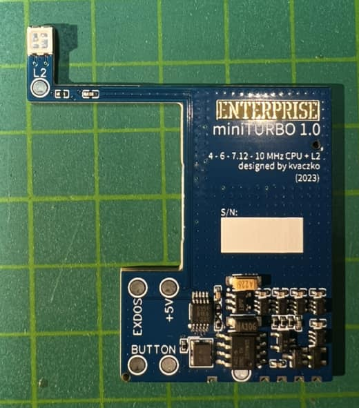

# miniTURBO

[Оригінал статті](https://magazin.enterpress.news.hu/2023/3-4/#p=4)

----

Írta: [Vaczkó Károly](../../../../peoples/community/kvaczko.md) (kvaczko)

Talán emlékeztek a [The “L2”](../../../../hardware/mods/the-l2.md) nevű fejlesztésemre, ami arra készült, hogy a [Nick](../../../../hardware/hm-nick.md) számára a korabeli PLL-es megoldással működő pixelórajelet előállító áramkört kiváltsa, ezzel stabil, hullámzástól mentes képet adjon a gép minden körülmények között.

Pár hete, egy kellően frusztráló nap után bevillant az agyamba, hogy mi lenne, ha ezt az áramkört kicsit átalakítva klónoznám az SMD Team-féle [turbóáramkört](../../../../hardware/mods/smd-turbokartya.md), azaz a gép oldalára kihozva egy nyomógombot, gombnyomásra tudnám állítani a Z80-as processzor órajelét az eredeti 4 és a turbós 6 MHz között. Elsőre ez nem is hangzik bonyolultnak a [The ”L2”](../../../../hardware/mods/the-l2.md) előzményei alapján, mert módosítani kell a szoftverét, plusz rá kell tenni egy nyomógombot és az áramkör kimenetét meg be kell kötni az alaplapi óragenerátor áramkör helyére, kész, meg is vagyunk.

Ezen fellelkesedve elmondtam az ötletet Zozónak… (hibát hibára halmozok) …aki előállt még pár dologgal: lehetne háromsebességes, hiszen az eredeti Nick órajelgenerátor kimenetének felével (7.12 MHz) még működik a legtöbb gép… kellene rá egy színes LED, hogy visszajelzést kapj az aktuális frekvenciáról… ha az óragenerátor IC-nek eleve három független kimenete van, miért ne csinálhatna a turbópanel L2 funkcionalitást is egy másik kimenetén… a harmadik kimenet meg kéne az expansion busz felé fix 8 MHz-vel, mert akkor a floppyvezérlő kártyák nem hülyülnek meg a nagyobb sebességtől…

Itt megkérdeztem tőle, hogy toronyórát nem akar-e lánccal és már morogtam is kicsit magamban, hogy kár volt elmondani, meg kellett volna csinálni, tessék, kész, 4-6 MHz egyszerű turbó, boldogság. Aztán persze nem hagyott a dolog nyugodni (nem szokott…) és nekiálltam megcsinálni. Először egy The “L2”-t buheráltam meg a nyomógombbal, megírtam rá a programot, működött. Utána jött a tervezés, hogy legyen berakva a gépbe, hol fér el, stb. A végeredmény mostanra állt össze.

Bemutatom a [miniTURBO](../../../../hardware/mods/miniturbo.md) panelt, ami a fenti összes funkciót gyúrja magába. A beszereléséhez ki kell szerelni az eredeti óragenerátor alkatrészeit (fél marék), majd az eredeti Nick óragenerátor alkatrészeit (másik fél marék) — utóbbit nem muszáj, de minek maradjon benne áramot fogyasztani feleslegesen alapon érdemes. A miniTURBO beül a processzor mellé, ott szükséges néhány forrasztás, illetve az alaplapon két helyen át kell vágni a vezetősávot és két vékony dróttal a helyére kötni az expansion busz felé menő órajelet, illetve a Nick órajelet is be kell ugyanígy kötni. Ezután találni kell egy alkalmas helyet a nyomógombnak, majd azt is beépíteni és már kész is az egész. A panelen lévő kis nyúlvány tetején ücsörög egy RGB LED, ami a sebbességtől függő színben pompázik, ez az eredeti piros LED helyére megy, rá lehet tenni a fényvezetőt és össze lehet rakni a gépet.

> [!Fun fact:]
> a benne lévő mikrokontroller flash memóriája 4096 bájtos (4 kB), a rajta futó szoftver 4086 bájt…  

A beszerelése (elsősorban a sok felesleges alkatrész kiszerelése miatt) eléggé komplikált, de ebben Németh Zoltán (Zozo) tud segíteni.

[Основна сторінка модуля miniTURBO](../../../../hardware/mods/miniturbo.md)
