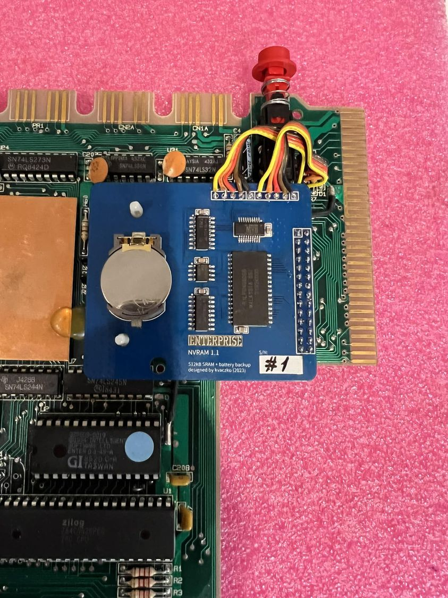
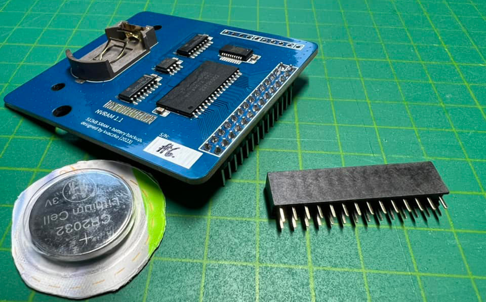

# NVRAM 1.1

[Оригінал статті](https://magazin.enterpress.news.hu/2023/3-4/#p=3)

Írta: [Vaczkó Károly](../../../../peoples/community/kvaczko.md) (kvaczko)

**Ez meg mi a képen? Jajj, már megint egy unalmas belső rambővítő, mi? Majdnem…**

Az tény, hogy a képen látható panel egy [rambővítő](../../../../hardware/ram-expansion/int-ram-exp-main.md), méghozzá **512kB**-os (tehát **576kB** lesz általa a gépben). Két érdekessége mégis van.

Az első inkább „szakmai”: én nem használok se PAL-t, se GAL-t, se CPLD-t, se FPGA-t, mivel nem értek hozzájuk. Így annak érdekében, hogy a rambővítő a beépített **FF**-**FC** szegmensek után látszódjon közvetlenül, egy újfajta (máshol eddig nem látott) címdekódolási mechanizmust kellett kitalálnom. Ez a későbbi fejlesztésekkor még nagyon hasznos lesz.

A másik a fontosabb, ami felhasználói szemmel emelheti meg sokak szemöldökét: ez a rambővítő nem felejt. Vagyis inkább: azt felejti el, amit a felhasználó akar. A rajta lévő CR2032-es elem és hozzátartozó vezérlő segítségével ugyanis a ram tartalma kikapcsolás után is megmarad. Ha lehet hinni az adatlapoknak, akkor egy elemmel közel három éven át megőrzi a tartalmát!

Miért jó ez azon kívül, hogy lesz a gépedben **576kB** ram?

**Példák:**  
Kapcsold be a géped. Csinálj egy ramdiszket [EXDOS](../../../../software/ss-exdos.md)-ból (pl. `:ramdisk 16`[^1] paranccsal, ez 256kB-ost készít), írj valamilyen programot és mentsd el rá a sima `SAVE` paranccsal. Majd vedd elő a géped két hét múlva és a `LOAD`-dal töltsd be, folytasd a programozást, ahol előzőleg abbahagytad. Kazettázás, floppyzás nélkül.  

Vagy töltsd bele a kedvenc ROM-jaidat anélkül, hogy EPROM-ot kellene égetned. Pl. az EXDOS-t, hogy tudj csinálni ramdiszket. Vagy az ASMON-t vagy a [Cyrus Chess II](../../../../sf-games/c/cyrus-chess-2.md)-t, bármit.

> [!Figyelem!]
> Az EXOS 2.1 a memóriatesztelés közben felülírja a ram tartalmat. Ahhoz, hogy élvezni tudd az NVRAM panel fenti előnyeit, [EXOS 2.4](../../../../software/exos/exos-versions.md)-et kell használnod, amiben már benne van Zozo gyors ramtesztje, az figyel erre. Nem mellesleg két másodpercen belül lefut a ramteszt, míg a régi EXOS-ok esetén ez majdnem két perc. 

A panel a jövő hét közepétől érhető el, darabonként 11000 Ft-os áron, plusz egy ezres a Foxpost automatába való szállítás díja. Akit érdekel, Messengeren írjon rám. 

EXOS 2.4-ben Németh Zoltán (Zozo) tud segíteni, illetve a beszerelésben is, aki igényli.

[Основна сторінка модуля NVRAM](../../../../hardware/ram-expansion/nvram.md)

[^1]: [Команда RAMDISK](../../../../manuals/dos-commands/cmd-ramdisk.md)
