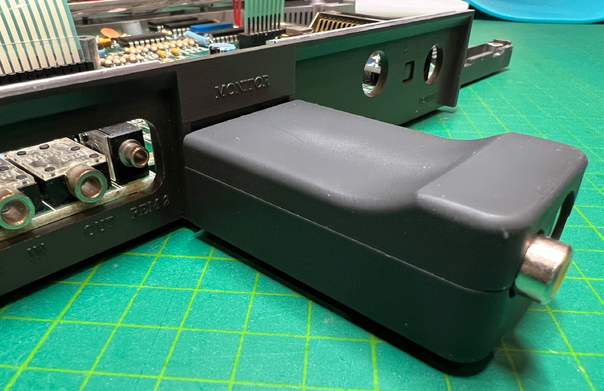
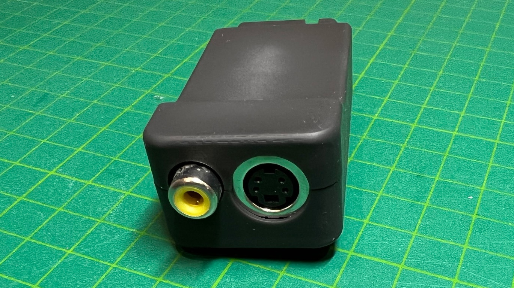
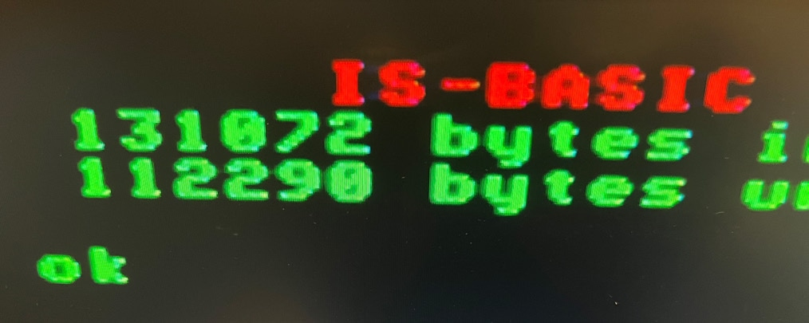
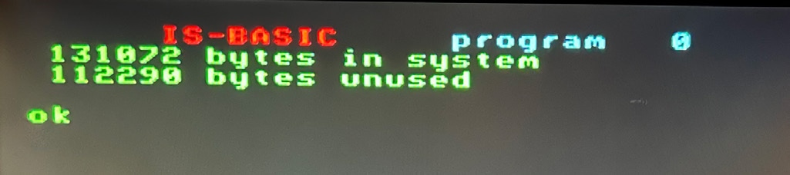
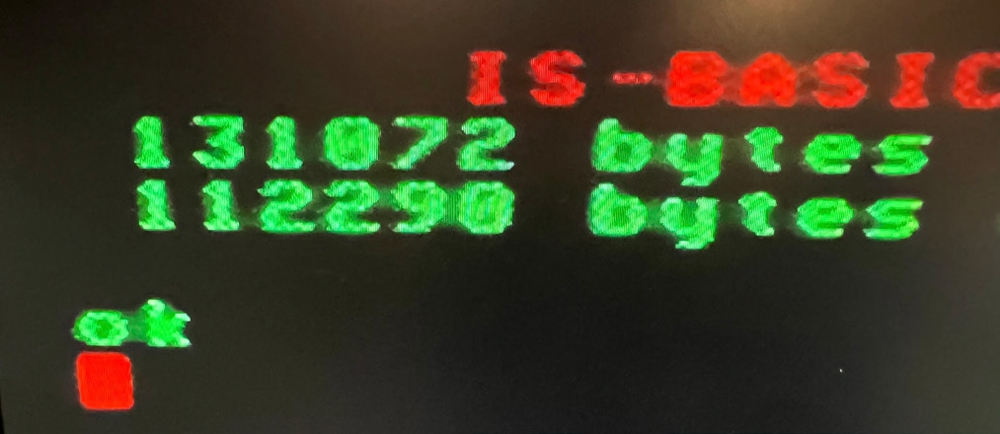
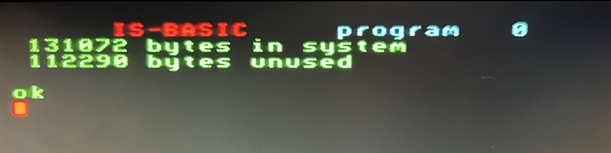
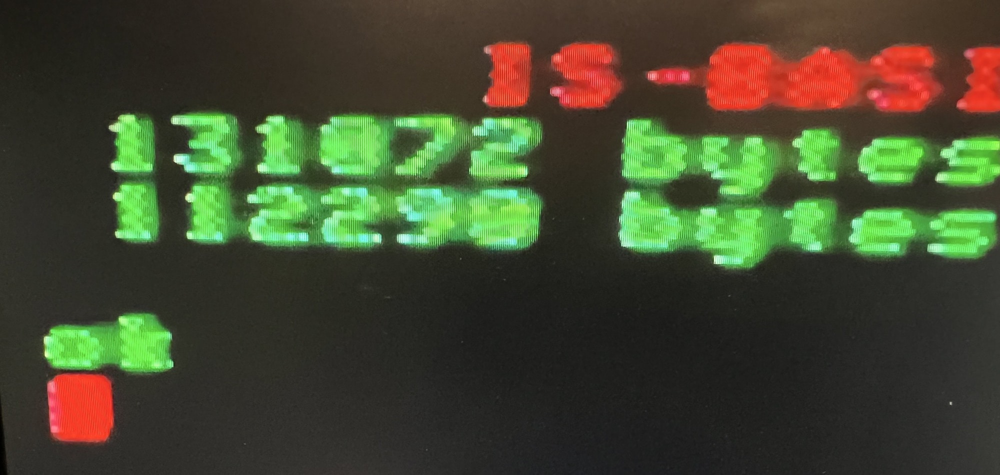
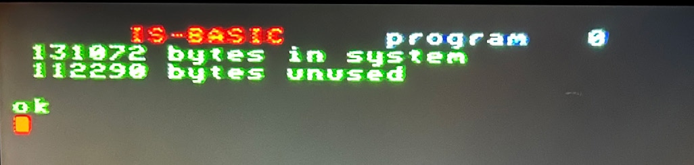

# RGB/S-video/kompozit adapter

[Оригінал статті](https://magazin.enterpress.news.hu/2023/3-4/#p=12)

----

Írta: [Vaczkó Károly](../../../../peoples/community/kvaczko.md) (kvaczko)

**Sokáig tartott, de elkészült végre a tavaly októberben beharangozott RGB/S-Video/Kompozit adapterem végleges változata, 3D házzal együtt!**

Ez az adapter a gép monitorcsatlakozójába dugható, és kompozit videójelet, valamint SVideo jelet állít elő tévék, monitorok számára. Kompozit kimenetet az Enterpress egyik nagyon régi számában leközölt egytranzisztoros moddal is lehetett már csinálni a gépben (bizonyára közületek is sokaknak van ilyen), ám ez az adapter az RGB jelből állítja elő ugyanezt és sokkal tisztább képet produkál. Az akkori posztból beteszek ide néhány képet, ezeken jól látszódik a különbség.

Az adapter használatához nem kell megbontani a gépet, egyszerűen be kell dugni a monitor kimenetbe és kész, működik! Az egységcsomagban az adapteren kívül található egy kétméteres kompozit kábel és egy kétméteres SVideo kábel is.

Akit érdekel, 9800 Ft-os áron megvásárolhatja, a szállítási díj 1000 Ft Foxpost automatába (utánvétel is lehetséges). Ha már van kompozit mód a gépedben, de szeretnéd kipróbálni az adaptert, arra is van mód: az átvételtől számított két héten belül bármikor visszaküldheted, és viszszakapod az árát, így a „teszt” mindössze az ezer forintos Foxpost díjba kerül, illetve amennyiért hozzám visszajuttatod.

  
 
 <i>приклад зображення з підключенням через S-Video</i>  
 
 <i>приклад зображення з підключенням через композит</i>  
 
 <i>приклад зображення "класичної" композитної модифікації</i>  

[Основна сторінка конвертера](../../../../hardware/video/rgb2cvbs-yc-interface.md)
