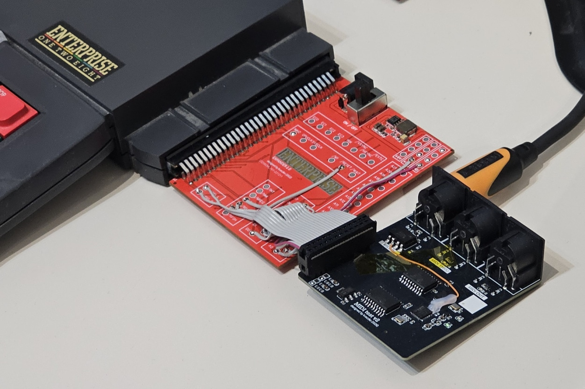
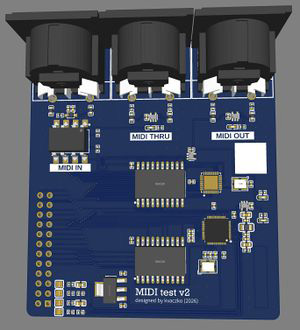
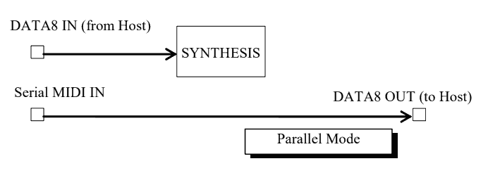
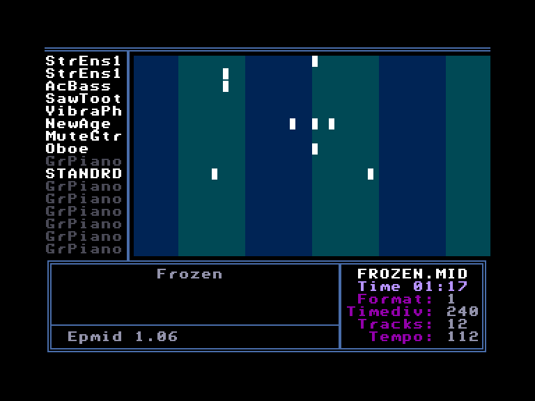
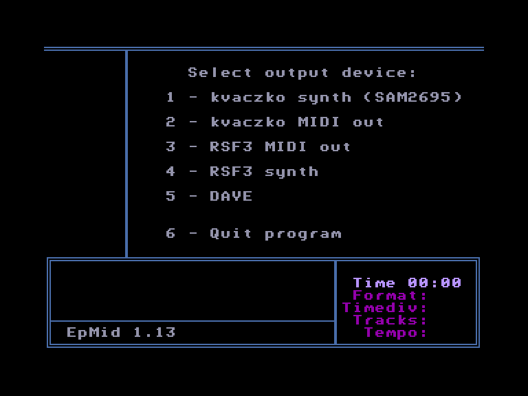

# MIDI kártya

[Оригінал статті](https://magazin.enterpress.news.hu/2026/3-4/#p=10)

Írta: [Povázsay Zoltán](../../../../peoples/community/povi.md) (Povi)

<div style="text-align:center;">
</div>

Aki járt a 2026 évi januári és februári Enterprise találkozókon, az láthatta (és hallhatta) már a [kvaczko](../../../../peoples/community/kvaczko.md)-féle [MIDI prototípus kártyát](../../../../hardware/sound/hs-midi-card.md). A kártya lelkét két IC adja; az egyik a francia DREAM szinti-chip gyártó, ma már nem gyártott SAM2695 modellje, ami a hangzásért, és a MIDI bemenetért felelős, a másik pedig egy egyszerű UART kontroller (TL16C550C), ami a MIDI kimenetért felelős. Az eredeti terv az volt, hogy a MIDI bemenetet is az UART kezelje, de ezt sokszori próbálkozásra sem sikerült működésre bírni (a 8 bites adatból a felső 3 bit valahogy mindig eltűnt).

A működő prototípus alapján fog elkészülni az [i7](../../../../hardware/hm-mb-issue7.md) alaplap MIDI-szinti egysége, de Karesz ígéretet tett egy, az Enterprise oldalába, a buszbővítőbe dugható változatról is.

<div style="text-align:center;">
</div>

A kártyán három 5 pólusú DIN aljzatot találunk, ezek a MIDI IN, MIDI THRU és MIDI OUT csatlakozók, amihez MIDI-billentyűzetet, vagy bármilyen MIDI-szintetizátor egységet dughatunk. A végleges, issue7-be szánt változatban, a tervek szerint 3.5mm-es jack aljzatok lesznek, MIDI Type A szabványú csatlakozással.

A kártyán a SAM2695 szinti-chipet két porton keresztül érhetjük el. A [246](../../../../programming/system-info/ports/port246.md)-os port (**0xf6**) a **CONTROL/STATUS** port, a [247](../../../../programming/system-info/ports/port247.md)-es port (**0xf7**) pedig a **DATA8** port. Ezek a portszámok tudatosan lettek kiválasztva, hogy kompatibilisek legyenek az [ep128emu](../../../../emulators/em-ep128emu.md)-ban már implementált MIDI emulációval.

<div style="text-align:center;">
<br><i>A SAM2695 működése parallel módban</i></div>

Ahhoz, hogy a szinti chip-et működtetni tudjuk az Enterprise-ról, a chip-et parallel módba kell kapcsolni (bekapcsoláskor és reset-kor a SAM2695 mindig serial módban van). Mit is jelent ez a parallel mód? Ekkor a szinti chip a soros bemenetén (MIDI IN aljzat a kártyán) kapott adatot a **DATA8** regiszterre küldi, amit mi az Enterprise-on a [247](../../../../programming/system-info/ports/port247.md)-es porton tudunk olvasni.

Ha mi írunk a szinti-chip **DATA8** regiszterébe adatot ([247](../../../../programming/system-info/ports/port247.md)-es port az EP-n), akkor azt a chip MIDI adatként értelmezi, és a **SYNTH** egységnek küldi értelmezésre (azaz meg fog szólalni).

A chip-et úgy tudjuk parallel módba kapcsolni, hogy a control portjára ([246](../../../../programming/system-info/ports/port246.md)) kiküldünk **63**-at (**0x3f**), majd a [247](../../../../programming/system-info/ports/port247.md)-es porton kiolvassuk a chip válaszát, aminek **254**-nek kell lennie, ha sikerült a mód váltás.

```basic
100 OUT 246,63
110 IF IN(247)=254 THEN PRINT "SAM Init OK"
```

Egy egyszerű C-dúr skálát az alábbi programmal tudunk lejátszani a kártyán (ep128emu-ban is műküdik!)

```basic
100 OUT 246,63
110 LET R=IN(246)
120 WAIT DELAY 1
130 OUT 247,144
140 FOR I=1 TO 8
150 READ N
160 OUT 247,N
170 OUT 247,63
180 WAIT DELAY 1
190 OUT 247,N
200 OUT 247,0
210 NEXT
220 DATA 60,62,64,65,67,69,71,72
```

Karesz január elején keresett meg, hogy ő bizony csinálna egy MIDI-kártyát, de nem tudja, mire is lehetne igazából használni. Én ekkor azt mondtam, hogy akkor írok egy MIDI lejátszót, hogy lehessen rajta zenéket hallgatni. Így is lett, elkészült az EpMid nevű MIDI lejátszó, amivel MID kiterjesztésű zenéket lehet közvetlenül lejátszani a szeretett gépünkön. A program működik a TMTLOGIC féle [RSF3](../../../../hardware/he-rsf3.md) kártyával is!

<div style="text-align:center;">
 </div>


[Основна сторінка MIDI-карти](../../../../hardware/sound/hs-midi-card.md)

