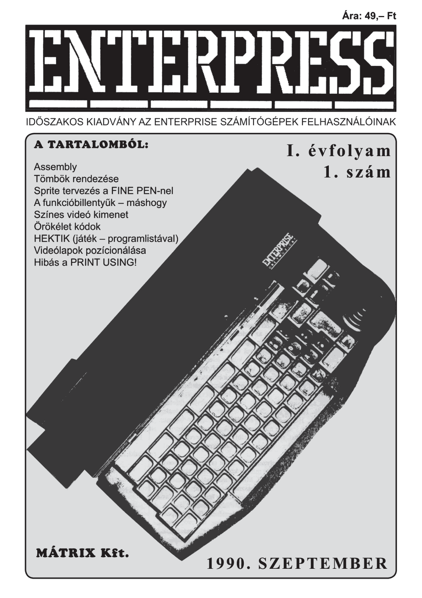

# Enterpress 1990/1 (1990.09)

[Онлайн версія](https://magazin.enterpress.news.hu/1990/1/) / [Ремастер PDF](http://enterprise.iko.hu/magazines/Enterpress_19901pdf.pdf) / [Оригінальний PDF](http://enterprise.iko.hu/magazines/Enterpress_1990-1.pdf) (угорською)

## Зміст

[Tisztelt Olvasó!](https://ep128.hu/Ep_Konyv/Enterpress_Cikkek.htm)  
[Assembly 1 .rész](https://ep128.hu/Ep_Konyv/Enterpress_Gepikod.htm#a1)    
[Tömbök rendezése](https://ep128.hu/Ep_Konyv/Enterpress_Cikkek.htm#1a)  
Sprite tervezés a FINE_PEN-nel  
Funkcióbillentyűk - máshogy  
Nyomtató hiányában  
[Színes videókimenet](https://ep128.hu/Ep_Hardware/Videokimenet.htm)  
Gyorsabb directory  
Röviden az editorcsatornáról  
Üzenet a státuszsorban  
Rendszerindítás a START programmal  
Örökéletkódok  
HEKTIK  
Percenként hatvan keretszín  
Látszólag több  
Videólapok pozicionálása  
Hibás a PRINT USING!  