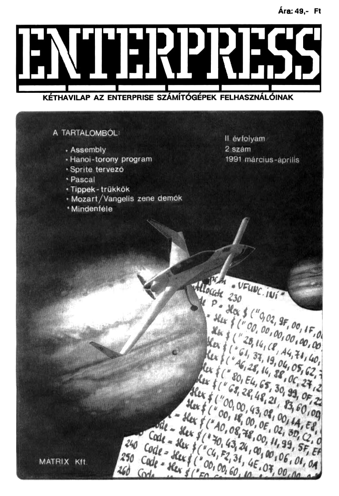

# Enterpress 1991/2 (1991.03-04)

[Онлайн версія](https://magazin.enterpress.news.hu/1991/2/) / [Ремастер PDF](https://magazin.enterpress.news.hu/1991/2/Enterpress-1991_per_2.pdf) / [Оригінальний PDF](http://enterprise.iko.hu/magazines/Enterpress_1991-2.pdf) (угорською)

## Зміст

A helyzet jó, de nem reménytelen  
[Assembly 4. rész](https://ep128.hu/Ep_Konyv/Enterpress_Gepikod.htm#a4)  
[Pascal 3. rész](https://ep128.hu/Ep_Konyv/Enterpress_Pascal.htm#3a)  
[Lehetőségek Páratlan Tárháza - az LPT kezelése 3. rész](https://ep128.hu/Ep_Konyv/Enterpress_Cikkek.htm#1)  
[Hanoi Tornyai](https://ep128.hu/Ep_Konyv/Enterpress_Cikkek.htm#2a)  
EnterSPRITE példaprogram és még valami  
Köztük: Dvorak, Mozart, Vangelis dallamok  
Leírás és térkép: MAHJOONG, KING OF THE CASTLE  
Örökéletkódok  
[ENTERPRISE képviselet nyílt Budapesten](https://ep128.hu/Ep_Konyv/Enterpress_Cikkek.htm#2b)   
Postafiók 334.  
Hirdetések, felhívások   

----

[Чернетка вмісту](1991-03-04/epress-1991-03-04.txt)
