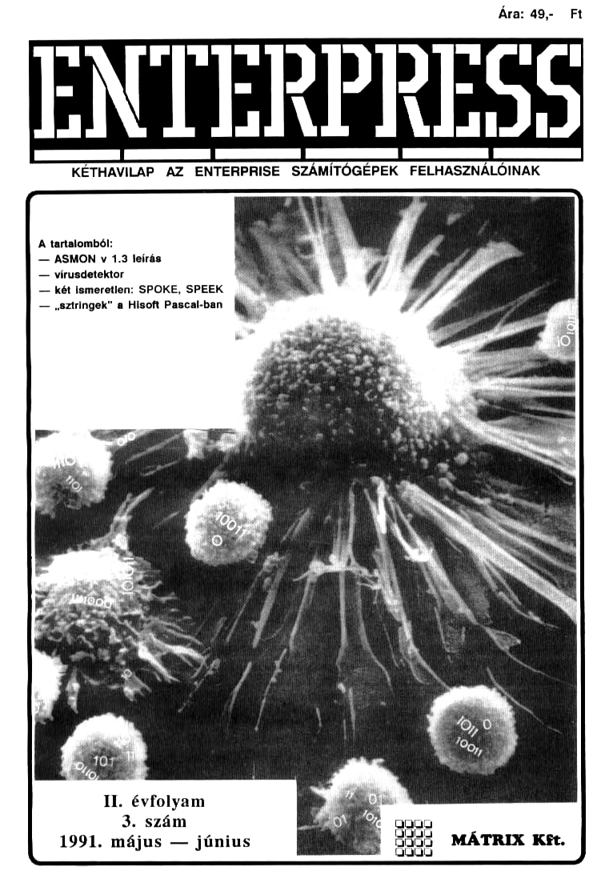

# Enterpress 1991/3 (1991.05-06)

[Оригінальний PDF](http://enterprise.iko.hu/magazines/Enterpress_1991-3.pdf) (угорською)

## Зміст

## Чернетка вмісту

"page-000.jpg" ------------------------------------------------------------ 
mt

Ára: 49,- Ft

ENTEKEÉRESS

KÉTHAVILAP AZ ENTERPRISE SZÁMÍTÓGÉPEK FELHASZNÁLÓINAK

A tartalomból:

— ASMON v 1.3 leírás

— vírusdetektor

— két ismeretlen: SPOKE, SPEEK

— ,sztringek" a Hisoft Pascal-ban W

II. évfolyam
3. szám
1991. május — június

"page-001.jpg" ------------------------------------------------------------ 
§

Felléc

1991. május — Június

!

!

Kedves Olvasó!

Megértésére, türelmére apellálok. amikor e néhány sor elolvasásá-
ra kérem, Eádig Ön ezen a helven a lap szakmai arculatát biztosító
Szerkesztők néhány gondolatát üzenetét, tervét olvashatta, Most
azonban szót kér a kiadó, ugyanis: jubileumi számhoz érkeztünk! A
lap fennállása óta ez az ötödik ,kísérleti" szám:

— Ötödik kísérlet arra, hogy a kis hazánkban ENTERPRISE-t
használók közel húszezres táborából megtaláljunk néhányat,

— Ötödik kisérlet arra, hogy a kiváló terjesztési tapasztalatokkal
rendelkező Postának a ma már erősődő konkurenciávál szemben bi-
TONY dik kisérlet ara, hogy társaságunknak egyéb tevékenységei

— ötödik kísérlet arra, hog inknak eg ei

kiadási zletágat biztosítrk, pú

mellett gazdaságos li ígat
Nem áltatom, Kedves Olvasó: pillanatnyilag mindhárom kisérle-
tünk vesztésre áll.

Mielőtt lapunk ellenzéke — eljutva eddig az olvasásban — féke-
veszett ünneplésbe kezdene, őket ís türelemre. intjük: mi még nem

juk fel!

"Nem adjuk fel. mert a hozzánk érkező levelek alapján úgy érezzük,
hogy az :RPRESS-t sokan szeretik, sokan keresik.

lem adjuk

fel, mert most már bennünk is erősödik a bizonyítás
vágya: napjaink lapkiadási hullámában a rengeteg hirdetés,szex, plety-
ka mellett a földi élet egyéb hívságainak — tudás tapasztalat, körsze-
rűség — is helye van.

Nem adjuk lel, mert látjuk a szerkesztők (ld. impresszum) fantasz-
ikus (és fánatikus) lelkesedését, önfeláldozó munkáját. (Ök nem fő-
állásban és egyelőre bizony honorárium nélkül dolgoznak.)

Szóval egyelőre nem adjuk fel! Persze nem azért, mert tartósan
veszteségre rendezkedünk be. S nem azért, mert hiszünk a Posta áru-
sítási terjesztésének látványos javulásában. Nem adjuk fel, mert hi-
Szünk abban, hogy a lapra szükség van. Ezért kérjük a Kedves Olva-
sót: segítsen a terjesztésben. (Nem utcai rikkancsokat keresünk!!) A
Jegnagyobb segítsúg az előfizetés. Ezt lehel a Fosta közreműködése
vel (reméljük a jelenlegi 425 előfizető megkapja ezt a szolgáltatást),
5 lehet a kiadón keresztül is intézni. Társaságunk vállalja egyedi pél-
dányok elküldését, vagy a rendszeres POstázását, előfizetés ala
(Az előfizetés megrendelhető levélben TMÁTRIX Kít.. 8000.

fehérvár, Dózsa T 10.) A budapestieknek némi prrckbzj ithet,
hogy a lap bármel Hdánya kapható jelenleg is a Műszaki Könyv-
áruházban (VI. ker. Liszt F. tér 9.).

Remélve, hogy az ötödik — jubileumi — szám jó értelemben vett
fordulópont lesz a lap életében, további hasznos, időtöltést
kívánok a lap olvasóinak.

A kiadó nevében:
Annus István
TARTALOM
KURZUS

Asvemly £. été zá ő geg at gre át a Sb

A Pascal 5. . ... ki .. 67

Lehetőségek Páratlan Tárháza (LPT) kg
PROGRAMOZÁSTECHNIKA

Az lemeretlen SPOKE és SPEEK . . . . .... 9

VÉGBT szé s és késes s s e s 10
TIPPEK-TRÜKKÖK

Köztük: színkeverés, sztringek a Pascakban  . . . 11
KÖNNYED MÚFAJ

"Green HilI, Super Robin Hood,

Joeblade, Nether Earth... . 12-14
MINDENFÉLE

Postafiók 334 , . . .. véd ős s o. 15-46

Hirdetések, felhívások rzizekttee . 16

II. évfolyam 3. szám
1991. május — június

Kiadja a
MÁTRIX Számítástechnikai,
Kereskedelmi és Szolgáltató Kft.
Székesfehérvár
Felelős kiadó:

Annus István.
ügyvezető
Felelős szerkesztő:

Ujlaki László (UL)

A lap szerkesztőt:

Hajnal Csaba (HCS)
DevilSott (Devil)

Címlap:
Németh Ferenc
"Technikai szerkesztő:
Bartha István
A szerkesztőség és a kiadó címe:
5000 Székesfehérvár
Dózsa György tér 10.
Telefon: (22) 12 - 619
Telefux (22) 11 . 585

1evéleím:
ENTERPRESS
1399 Budapest
PL. 701/3384
Lapunk az ENTERPRISE Computers
(GmbH kelet-európai képviseletének, a
"VTGe Electronics Ltd.-nek szakmai
támogatását élvezi.
Nyomja a
VIDEOTON Nyomda
Székesfehérvár
Felelős vezetőt
Gombaszögi József
ISSN 0866-1820
Terjeszti a
Magyar Posta
Előfizethető a HELIR Bp. 1900 címen

Előfizetési díj
egy évre 294 Ft, fél évre 147 Ft.
Árat 49,- Ft

Következő számunk
Július 20-án jelenik meg

"page-002.jpg" ------------------------------------------------------------ 
1991. május — Június

Kurzus 3.

[ Assembly

5. rész

Legutóbb nagy általánosságban megismerkedtünk az AS-
MON-nal, mint komplett assemblerfeditorjdebugger prog-
rammal. Ebben a fejezetben egy ténylegesen használható le.
Írást kapunk a rendszerről.

Az ASMON kétféle változatban terjedt el: az egyikben au-
tostartos . alkalmazói ként, a másikban  rend-
szerbővítőként inicializálódik. Jelen leírás az előbbi 1.3-as válto-
7atára vonatkozik, igazán lényeges eltérés nincs a különböző
verziók között.

A betöltést követően megjelenik az ASMON képemyője,
"amely három főrészre tagolódik:

BC-0000 FF FF FF FF 00 00 00 00 00 00
DE-0000 FF FF FF FF 00 00 00 00 00

!  §E-0200 04 90 BF 95 04 09 00 03 45 01

A felső, legnagyobb ablakban 16 sorban jeleníthető meg a
kód listája, a memóriatartalom (vagy népszerűbb nevén a me-
móriadumi am), itt végezhetjük el a memóriatanialom módosítá
sát, ide írádnak a rendszer üzenetei stb,

A két csík által bezárt középső sort parancssornak nevezhet-

juk. A "Command 2 " promptnál nyomjuk le az egyes paran-
Tlokítoz tartozó bileníyiket, és a szükséges továból paráméte.
reket is ebben a sorban adjuk meg. A sor vége feletti "PRIN-
TER" felirat tájékoztat a nyomlató statuszáról, a sor alatti
JINPUT:" pedig azt árulja él, hogy hexadecimális, docimális
vagy éppen Farukteres fortálbán Köbitágádmuk a parazsétet
reket az illető parancsnak.

A legalsó ablak bal szélén a regiszterek tartalmát látjuk. A.
tegfeiső sorban az F regiszter bitjeinek állását vizsgálhatjuk. Ha
valamelyik bit értéke 1, akkor jelenik meg a hozzátartozó bető.

A BC, DE, HL, IX, IVY, SP regisztertartalmak mellett tíz
értékből álló dumpot látunk, Ez a dump úgy kél hogy a
KEZE Ae ERT SaS A EL ESZE
Szomszédos négy alsóbb és Ot felsőbb címd rekesz tartalmát is
kijelzi. Ez a lehetőség főleg az indexregiszterekkel, veremkeze-
téssel kapcsolatos vizsgálatoknál nagyon hasznos.

A legalsó sorban a PC értéke mellett az éppen megcímzett
utasítást láthatjuk.

A debugger
A debugger jom tos lehetőséggel rendelkezik: ítt
végezhetjük a prok ítását, lét végrehajtását,

futtatását; kezelhetjük a portokat, vájkálhatunk a tárban stb. A
fő feladata tehát, hogy segítsen programunkat futtatható for-
mába önteni, a hibákat kibogarászni (nem véletlenül hívják de-
bugger-nek, a "bug" ugyanis bogarat jelent).

Az ASMON összes parancsa a megfelelő billentyű leütésé-

jelkíívisátkátó A öktátkéták élét e TÓ (Vtdlöi setét a,
kapjuk meg. A Paraméterként
szátokat ús szövegeket b várhalnak "A számokít hexdedíi

lis vagy decimális formában adhatjuk meg, a számrendszerek

között LTE ATS ÉENÍTKEÉI KÉRÉSÉT KS

bként a szükséges helyeken mindig működik,
KSH mit sz (ESC), amellyel bátmiyen helyzetből, bár.
visszaléphetünk a parancssorba.

alapértelmezése! rendelkezik, Így ha az ott sze-
dó énák származik HEGTeldlÁ Kkkor TEL tá égni,
it hogy az (ENTERJ-t leússük.

A következőkben az angol
ken csak an nag ehérés hogy 3.nérány paran mis li

- csak annyi az elt 15. lent
indul ek Ezen különbségekről a [HI lenyomásával szerezhetnek
tudomást a német gépek tulaj tulajdonosai. (Sajnos, szerkesztösé.
IEEE ÉKSEL KÉS EDZES A EST

TAT Assemt megfelelően elindul az
táltorban tévő forráslka fordít

1BI. Breukpointa : két töréspont ("Breakpalat, 17 és "Bre-

aikpoint 2-") beállítása. Ha a program futás közben a törés-
Egg. Jut, akkor megáll a végrehajtása, így ismét az AS-

[ON-hoz kerül a főszerep.

: memóriatartalom másolása a "Start:".
:" céleímre,

DJ, Dump. memory : memóriatartalom megjelenítése a
start" almtól.

TEJ Edit source : belépés az ASMON edítorba.

IFI, FIL memory : a memória feltöltése a "Start:
"End:" címig a "Value:" értékkel,

GJ Go : a lefordított program indítása a "Start:" címtől.

helpüzenetek megjelenítése.
I Set function key : 2 "Key number" sorszámú funkció:
billentyűhöz a "Key st jelek között megadott sztrin.
get rendelhetjük. Az ASMON az edítorba lépve elfelejti a meg-
dott sztringeket, Így ez a lehetőség használhatatlan.

ÚJ] Swap register : a regiszterkészletek cseréje,
kijelzése AZ alsó ablak jobb oldalán az "ALT
írat jelenik meg.

ÍKI Read source : a "File name:"-nél megadott nevű for-
ráslista beolvasása az editorba.

ILI Disassemble : a lefordított kód listázása a "Star
től.

ÍM] Modify memory : a memóriatartalom módosítása a
start" címtől. A számmező és az ASCII mező között az
TALTJ$(FS] billentyűkkel ugrálhatunk.

IN] Number eruncher : kiszámolja a "Value:"-nál meg-
adott szám 16-os, 10-es, 2-es számrendszerbeli és ASCII meg.
felelőjét.

10] Output port : a "Port:" portra a "Value:" értéket írja

(PI Printer ON/OFF ; bekapcsolt (ON) állapotban a meg-
jelenítést a nyomtatóra irányítja.

TO] Overy port : megjeleníti a "Port:" port tartalmát

ÍR] Reud BIN file: a "Start:"-tól az "End:" címig a "File
name:" nevű tárgykód betöltése.

IS] Save BIN file : a memóriában a "Start:"-től az "End."
Címig elhelyezkedő tárgykód elmentése "File name:" néven.

ITT Trace : a "Start:" címtől "Steps:" számú uta-
sítás végrehajtásának lépésenkénti végrehajtása, nyomkövetése.

UI Uatrace : ez a furcsára sikeredett funkció elvileg
ugyanaz, mint az előző, csak itt nincs kijelzés.

GÍVI View status : megjelenik az EXOS verziószáma; a
GÉU-ra lapozott szegmensök száma (Page. Pagc3y; a szabad

:gmensek (Free segmenu(s) ), az ASMON munkaszegmensei-
neke (Working segmen(1)), az üzemképtelen szegmensek (De.
fective segmenuís)) és az összes szegmens (Total RAM seg-
menu(5)) száma; a copyright szöveg.

IWI Write source : a forráskód mentése az edítorból a
te name:7-nél megadott néven.

IXI eXamine register : a "Registerpair:"-nál megadott re-
tiszerpár (AP, BC Hb) értéke a ÉVale" kesz

1 meg
5 fünkciók. A német gépe:

tól az

tartalnuk
EGS-" fel.

"elm

"page-003.jpg" ------------------------------------------------------------ 
4. Kurzus

1991. május — Június

IYI Optionz disassemabler or megjelenő memó:
riacímekhez, hozzáadhatjuk Memory otta -nél megadott
értéket, a címek kiírását az "Addresses tílthatjuk/en-
gedélyezhetjük (a "NO/YES" válaszokat bármelyik billentyű le-
ésével váltogathatjuk).

isdzl, azoemble : "Assembly iisting" - fordítás közben

istázza-e rag tem; "List conaítloai" . foráítás köz

ben istázza t a fehételeket, vágy sem (a feltétekikről később)

"Force Pass 2" - az ciső menet esetleges hibáítól füg

vét e a másosik fordaáui menet, vagy 96;
sáemtlj" memóriába fordison, ha a "Memory as.

témbyere YES" válaszolunk, akkot a Memory ottselr-tei

a forráslítában megadott fordítási címtől eltérhetünk);

file name:" - a tárgykód neve. Ha nem adjuk meg a tárt

nevét, akkor nem lesz fel több kérdést a rendszer, elet

€setben még a közvetkezőkre kell válaszolnunk: "EXOS modu-

e header" - készítsen e az ASMON a tárgykód elé EXOS fej-

lécet, vagy sem; ha "YES"-t válaszolunk, akkor meg kell

fu5E A BEstát ÉLCEKCS ms TEA,

ges peáztse OS

1 roi
RINTER-t vélesztunk, akkor a

Tistázott sorok végére CRULF
Line Fecd, soremelés) karakte-
egy oldalra kerülő sorok.

- a bal margó mérete karaktert
margó mérete karakterben; "Header:
fejléc szövege.

ÚN Option editor : az editorban tárolt forráststa az "Edi-
tor buffer start:"-tól az "Editor buffer en

ITJ Load module : a "File name"
EXÖS rendszerbővtő betöltése.

(01 Symbol table : a szimbólumtábia tartalmának megje-
tenítése.

15] Find atring : a "Start:" címtől a "Search:"-nál idézője-
lek között megadott sztring keresése. Ha idézőjelek nélkül szá-
mokat fel, akkor a számsorozatot keresi.

CI EXOS string : parancs küldése az EXOS-nak.

- a lap tetejére kerülő

ságdőltsáávű

Az editor
Az edítorba az (EJ leütésével léphetünk. Az editor gyakor-

latilag minden olyan tud, ami fontos. Az editorba
az alsó két sorban a yúkhoz rendelt lehetőség
láthatjuk.

IFIJ Find : Keresés

Find string : sztring kercsés. Az "F után beírt szöveget ke-
.Iyétől a szöveg vége felé haladva.

: keresés és helyettesítés. Az "R" után előszőr

jelyettesíendő, a "2" után a helyettesítő sztringet

kell megadni.

Cont search : a keresés folytatása.

Repl string : a megtalált sztringet kicseréli a megadottal.

Repl 4 cont : a helyettesítés után folytatja a keresést.

IF2] Tabs : Tabulátorok
let felírt tedf tábalátoepoztóló láza orzor ülés

n.

Res tabmark : tödli azt a tabulátort, amelyen a kurzor éppen
all

Cr tabmark : törli az összes tabulátort.

Stand mark : beállítja az alapértelmezésű tabulátorokat.

IF3] Copy : Másolás

Mark start : a blokk eleje a kurzor helyén lesz.

Mark end : a blokk vége a kurzor helyén kesz

Copy block : az előzőleg kijelölt blokk. másolása a kurzor

Del block : a kijelölt blokk törlése.

Pt block : a kijelölt blokk printelése.

Cir mark : a biokkjeizők törlése.

1F4) File : Fájiműveletek

[Load file: a "File name:" -nél megadott című forrásfájl be-
töltése az edítorba.

Save file : a "File name:" -nél megadott néven elmenti az

editorban lévő forrásfájlt.

Save block : a "File name: "-nél meg
kijelölt blokkot. E funkció csak akkor mi
kurzora a blokk előtt van.

Köll text : törli az edítor tartalmát, ha a "Delete text Y/N"
kérdésre (Y-t válaszolunk.

1F6] Free : Szabad belyek

A "Tax" után a forráslista hosszát, a "Free" a még az edi-
torba írható karakterek számát jelenti bájtban.

AFTI Help : help az editor lehetőségeiről

A szerkesztő billentyák a szokásos funkciókat valósítják
meg, ezért ezeket külön nem érdemes felsorolni. A hel
tartalmazza az (ALTJ4[JOYUPI és az JALTIH[JOYDOWNI
kehetőségeket, szmelyektel egyenésen a fervániais elelérelvézée

re ug tunk. Az edítornak ej
Bogy nem tud folyamatosan beszőrásos ÁNSEKT) üzemmód:
1F8) et : Kiüépés az edítorból

ban dolgozni.
A billentyű leütése után visszajutunk a debugger parancs-
sorába.

néven elmenti a
iködik jól, ha az edítor

Az assembler

Az assembler feladata, hogy az editorban megírt forráslistát
lefordítsa, futtatható kódot ljon. A minél :bb
PEGYE9zői munka érdekében a sokfajta lehetőséget
négyféle számrendszert használhatunk, a szimbólum
ALTE GNÁS kg KiGYEKe KEL VEJE MET
makrók használatát stb. Vegyük sorba ezeket az adott

Számrendszerek

Az assembler uj a jelöléseket használja, mint
amelyekkel a sorozat előző részeiben mi is alkalmaztunk: a szá
mok végén egy-egy betűvel jelöljük a számrendszert. Ha nem
adunk meg a szám után betüt, akkor az assembler az alapéi

jelmezésnek megfelelő számrendszerben (I. .RADIX) értelme

— Decimális : a végén "d" betű, pl. 674.
Hexadecimális : a végén "h" betű, pl. OMZTh. Ha a szám

alfanumerikus karakterrel (azaz betdvel) kezdődik,

szám elé nullát kitenni, mert a fordító címkeként értékeli

Bináris : a végén "b" betű, pl. 110010016.

Oktális : a végén "o" betű, pl. 730.

Értékadás másképpen is történhet:

Ha idézőjelek közé teszünk egy karaktert, akkor annak AS-
CI megfelelőjét fogjuk megkapni, pl. LD BA", amely az LD
B.041h-val megegyező.

Szimbólikus jelölés ís használható, A szimbólum egy, a for-

létező értéket képez a fordítónak. Legyen rare
la CHART" szimbólum értéke ált. Ekkor az LD B

hatására a fordító az LD. B.OZIh kódot fogja előálítank,
Az ún. címszámláló értékét is megkaphatjuk, ha a "$" jelo-
lést használjuk. A fordítás indításakor meg kell adnunk a fördí-
tás kezdőcímét, erre fog kerülni az első utasítás. A címszámláló
értéke a fordítás során az utasítások hosszának megfelelően ál-
landóan növekszik, mindig annak a tárrekesznek a címét tartal-
mazza, amelyre az illető utasítás kerülni fog. Ez a lehetőség az
EXOS-nál különösen hasznos, mert pl. az ún. escape szekven-
ciák elkükdésekor tudnunk kell azok hosszát.

A szimbólumokkal végezhető műveletek
Legyen a két szimbólum A és B, ekkor a következő műve-

letek végezhetők el:
A4B Összeadás
A-B kivonás
ASB szorzás
AIB osztás
AMODB — maradék
AANDB — ÉS műveket
AORB —— VAGY művelet
AXORB KIZÁRÓ VAGY művelet

ASHLB A bitjei B hellyel balra mozognak
"page-004.jpg" ------------------------------------------------------------ 
1991. május — Június

Kurzus 5.

ASHRBO Abitjei B hellyel jobbra mozognak

NOTA a biteket negálja (egyes komplemens)

4 kettes komplemens képzése

LOWA az alacsony bájt képzése

HIGHA a magas bájt képzése

"Használatók még az

ASB, AB, AczB, Az3B, AzB, Ac3B relációk.

Ezek után lássuk a fordítást vezérlő utasításokat, az ún. as
sembler direktívákat. A direktívákat a sar elejénél legalább egy
Szököznyi (céiszerden egy tabulátornyi) hellyel beljebb kell fi;
a szimbólum: és a cimkeneveket viszont mindig a sor elejére
kell tennünk, máskülönben a fordító utasításként próbálja ér-
telmezni

ORG n A fordítás az "n" címtől fog kezdődni, minden
Programot ezzel kell kezdeni, pl. ORG OCÓOAh.

CPHASE a Ez a direktíva tulajdonképpen egy második
címszámiálót indít el az "n" címtől, a fordítás természetesen er-
fe az új címre történik, Párhuzamosan az elsődleges címszám-
1áló értéke is megfelelően növekszik.

.DEPHASE . Ismét az elsődleges címszámlálóé lesz a fősze-
tep;

DEFB a Az én? bájtot a címszámláló által meghatározott
tárrekeszbe teszi (DEFine Byte, bájt definiálás),

DBa L.DEFB an

DEFWn Az "a" szót a címszámiáló által megeímzett hely-
fe teszi (DEFine Word, szó definsálás)

DWn L.DEFW n.

DEFS a , A kódban -n" bájtnyi helyet üresen hagy (DEFi-
ne Storage, "tárolóhely" definilás)

DSn L.DEFSn.

DEFM etet" . Az idézőjelek között álló szöveget letárolja
(DEFine Message, "üzenet" definiálás),

symb OU value . Egy adott szimbólumot egyenlővé tehe-
tünk egy értékkel, pl. az cse BOL OTBN után az ese" szimbó-
lm 27-el lesz egyenértékű (EOUaI, egyenlő).

INCLUDE filename . Az "filename" nevű forráslistát lefor-
dítja, a kódhoz illeszti. Az inkiudolást" nagyobb programok
készésekor szokás használni. Ilyenkor a már jól működő ré.
szeket külön fájlokba mentjük, és a szükséges helyeken betölt:
jük őket. Így áz edítorban, mindig csak az aktuális, fejlesztés
alant álló rutin van. Ez. a direktíva akkor ss nagyon hasznos, ha
a forráslstánk teljes mérete meghaladja az cdítorha tölthető
áGKlvot. Nagy jelentősége van a makrókönyvtárak alktívizálásá:
vál ís, . alább.

END A forráslista és ezzel együtt a fordítás végét jelzi

mmname MACRO parameterís) A makródefiníció kezdetét
jelöli, A makró egy olyan paraméterezhető, csak a fordítás ide-
JÉn létező utasíásogyűltes amely csak akkor kerül be a kódba,

a nevével hivatkozunk rá. A makró definiálása tehát önma-
gában még nem eredményez semmiféle kódot, A makró és a
Szubrutin, között az a különbség, hogy a szubrutin a kódban
Csak egyszer fordul elő, és ezt az egy rutint hívjuk meg távolról;
a makró viszont minden esetben lelordításra kerül, ha hívatko:
Zunk rá, így a makróban szereplő utasítások több helyen is sze-
fepcinek majd a kódban, Egy példa a makró definiálása és
használatra

; előszőr a definíció

útehr MAGRO Gohar
1d a070n
1a biGchar
ret 0g0h

; majd a használat

A példában egy olyan makrót készítünk, amely bemeneti
paraméterként a kiírandó karakter ASCII kódját varja, majd
ezt a megfelelő EXOS hívással kiteszi az ASMON debugger
képernyőre, A tulajdonképpeni programban a makró nevét
(urchr") a paraméter, azaz egy "A" betű követi, ez fog megje-
lenni. Ha megvizsgálnánk a generált kódot, akkor azt látnánk,
hogy az ugyanaz, mint a makró (mi más is lehetne..?), csupán
az Hid bfehar" helyére "d b0sih" került

Az ASMON egyik súlyos hiányossága, hogy nem támogatja
a feltételes paraméterátadást,

ENDM A makró végét jelzi, I. az előző példát.

EXOS n Egy előredefiniált, az operációs rendszer hívását
támogató makró. "n" a hívni kívánt funkció számát jelenti. Az
előbbi példában az "rst 030h" és a "defb 7" sorok helyett "exos
Ta is Írhattunk volna.

EXITM A dírektívát az alább ismertetendő feltételes for-
dítást vezérlő utasításokkal együtt arra használhatjuk, hogy for-
díhás alatt kiugorjunk a makró beejéből (XT! Macró, kié
pés a makróból).

1F kitejozés

ELSE

Utasításokt

utasítások2

ENDIF Az IF..ELSE..ENDIF szerkezettel feltételes fordí-
tást végezhetünk. Ha a "kifejezés" igaz, azaz értéke egy, akkor
az. vutasításokI", egyébként az "utasítások" lesz lefordítva. Az
ELSE ág elhagyható.

IFT Ua, mint az IF (IF True, ba igaz),

IFF Az IF-től annyiban különbözik, hogy az "utasítások!"
a feltétel hamissága esetén kerül lefordításra (IF False, ha ha-
mis).

IFI A fordítás első menetében igaz.

IF2 A fordítás második menetében igaz.

.SFCOND A fordítási feltételek listázását kapcsolja be.

ALFCOND A fordítási feltételek listázását kapcsolja ki.

TFCOND A fordítási feltételek listázását kapcsolja beki.
E három dírektíva a debugger "Options Assemble/Lást condíti-
ns" részét utánozza.

ALIST E direktíva már a listázás vezérlésére vonatkozik. A
direktíva hatására fordításkor bekapcsolódik a listázás.

XLIST Kikapcsolja a listázást.

-PRINTX text . A "text" szöveget beleírja a fordítási listába,
Ha a szöveg első karaktere a "96" jel, akkor a jelet követő ki-
fejezés értékét jeleníti meg.

TITLE str Nyomtatásnál a lap fejlécébe kerül az ést"
szrng,

RADIX a Az alapértelmezésű számrendszer "n" lesz.

(Az ASMON saját kódjában szerepelnek a relokálható Alla
mányok fordításához szükséges INIÖFS, SETRTP, RESRTP,
ASEG; CSEG stb. direktívák is. Mivel azonban a rendszer kép-
telen korrekt relokálható fájlokat készíteni, ezek a direktívák
használhatátlanok.

(Folytatjuk)

-HCs.

Fizessen elő a

Hobby Elektronika es a Rádiótechnika

folyóiratokral Így biztosan mindig hozzájut!
A cím: 1387 Budapest, Pf. 603. Tel.: 117 - 0262
A szerkesztőségben regisztrált HE előfizetőknek ingyenes nyák-film melléklet.

"page-005.jpg" ------------------------------------------------------------ 
€. 0 Kurzus

1991. május — június

! A PASCAL

5. rész

A halmaz (set) típus

A, matematikában a halmaz valamilven szempontból azonos jel-
temzőjű objektumok összesége, A Pascal nyelvben is bevezették a hal;
maz típust; ez egy adott - megszámlálható - tipushoz tartozó értékek
együttesét jelenti

Miért van erre szükség? Mindenki, aki készített már komolyabb
programot, találkozott azzal a problémával, hogy meg kell állapítani
egy érték hovatartozását. Numerikus értékeknél legtöbbször nincs is
gond, egyszerűen megvizsgáljuk, hogy az érték belesik-e az előírt tar.
Sömányba:

1F ( ERTEK 2 — ALSO HATAR ) AND ( ERTEK €— FELSO HA.
TAR) THEN

Egy fordítóprogram készítésekor azonban olyan feltételeket kell
"azsgálni, hogy az adott karakter pl. betű-e vagy szám, esetleg írásjel.
Szerencsére az ASCII kódok esetében a betűk egy (a kis- és nagybe.
tűket külön kezelve két) folyamatos kódtartományba tartoznak, így a
zsgálat megoldható a fenti módszer kiterjesztésével, Eláruljuk, hogy
ez nem minden kódrendszerben van így - az IBM nagygépeken hasz.
nált EBCDIC (ejtsd "ebszidik") kódkészlet sem ilyen -; az írásjelek
"Viszont valóban Össze-vissza helyezkednek el a kódiartományban,

A Pascal az ún. halmazgenerátor segítségével generálni tud az
ataptítupusának - egy megszámlálható típusnak - az elemeiből egy hal-
azt (a halmazgenerátor programbeli alakja egy szögleteszárójel-pár,
amelyben felsoroljuk vagy folytonos tartományként megadjuk az alap-
ipusnak azokat az elemeit, amelyeket az adott halmazhoz akarunk
rendelni). Lássunk erre először pár példát. It most halmazokat gene-
Tálunk egy fordítóprogram számára:

CONST
TAB "— CHR( 9 ); ( HiSott Pascal; TURBO-
Pascalnál TAB — 49);
PONT
VESSZO
PONTOSVESSZO
VAR
KISBETU. 4 ezeket )
NAGYBETU, 4 a változókat )
BETU, 4 karaktor- )
SZAMJEGY ( halmaznak )
HEXA SZAMJEGY. — ( doklaráltuk )

ELVALASZTOJEL : SET OF CHAR;

BEGIN
KISBETU [/9..7 ]; ( a kisbetűk halmaza
atól ág)
NAGYBETU [47.577]: ( a nagybetűk
halmaza A-tól Z-ig )
BETU :— KISBETU 4 NAGYBETU; ( a két
előző
halmaz
Uniója )
SZAMJEGY [70.91
HEXA SZAMJEGY — 1— SZAMJEGY 4 [/A0FJ;
ELVALASZTOJEL — :— [ PONT, VESSZO, PONTOSVESSZO,
TAB];
END;

Fzután gyerekjáték megállapítani, hogy egy karakter beletartozik-e

valamelyik halmazba:

IF C IN BETU THEN
IF CIN ( BETU 4 SZAMJEGY ) THEN ..

AZ IN halmazművelet, értelemszerűen, igaz eredményt ad, ha egy
érték beletartozik az adott halmazba. A második programsorban a be-
tűk és a számjegyek közös halmazába tartozást vizsgáltuk.

Ihattuk volna ugyanezeket a

KISBETU — (a.
stb.

A halmazok között megengedett az értékadás; ha A és B halmaz
típusú, akkor ez

AszB
alakban írható. A természetesen változó, B tetszőleges - halmaz típusú
- kifejezés lehet.

Az

AB
kifejezés, mint már láttuk, a két halmaz unióját - közös halmazát
- jelenti (vagyis azokat az elemeket, amelyek akár az A, akár a B hal-
mazba tartoznak); az.
AsB
a két halmaz közös részét - interszekcióját - (vagyis azokat az ele.
meket, amelyek egyidejűleg mind a két halmazhoz tartoznak); az
A-B
a két halmaz különbségét (A-nak azt a részhalmazát, amelyik nem
tartozik ugyanakkor B-hez ís).
Vizsgálhatjuk két halmaz egyenlőségét, azaz, hogy ugyanazokat és
Csak ugyanazokat az elemeket tartalmazzák-e:
AB
két halmaz egyenlőtlenségét, azaz, hogy nem tartalmaznak azonos
elemet:

AcsB
s azt, hogy az egyik halmaz részhalmaza-e a másiknak:
A czB
Vagy megfordítva, a másik az egyiknek
AzaB
Irjuk még fel az üres halmazt:
(8)
Ez nyilván egy olyan halmaz, amelynek nincs egyetlen eleme sem.
Szóljunk pár szót a halmaz típus gépi ábrázolásáról, Egy adolt
Magtpusból képzett összes lehetséges halmazban az összes elemnek
gy tulajdonságát használjuk ki, mégpedig, hogy beletartozik-e az
adott halmazba vagy sem; így az elemek ábrázolásához elegendő egy.
egy bit, Például, a karakter alaptípusból képzett összes halmaz egy 256.
bites (32 bájtos) mezővel ábrázolható, ahol az egyes bitpozíciókon 1
jelenti, hogy az adott karakter eleme a halmaznak, és 0, ha nem eleme,
Így az üres karakterhalmaz gépi ábrázolása
9009000 1I000000 00200200 10020009 000000 000000 10000000 00000000
(még 26 x 8 multat
ahol a bal szélső nulla a 00 hexa kódú karaktert (pontosabban annak
hiányát) jelenti, az utolsó - a példában már nem ábrázolt - nulla pedig
az FF hexa kódú karakterhez tartozik.
A csak a számjegyeket tartalmazó halmaz gépi ábrázolása pedig

905009 900000. 1000000 00000000 10000000 000000 111 TTLTT 100000
(itt az első egyes a 0, az utolsó a 9 számjegyhez tartozik). Az elválsz-
Tójeleket tartalmazó halmaz ábrázolása pedig (lásd a fenti példái)

92002005 01900000 10007000 10000300. 92009000 09001019 000000 10019000
az összes karaktert tartalmazó halmazé pedig
NANTT ANTANT TANYÁN ANTANT ANNTNNT ANNTANT áaaNANT 19ANANT

Mindezzel nem kell töródnúnk, a fordítóprogram megcsi-
nálja helyettünk a leképezést,

A fájl (magyarul állománi

típus
A fájl típub ugyanúgy azonos típusú elemet

All mint a tömb
"page-006.jpg" ------------------------------------------------------------ 
1991. május — június

kurzus 7.

Típus, azonban azzal ellentétben az elemeinek száma nem meghatáro:
zott. Az ciemex sorban egymás után következnek, és egyszerre csak
€gy eiemhez férünk nozzá, Ezután mar nem meglepő; hogy a fájl típus
megvalósítása a köznapi ájl fogalommal azonos módon történik, azaz

TÁL típus valamiven háttértárolón (mágnesszalag, mágneslemez)
Vagy periférian (terminál, modem) megjelenő adatok kezelésére szol
gl. A file npus elemei tetszóleges típusúak lehetnek, azaz pl. karak.
fer, egész vagy valós, rekord vagy tömb, A karakter-táji (FILE OF
CHAR) mellett a Pascal kényelmi okokból megkülönböztet ú.n. szó.
vegítjít (TEXT), amely ugyan karakterekból áll; de benne a karakte.
rek szöveggorokat alkotnak.

Ha deklarálunk egy fájl típusú változót;
VAR

F : FILE OF INTEGER,
akkor automatikusan létrejön egy PF". változó 16, az adott fájl puffer:
változója, Ez, mint egy ablak, mindig meganutatja a fájl valamelyik ele.
mét, Az "ablak" végig tud lépkedni a (őjl elemein, így tudunk ezekhez
hozzáérni, Ha a fájl utolsó elemén is túlmentűnk, a pufferváltozó ér
téke meghatározatlan.

Minden ájlhoz tartozik még egy logika tipusú függvény is. az

EGF(F)
függvény (end of file), amely igaz értél
végén túlra került

A fájl típus kezeléséhez négy alapvető eljárást használunk.

RESET( F ) Egy létező (áj elejére állítja a pufterváltozát, elkezd:
heljük (újrakezdhetjük) a fájt olvasását;

REWRITEK( F ) Egy nemlétező fájlt létrehoz, vagy egy létező fájlt
töröl, és az elejére állítja a putterváltozót, elkezdhetjük a fájl írását;

GETC FH ) Egy elemmel tavábtlépteti a pufferváltozót a fájlban. a
következő elemet tudjuk olvasni

PUT( F ) Egy elemmel tavábbtép
következő elemet tudjuk (rni.

Maga az irás és az olvasás a pullerválozó segítségével végezhető,
szaz pi.

Fő iz 34: PUTF):
Arás esetén, és
Vim FO: GET F
olvasás esetén (itt a V változót korábban ugyanolyan típusának kellett
eklarálm, mint az F file elemeinek típusa).
jár ezekkel az eljárásokkal mindenfajta fájlművelet elvégezhető, a

Pascal - megint csak kenveimi okokbál - újabb két eljárást vezet be:

READI F. V)
amely a V változóba teszi a puflerváltozó értékét, majd tavábblép a
fájlban;

WRITE F, EJ
amelv az E kifejezés értékét a fájl végére írja, majd ugyancsak tovább.
lép a fájlhac;

Tavábin kényelmet nyújt az, hogy a READ és a WRITE eljárás.
nak több paramétere is lehet, igy egyetlen eljáráshívássai több értéket
44 olvashatunk vagy árhatunk

READI F, VI, V2, .. Vn )

WRITEC F.. Kt, K2, Kh

ad. ha a pufterváltazó a tájl

puterváltozót a fájlban, a

A szövegfájlok

bár a szöveget, azaz karasterek sorozatát tartalmazó fáltt definia
FILE OF CHAR

álakran, a Pascal megis evezett a spovulan szóvepfáil TEXT tögat

mát. Éz abban különbözik a FIL. OT CHAR tpustól, hogy leltéle

den azt. hogy a szöveg sorokra tagolódik. zt a sorokra tagoládási ie
Fascal elvettünk kezeli, igy sokkal egyszerűbb a szóvegsorok feldol
ozása.

Ennek megvalósításához a Pascal bevezet két új eljárást és egy
függvényt

READLNI F ) A beolvasás alatt lévő fájl következő sorára pozl.
cionálja a pufterváltozát:

WRITELNI F ) Lezárja az eddíg írt szövegsort, Az ezután kiirt
karakterek új sorba kerülnek majd.

Kényeimi okokból a READLN és a WRITELN eljárásnak para
méterei ís lehetnek, ezekre ugyanaz érvényes, mint a READ és WRI
TE elfárásparamétereire; Így a beolvasás (kiírási és az új sorra állás
egyetlen ulasítással elvégezhető. A sorváltás mindíg az összes parame-
ter beolvasása (kiírása) utá történik.

Az

EOLN(F )
(end of line) függvény TRUE értéket ad. ha a putlerváhozó a sor
vegere mutat a beolvasott (ájlban

A mutató (pointer) típus

Az összes cdidig tárgyalt adalázerkezet közös Vonása, hogy statiku-
tak: valahol, egy blokkban deklaráljuk őket, ezzel "léirejönnek", és
mindaddig "élnek", amíg a programvégrehajtás ki nem lép az adott
blokkból, . Szükség lehet azonban olyan adatokra. amelyeknek a
mennyiségét, struktúráját nem merjük a program írása idején; ezeket
menet közben, a program végrehajtása során kell létrehozni és esetleg
megszüntetni, Ezek a dinamikus változók

A dinamikus változókra nem lehet név szerint hívatkozni, hiszen
nem szerepelnek semmilyen deklarációban. Kezelésükhöz a Pascal a
mutató fangolul pointer) típust, használja, A. mutató típusú változó,
értelemszerűen, "rámutat" a dinamikus változóra; maga a dinamikus
változó tetszőleges típusú lehet,

A

TYPEP 2 0T
deklaráció a P úpust olyan mutató típusnak deklarálja, amelyik vala.
milyen T típusú (dinamikus) változóra mutat.

Deklaráljunk most egy ilyen P típusú változót, tehát egy mutatót

VAR MUTATÓ : P.

Ha MUTATO értéket kapott, akkor valamelyik T típusú elemre
mutat, Lenetséges még egy olyan eset, hogy a mutató éppen nem mu-
lat semmire: értéke ekkor a NIL. (magyarul semmi) nevű speciális
konstans tez gyakorlatilag ugyanaz, mint az egész vagy valós változó 0.
énékes,

Hogyan tudunk most a mutatott, a dínamikus változára hívatko.
ni? A mutatón keresztül

MUTATÓ"
jelentése az a T Upusú) változó. amelyre MUTATÓ éppen most mu.
tat
A dinamikus változók létrehozására a NEW eljárás szolgál: a.
NEW MUTATO )
eljáráshívás létrehozza a T típusó dinamikus változót (helyet foglal
számara a memóriában), és a MUTATÓ változónak az új dinamikus.
"áltozóra mutató értéket ad. A
DISPOSE( MUTATÓ )
eljárás megszűnteti azt a dinamikus változót, amelyikre a MUTATÓ
az adott pillanatban éppen mutat,
Ha az A és B változó - a dínamikus változó tipusával egyezően
TT típusa, akkor az
A :m MUTATÓS

értékadás A-ba tölti a dinamikus, mutatott, változó pillanatnyi értékét,
MUTATO" tm B

értékadás pedig a dinamikus változóba tölti B értékét

A dinamikus változókkal számtalan érdekes dolgot lehet csinálni
Az egvik ilyen az adatrekordok "felfüzése". Mivel a dinamikus változó
tetszőleges tipusú lehet, senki sem akadályozhat meg bennünket ab.
ban, hogy a mutató egy olyan rekordra mutasson, amelvik Önmaga [
egy vagy több), ugyanilyen mutatót tartalmaz. Ha mindegyik rekorú.
ban a mutató valamelvik másik rekordra mutat, a mutatókon "lépked.
ve" akkor 1 végigmehetúnk a rekordok láncolatán, ha azok fizikailag
em sorrendven, hanem őssze-visza helvezkednek el:

Pu pl. Mllltedendíllli . Ville "

Az ulok rekorú mutátona nem mutat sehová (értéke NIL). hiszi

z azi telen, nogy na egy új rekordot hozunk létre egy rendezet
lancnan, akkor azt ugy tudjuk a "helvére" tenm. nagy nem kell a;
összes rekordot mrendezni. az új elemet egyszerűen "beláncolíui
megfelelő heivre: az előző elem mutatóját ráállítjuk a beszurt elemrc
A beszürt elem mutatóját pedig a következő elemre,

A másik érdekes lehetőség, ha n rekord több mutatót ís tartalmaz
Ekkor ugyanazokon a rekordokon többféle láncot követve mehetuni.
végig; pl: egy könyvtári adatbázisban az egyik lánc mentén a szerz
neve szerini, a másik lánc mentén a cím szerint, egy harmadikon
kiadás éve szerint lehet "rendezve" ugyanaz az adattómeg,

ilyen pormteres, mutatós adaiszerkezettel lehet ábrázolni a szam.
tástechnikában. de más területeken ís közkedvelt fa:struktúrásat, vi
a matematikusok álial szeretett gráfokat. Valós tolvamatok mode:
7ésénél szinte elkerülhetetlen a dinamikus adatszerkezetek alkalma,

"page-007.jpg" ------------------------------------------------------------ 
8. Kurzus

ENTERPRESSI

1991. május — Június

Lehetőségek Páratlan Tárháza (LPT) 4

A legutóbbi részben már elkezdtem a beígért látványos rutinok be-
mutatását egy scroll-rutínnal. Most ezt folytatva két, demókból jól ís-
mert látványeiem megvalósítása kerül sorra. Mielőtt azonban a ruti-
nok ismertetésébe kezőenék, szeretnék néhány szót szólni a színekről,
"merthogy erről még nem volt szó.

Valószínűleg mindenki előtt ismert tény, hogy a TV-technikában a
színek három összetevőből - a vörös, a zóld és a kék színárnyalatok
keverékéből - állnak. Ugyanezt a módszert használják a számítógépek
ís, Az ENTERPRISE 8 árnyalatot tud megkülönböztetni a vörös és a
zöld színből és négyet a kékból. Ez alapján könnyen kiszámolható,
hogy összesen B"874256 színárnyalatot képes megjeleníteni. Ahhoz,
hogy egy színnek megállapíthassuk a kódját ismernünk kell a színkó-
dok felépítését. Ez a következő:

57 bő b5 b4 b3 b2 bt bő
G0 RO BOGI A! B! 02 R2

Fz egy bináris szám, ahol R a vörös, G a zöld, B a kék színt jelenti,
a betűk melletti szám pedig a színerősség bináris értékének helyiérté.
ke. Például, ha 5-ös erősségű vöröset akarunk előállítani, akkor
ROz101b vagyis a színkód 010000014—8ih. Ezek alapján már bármi-
yen szín kódját kiszámolhatjuk.

Ezután a kin kitérő után lássuk a két rutint" Az első egy hullámoz-
tató rutin, amely a megadott LPT által definiált képet egy táblázatnak
megfelelően hullámoztatja vízszintes irányban. Működése röviden a
Következő; a táblázat elemeinek megfelelő értékkel megváltoztatja az
egymás után következő LPB-k videomemória-címét, az alapértelme-
7ésbelihez képest, Ha a táblázat végére ért, akkor az első elemnél foly-
tatja A rutinban szereplő táblázat egy 32 elem szinusztábla, ami
könnyen megváltoztatható, Így akármilyen alakzatnak megfelelő hul-
lámzást elérhetünk. Ha meg akarjuk változtatni a táblázat méretét, ak-
kor a rutinban lévő mindkét "AND 1Fh" utasítást operandusát át kell
(mi, így csak kettő hatványainak megfelelő elemszámokat tudunk meg-
valósítani;

A második rutinnal háttérszínezést tudunk előállítani. Ezt általá-
ban raszternek hívják. Ha megnézzük a programocska működését lát-
hatjuk, hogy először visszaállítja az összes LPB COLO mezőjét a meg-
adott háttérszínre, majd kirakja a megadott számú rasztert. A raszte-
fek kirakásánál elsőként ellenőrzi, hogy nem érte-e el valamelyik meg-
adott végállást. Ha igen akkor írányt vált, majd kiszámolja az új poz.
ciót, és korban beállítja az LPB-k COLO mezőjét a táblázatban meg-
adolt színekre, A rutinnal tetszóleges számú rasztert mozgathatunk,
amelyekre. külön-külön megadhatjuk az alsó és felső határpozicióját,
sebességét, méretét és színeit

Mindkét rutinnál alapvető követelmény, hogy a megadott LPT-ben
minden LPB csak egy pizelsort definiáljon, mint ahogyan azt az előző
Tészben szereplő scroll-rutinnál bemutattam. Ezenkívül a nemkívána-
1os villogások elkerülése érdekében ajánlatos videomegszakításból hív.
ni őket,

-DEVIL-

RADIX 104
LPTADR EGY 8000
LPTLEN EV 80
VIDADDR EGY 4000
LINELEN EGY 50

 VIDEOMEMORIA NICK-CIME
EGY PIXELSOR HOSSZA BAJTOKBAN

VANES LD ALÓ BELEPESI PONT
1xc A HULLAMSZAMLALO
AND TEK NOVELESE ES
D CMAMESET),A  FTAROLASA
1D CA
AD BILPTLEN  CIKLUSSZAMLALO

1D DÉ,VIDADOR
AD HLALPTADRSG

NEXTLIN PUSH ÚC GCIKLUS KEZDETE

PUSH DE GREGISZTEREK
PUSH HL. ÍMENTESE

! LD HLAHAMETAB  FTÁBLAZATBOL
10 AC C-EDIK ELEM
ADD ÁL GKIOLVASASA
10 LA
ADC ÁH
Sus L
10 HA
10 80
LD CHI
8iT hc HA NEGATIV
JR ZJÁONEGAT AKKOR KIVONAS
10. BZOFFK

NONEGAT EX DÉ,HL VIDEOCIM
App KL,BC JALLÍTÁSA A
EX DEJÁL TABLAZATNAK
Pop HL MEGFELELOEN
10 CL ,E GBELRASA AZ
IRC HL TAKTUALIS
1D eHLJD §LP8B-BE
10 BCOEK KÖVETKEZŐ LPB

DD HL.BC JCLKMEZOJEKEK

POP DE
EX DE,HL

AD BC LINELEN
ADD HÉ BO

EX DEÁL

Pop BÉ

VAMETAB

LPTADDR
RASTNUM
LPBNUM
EGRCOL
RASTER

10 A, BGRCOL,
LD HL LPTADOR98

GACKOR

NRAST  PUSH ÉC
10 DM
10 EL
LD ALCHLI
c ÁL
LD BA
CP (ÁL
ILAUTS
JR CBACK
CP ÁL
JR HC BACK
1xc hi
AR NOBACK
INC HL
LD ALÉHLI

Back

NOBACK

LD CDEJ A

EX DEJHÚ

1D LA

10 HO

ADD ÁL,HL

ADD HL,HL

ADD HL,HL

ADD HL ,HL

LD BCLÚPTADOR:B
je

MLINE

982 HRAST
BET

088 2.2
beta közésébrl,
bEFB 949941,
DEFB 46.860
bet

DFB B0-10790/8
bErB 2.óz.ó2,1ő
DEFB 16, 96,95592
bEFB ér térőér68
bErB 2ézóh TŐJE
vera 564
bEFB 207é,4 től
bEFA Zérrás 20

RDATA

TO, 1Ó,OC0, 2, 15

0, 0E0,3,9

TSZAMOLASA
GKOVETKEZŐ PIXELSOR

GAKTUALIS POZICIÓ
GKIOLVASASA

GFELSO VEGALLAS?
GUGRAS HA IGEN

LSO VEGALLAS?
JUGRAS HA IGEN

GARANYVALTAS

GKISZAMOLASA

GRASZTER MERETE
GRASZTER KIRAKASA

GKÖVETKEZŐ LPB
GCIMENEK. SZAMOLASA

GKÖVETKEZŐ
RASZTER

MERETNEK MEGFELEO
8 SZAMU SZINKOD

L

"page-008.jpg" ------------------------------------------------------------ 
E
A

1991. május — Június

Programozástechnika 9.

Az ismeretlen SPOKE és SPEEK

Olvasóink közül jónéhányan kifogásolták, hogy a közölt prog
ramok egy részében magyarázat nélkül használjuk a SPOKE és a
SPEEK utasításokat. Kicsit értetlenül fogadtuk ezeket a kifogáso-
kat, hisz nincs ezekben az utasításokban semmi különleger. Sze-
retnénk azonban elejét venni a további tsörtőlődémnek, Így most egy
külön cikket szentelünk e témának. Csak remélni merjük, hogy
ezek után már bátran használhatjuk e két igen ügyes utasítást.

Gépünk 128KB-nyi RAM-mal rendelkezik, ezt a memóriát
a gép tervezői I6KB-os részekre, ún. szegmensekre osztották.
A teljes RAM az alapkiépítésű gépben 8 darab ilyen szegmens-
re tagolódik, A prospektusokból megtudhatjuk, hogy a gép ma-
ximálisan 4MB-os memóriát tud kezelni, ebbe a ROM és a
RAM szegmensek egyaránt beleértendők. A Z80-as CPU
64KB memóriát képes egyszerre kezelni, így a CPU.-a egy idő-
ben négy szegmens lóghat. A CPU a lapjain látja a szegmen-
seket, A lapok mérete igazodik a szegmensek méretéhez, egy
lap egy 16KB-os tartományt fed le. A laptartományok:

0lap 00000-16383
1.ap 16384-32767
2.lap 32768-49151
alap 49152-65536

A szegmensek cserélgetését memórialapozásnak, röviden
csak lapozásnak nevezzük, Fizikailag a lapozás egy meglehető-
Sen komplex feladat, nem véletlenül szükséges hozzá egy külön,
memórialapozó funkciókat (is) ellátó kooprocesszor, a Dave,
Basic-ből is van lehetőség a dírekl memórialapozásra: a 176-
179 portok tartalma dönti el, hogy a CPU adott lapján melyik
szegmens van. A 176-os port a O.Japhoz, a 179-es port a 3.lap-
hoz tartozik; az IN és az OUT utasításokkal e portok tartalmát
Szabadon olvashatjuk, írhatjuk. (A 0. és a 3.Japokat lehetőség
szerint ne zaklassuk!)

Minden szegmensnek saját azonosítászáma van, ezt szokás
szegmensszámnak (vagy nagyzolós körökben "szegmenscím-
nek") nevezni. Például az EXDOS vezérlőprogramja a 32-es és
2.33-as ROM szegmenseken helyezkedik el, Ha igazán jó prog-
ramokat akarunk készíteni, akkor a szegmensek számozását és
szerepüket pontosan kell ismernünk, Lehetetlenség lenne e
cikk, de akár a teljes lap terjedelmében a gépben lévő szeg-
menseket, feladatukat ismertetni, így ettől eltekintünk. Itt most
elegendő annyi ismeret, hogy az EXOS a RAM szegmenseket
a 248-255 tartományba sorolja, és a 255-ös szegmens az ún.
rendszerszegmens, Az alapvető lehetőségeknél (pl. gépi kód,
POKE, PEEK) tudnunk kell, hogy melyik szegmensen és a
szegmensen belül melyik címen lévő adattal akarunk művele-
teket végezni, és hogy mindezt a CPU melyik lapján kívánjuk
tenni.

A két utasítás (SPOKE, SPEEK) elsősorban a közvetlen
"memórialapozástól mentesít bennünket. Basicben tehát elegen-
dő a szegmensszámot, és a szegmensen belüli címet az ún. of
Szetcímet tudnunk, a tár állapotának könyvelésével (melyik
szegmens melyik lapon van stb.) nem kell foglalkoznunk.

A SPOKE (Segment POKE) paranccsal bájtot tudunk le.
tárolni egy adott szegmens ofszetcímére, az utasítás helyes for-
mája:  SPOKE(szegmensszám,ofszetelm érték)

A szegmensszám 0 és 255, az ofszetcím 0 és 16383, az érték
0 és 255 közötti, illetve azzal egyenlő is lehet. Az ofszetcím he-
lyére a megadottnál nagyobb értéket is felvehetünik, az utasítás
csak a cím alsó 14 bítjét veszi figyelembe. Így ha például a
SPOKE(200,0.0) helyett SPOKE(200,65536.0) írunk, ugyanazt
az eredményt kapjuk.

Konkrét példaként színezzük át a képernyő első sorát a ha-

!

"gyományos POKE, majd pedig a SPOKE utasítással
Basic alaphelyzetben a sorparamétertábla (l. LPT sorozat)
első COLO bájtja a 47368-as címen van. Ha ekkor kiadjuk a
POKE 47368255
Parancsot, akkor a képernyő tetején egy fehér csík lesz lát-
ható. A sorparamétertábla mindig a 255-ös sorszámú szegmen-
Sen van, ez lesz tehát a szegmensszám. Az ofszetcímet megkap-

 hatjuk, ha vesszük a cím 16384-es modulusát (osztás utáni ma-

radékál), a MOD(47368,16384)-et. Ennek eredménye 14600,
Jöhet a
SPOKE 255.14600,255

Parancs, az eredmény ugyanaz, mint fent. Van azonban egy
igen lényeges különbség: ha valamilyen okból eltűnik a 2-es lap-
ról a 255-ös szegmens, és mi kiadjuk a POKE 47368.255 pa-
rancsot, akkor egészen biztosak lehetünk abban, hogy rossz
helyre ment a 255-ös érték. A POKE paranccsal egyébként is
csínján kell bánni, mert igencsak katasztrófális helyzeteket idéz.
hetünk elő a rendszerben...

Ugyanez nem fordulhat elő a SPOKE-ali A ROM Basic
ugyanis saját, belső memórialapozásával gondoskodik arról,
hogy az érték garantáltan jó helyre kerüljön, megmentve a fel.
használót ettől a feladattól.

A SPEEK (Segment PEEK) függvénnyel bájtot tudunk be-
olvasni egy szegmens adott címéről, a forma:

érték SPEEK szegmensszám, ofszetelm)

A szegmensszámra, az ofszetcímre, az értékre ugyanaz vo-
natkozik, mint ahogy azt fentebb megtudtuk.

Az előző példa folytatásaként olvassuk be a szín kódját, de
a "látvány" kedvéért lapozzuk le a 255-ös szegmenst a 2-es lap-
ról, adjuk ki:

OUT 1780

Most teljesen közömbös, hogy miért épen a nullás szeg-

menst rakjuk a helyébe. A lényeg az, hogy ha a
PRINT PEEK(47368)

Parancsot végrehajtja a Basic, akkor 252-öt fog kitrni, ami
biztosan rossz, hiszen az imént 255-öt küldtünk oda (csak ép-
Pen másik szegmensre). De a

PRINT SPEEK(255,14200)

után a helyes 255 jelenik meg a képernyőn.

A példa egy kicsit erőltetett, hiszen mi magunk tüntettük el
a szegmenst, de ugyanezt az EXOS ís teljes joggal megtehette
volna,

Ha valaki elsősorban Basic-ben írja programjait, akkor el-
bb-utóbb gyorsítani szeretné őket, ekkor veti be a Zzzíp Basic
fordítót. Köztudott, hogy a Zzzip ún. integer fordító, azaz a
programban szereplő számok csak a -32768...432767 tarto-
mányba eshetnek. Ha egy ilyen programba a minimál Basic
POKE, PEEK parancsait használjuk, akkor nagy valószínűség-
gel az őket követő címértékek láttán kiakad a fordító. Ezt a
Problémát a SPOKE, SPEEK kiküszöböli

A cikk közepe táján azzal büszkélkedtünk, hogy a két uta-
sítást használva nincs szükségünk memórialapozásra. Ez így is
van, de ne feledkezzünk meg a 16KB-nál nagyobb memória-
tartományok kezeléséről sem! Tegyük fel, hogy megnyitottunk
egy grafikus lapot, amelynek mérete 20KB, azaz két videoszeg-
mensen helyezkedik el, Ha ezt a 20KB-os tartományt kezelni
akarjuk, akkor a műveletek előtt mindíg el kell tudnunk dön-
teni, hogy az ofszetcím éppen melyik szegmensre vonatkozik.

Ha a közvetlen memóriakezelés vagy a SPOKE/SPEEK
nyújtotta lehetőségek között kell döntenünk, akkor ugyanúgy
járhatunk csak el, mint általában: a feladat pontos ismeretében.
alapos mérlegelés után kell a megfelelő megoldást kiválaszta-
nunk.
"page-009.jpg" ------------------------------------------------------------ 
10. Programozástechnika ENLERERES:; 1991. május — június

Vírusok?
Ten Sansz az ENTERTRBEZ u enlénea számítógépet véna a fog TŐ e.
temlőlt A taal megelerésée esni letett tie denérorrásák
Tasi a tekazaldtot atól gi MEGADEKO TŰ de ireseslk meg
fölszaliatsamkor menébaen mlksztank az egálkel e vev gar kae 19 2xoson
VAn egtsev gy tezéőtott rest hét használat közöt tg
c medkísett felhazábben a bla Bernát ST brut Met Féls barátvat 14 ekt;
lee vimáztésátsét ködben holt eltsüárottól hagy eltagíot 1 Zten ime
ievendánet. Kázztettnt ágy 10 bötes saláta máj ellátá a fetdeöti id a.0
emato! A vine régtén lapon Ú5 élőzene ér Szgteráme og,
énis elt KÖVÖN aal szgriztáltt Az ersúbény : kömtisző volt (d hi sübönsztn
sin lenerll e egen ető 3 ÉgNal eg egés ta mon
táktt a Élt végéhez, Fenőséttez szabvány TE. DÖS vizatásokat tes 14 tkbvs
deto elt a COM kietjetért Mionámokrr A ád végte megálát 10-i
ER VOL TÓLBRAIN vant miniat tis id. ebbe
mól feat ha AZA feíméden lak megeniztáje ir képes td ant
ko ellgór a vi köleálk vége iget te : tdeab
TEN ÁNZ AT ÉG TSZÁK SKÓT ÉRE (d Chla
Az áltak kézhe várundeteltor képes megülálai ezt a virutt aiv id estak átrt. cim j
Azért AS ett leben telt? CÓM Therommésset, fjtec 1d de dedzeh
van flénement 15-DÖB alt bataató 14 dt
A teás erésmaról hászhűok ménolatót egy árás kört tak dt ig e.zm blokk ola
eaéptov égek tte ts 19 dé vőt
9 ákos stó fjnés dhizaen
perarcdal ment AZ menőria urtalmát ia cxákkoen Kjdsazt alkat, catt
seazlrtale T vaz váltál, A tente rogyamtó sáláleri Tgylbál miklékt stb 0lh
hee zepuáá li Tk eejé
TARAFENOM vzsa Ég Hirözdzan
Szaklektorunk megjegyzése: tk ide
fenmánés ogy 2 ZT vedlsetv" a COM kiterjesztéső látok, hiten
kejedétének egyetek média hogy fertetoió progemákta készlet éz mait
EE ányzzetea üvet 275 DOS úg a ÖNT kiejaszésjesi Igy §
li teákat ter
Nem volt előélyek hoza
via Vágy a vine megült az tdnlők !
a tágestmes ét rősengelélző Éhérle ÉS köveket lemeset pedig "
véT magkáató teltéstbei ven fedél $ eno t Te nzrmegtő
vad psssalak a aran jólgánlaáápít tem tejaen izolják: a fő
ső pangás éven eltátlt ds taéebet mile tálN ÁL Ú § telaag
Vpenttrt tindhetnén egyen TARÁTENÖNI vipera progrmjúp tetők Math,
Me rtáldtanil a: tini ten mondják hogy atztál 2 Köénb,
A cikkben leírt módszer nem minden esetben alkalmas a vírus kiirtására, ir tr diggátdl
házét aaa Einátt 98 fell st a málléáai az ötéek, hneri
tölti atléta Kltneten a CEN mendvegggenje szok motel id nni)
tüzneák önmagákat módosít etén közben, Az APMÖN kétezer eztet sub sek
Tk erttsát he iseletalet gar a jegárőt mlíaget tl Je nzrmegto
iszt tzá jyall Tito letet Cinéstent e progeamet 3 vére till Éláma, telni
Szrsas hegy ime mereng evestoterti lesze KETEYGS
án ték st GÁT val foetida rendelkst
TÉS teltebb szak agy eztet képem éggyeny önt, Ír nzmegto
ázást egy elf megapyzákt amslsás töszezéek a méakvelókat az incl
ExDŐT árak Elzelétéről Kenéjük hogy eztet ves ieáát ej fel a Viras ldazthb
Brán sb bin
: VIRUS.ASM Virusdetektor ir Fkeeto
éra. 1005 Keglltttt j
FT ruwvelo ide.o9n —- a. ;
el E nzemegto
! d c,o9n alarm Ág czósh
1d dégmames td depvírus ;
i Hi cattó
í ans [dc,0ih Íp bej2
calls magra Ine ht
j sub beh Jo cikt i
16 ntyéns kilep. Íd €094
Ad hl, feb 1d de,vivege
1d be,36 call §
1d dezőbon fd esö i
tár calls
td et felso bejegye. sb 69
(d dezobon tet nz
call ó p muvelo
stb oten mocon Ég edők
ÚT ez tovabb 14 dér nemes
B netan eat ij
vejz ÍG ertem itrt. cim úp mwveto j
l 1d de. 08on viran db Ter az altonny sea
sali Í b rvirussot fertozott Iez10, 13.36
fa eten ikov. bejegyzes tevét Vázsgatata
ta dszögon 65 "folyanotban 22-tr10, 13.36
cattek hones db 1005 A lemezen nine CON 4
fb ofíh b kollonony ez10, 13756
e 2kitep ten db ONEPPEFTACÓMNT0ÓO,00000
tovato [8 rőfn file megnyit b 070,0,0,0,0.0,0/D:0-000.0-BI0 7)
14 úe.0BOn j fuves db JÓ, "Tádd ber a vizsgálandó
sit ő db slémezt, majd nyonj ÉNTERSETS 7)
fd hiz08őte1  ;ffe nev kimssolasa db 10.1021$.5é jj
Eipöh tam db izrt0rs . 1
1d der tnev j db evirutdeteetor V2.O. gy. 4 I
fela 1 db HPARAFENOMSOTT, T9OINT0 388!
(d e,09h afíle nev kiírása I 7 vivege db 10,"  Lemezvizsgalat befejezven
ta de, tev 24 FLJMSTNÉ

db 10." Folytassam? Cí/n) 4.36
(d hL,OBOheden  jadotrek beat mi
"page-010.jpg" ------------------------------------------------------------ 
1991. május — Június

Tippek — trükkök 11.

Szinuszgörbe

Megint egy START program!

A grafikával ismerkedők első dolga szokott lenni, hogy kirajzoltat:
ják a szinuszgörbét, Ezt teszi a listán látható program is, melyet érde-
mes kipróbálni a paraméterek változtatgatásával is ]

100 PROGRAM HSINUS.BAS"
110 GRAPHICS HIRES 2,

11 SET PALETTE 0,255

120 FOR x:0 TO 1279 STEP B

J80  PLOT X,3SOVSINCX/5099360;
140 NEXT

Színkeverés

Kedvenc masinánk 256 szín használatát teszi lehetővé. Ha egy-egy
Szöveges képernyőt ízlésessé szeretnénk tenni. akkor a megfelelő színek
kiválasztása alapvetően fontos. Ez a gépben lévő színkavalkádból meg-
lehetősen körülményes, ezért célszerű a listán látható programot segít-
ségűl hívni, Nincs más dolgunk, minthogy "billegtessúk" a belső bot-
kormányt, figyeljük a képernyő színeit, és lejegyezzűk a megfelelő szín-
kombináció kódját.

100 PROGRAM HEOLORKEY.BAS"
55

110 LET B5O:LET
120 50

130 SELECT CASE JOT(D)

160 CASE 1

150 LET B-Br1 BAND 255
160 CASE 2

ATÓ LET 658-1 BAND 255
180 CASE 6

490 LÉT FzF-1 BAND 255
200 CASE B

210 LET FeF1 BAND 255
220 CASE ELSE

230 END SELECT

240 SET $IO2:PALETTE B.B,
250 SET 276

260 PRINT Á1OZ,AT 1,1:B.F
270 100?

Directory-fájlba

Az idő előrehaladtával szükségünk lehet arra, hogy felidézhessük !
emezeink tartalmát, Ha emlékezetünk erre tál rövidnek bizonyulna.
úgy célszerű ezt a feladatot is a gépre bizni. a directory hatázását írá.
myílsuk ál egy fájtba, és később csak ezt "tájpoljuk kr. Hasic-ben a
megoldás:

OPEN 17A:DIRINFOT ACCESS OUTPUT
SET 4.1
DIR
CLOSE 41
SET 40
Ezek után a directory aktuális tartalma a DIRINFO fájlba kerül,
Csak megjegyezzük, hogy így akár (az egyenlőre) vírusmentes program-
nk eredeti hosszát is feljegyezhetjük a későbbi összehasonlíthatóság
érdekében...

Sztringek a Pascal-ban

A Hisoft Pascal az eredeti Pascal-t olyannyira hűen valósítja meg
az Éxos-on, hogy a rendszer nem ismeri a STRING típust, Megoldást
jelent a karaktertömbök használata, amelyekből annyifélét kell típizál-
unk, ahány különböző hosszúságát akarunk használni, Ha esetleg es-
Cape-szekvenciát (azaz nem ábrázolható karaktereket) akarunk elkül-
deni az Exos-nak, akkor ne is próbálkozzunk a CONCATO-al, hiszen
ez már alapértelmezésben feltételezi a STRING típus meglétét, Csak
úgy érhetünk célt, ha a tömb minden elemét külön-külön megadjuk...
EZ vant

Egyik előző számunkban már írtunk arról, hogy mennyire meg-
könnyítheti életünket egy-két ügyesen megíri START program. Most
ús közreadunk egyet ezekből, ezáttal nem csak a programfejlesztgetők-
nek, hanem azoknak is. akik játszani ís szeretnek.

gy lemezen gyakran igen sok játékprogram fér el; a normál két;
ldalason ís állagosan nyolc, de például a 3.§ hüvelykes (vagy 5.25
hüvelykes nem igazán szabványos) 720 kilobájtoson ló, az 1.44 meg-
abájtoson pedig kb. 32. Egy-egy játék rendszerint 2-3, de néha 4-5 vagy
még több fájlból áll. Hogy el ne vesszünk a félszáz különböző fájlnev
Között, érdemes a játékok 2. 3. és további fáljait HIDDEN (rejtett)

iribátummal ellátni, csak az elsőt hagyni meg normálnak. Ekkor csak
egy-egy fájl látható a katalógusban Játékonként, ennek neve pedig rend-
Szerint megegyezik a játék nevével, Igy már könnyebb a választás (az
EXDOS pedig gond nélkül megtalálja a rejtett fájlokat).

Hogy a dolog még egyszerűbb legyen, írhatunk egy rövid segéd-
Programot, amelyet azután START néven minden lemezünkre rám4-
Solunk. Az FI billentyű megnyomására a program elindul, és kiírja a
katalógust. A kiíráson kívül a margótól beljebb villogó, megváltozott
színű kurzor figyelmeztet arra, hogy most nem az IS-BASIC parancsér-
telmezőjével vagyunk. kommunikációs kapcsolatban. A kurzorral a
megfelelő programnevet tartalmazó sorra állva rögtön kiválaszthatjuk.
a futtatni kívánt programot, amit a programunk egy egyszerű trükkel
elindít,

A program az illendőség kedvéért beállítja a dátumot és az időt,
ha az nem lenne beállítva; ez persze játékprogram betöltésekor nem
igazán fontos, ilyenkor a 120 .. 160-as sorszámú programrész elhagy.
ható,

Csak megjegyezzük, hogy az ítt közölt program tudomásunk szerint
a lehető legegyszerűbb módszer programok menüből való indítására
elenleg - az olcsó beszédfelismerő alrendszerek piacradobásáig és az
ENTERPRISE-hoz illesztésük megvalósításáig - ez a legkorszerűbbnek
mondható eljárás az ember-gép kapcsolat területén), Emiatt hivalkodik
kis programunk az előkelő MENŰ kiírással.

Mint minden egyszerű megoldásnak, ennek ís megvannak a gyenge
Pontjai: senki sem akadályoz meg bennünket abban, hogy a képemyő
tetszőleges pontjára vigyük a kurzort, és ott nyomjunk ENTER-t; ek-
kor ne csodálkozzunk, ha csetleg kellemetlen hibalizeneteket kapunk.
Nincs persze akadálya annak, hogy egy minden ígényt kielégít, álom.
beli menúprogramot csináljunk, de ez a legegyszerűbb esetben ís nagy-
ságrendekkel több erőfeszítést igényel. Talán majd valamelyik követ
kező számban.

Csak a rend kedvéért jegyezzük meg, hogy vannak, akik az egyes
Játékokhoz tartozó fájlokat játékonként külön alkönyviárban tárolják;
emellett szól az, hogy a különböző játékok esetleg azonos nevű fájlokat
használnak, ezek ekkor nem zavarhatják egymást. Ebben az esetben a
program jelenlegi nagyszerű egyszerűségében nem alkalmas a progra.
mok indítására, Nincs azonban akadálya annak, hogy képessé tegyük
alkönyviárak végigbogarászására is,

PROGRAM, HSTART.BAS"
STRING X$
EXT "var 79 1858
ÍF DATESZYI9B00000" THEN

later
EXT ötímen
EN IF
SET IOZ:PALETTE BLACK, GREEN, BLACK, CYAN
CLEAR SCREEN
PRINT :PRINT
PRINT 8
PRINT
EXT üdít
PRINT
PRINT Alljon a kurzorral az fndítani
PRINT 4 kivant program
PRINT "ENTER-t"
LINE IKPUT PROMPT 9 uri
TF LTRIMSOKS Jot THEN

PROGRAMBETOLTO MENU

290 " LÉT KESRTRIMECKSE I FÖDJE.ELTRIKSEKSC10512!
300 RUN X$ fi m
0 o ir

ZO SET HIOZ:PALETTE BLACK, GREEN BLACK, RED
"page-011.jpg" ------------------------------------------------------------ 
12. Könnyed műtaj

1991. május — Június

GRANGE HILL

Ahányszor a számítógép mellé ülök, hogy az ENTER-
PRISE beépített szövegszerkesztőjével elkezdjek egy Ji
leírást, mindig az jut az eszembe, hogy vajon miért nem
írnak az olvasók?! Miórt nem írják meg, mit szeretnének ol-
vasni az ENTERPRESS hasábjain? Mindig tanácstalan va-
gyok, hogy vajon a POPEYE, vagy a mostani GRANGE HILL
érdekel-e egyáltalán valakit? Ezért arra szeretnék kérni min-
den olvasót, hogy írja meg, melyik játákkal nem tud mit kez.
deni, melyik az a játék, amelyiket végig szeretne játszani, de
nem tudja mit kell csinálni, legyen az kaland-, akció- vagy
logikai játék. A GET DEXTER befejezését még senki nem
(na meg! Pedig azt hiszem, minden olvasó izgatottan várja,
mit is kezdjünk, nogyan meneküljünk meg, Talán senkit sem
érdekelnek ezek a játékok? Vagy ezt a rovatot senki sem
olvassa? Én biztos vagyok benne, hogy igenis, kellenek a
jítókleírások! Várom a lveleketl.

Most pedig térjünk rá a cikk igazi lényegére, kezdjük a
GRANGE HILL-al. A játók egy BBC tévésorozat alapján kó-
Szüt Matthew Rhodes, Nick Vincent és John Pickford jóvol-
tából. A grafikát Jeremy Nelson, a zenét pedig Dave Whit-
taker - aki a legközismertebb zeneszerző a Spectrumosok
körében - készítette 1987-ben.

Piacra az ARGUS PRESS SOFTRWARE LTD dobta ki.
Ha mindezt elolvastuk, és végignéztük a digitalizált képeket,
akkor nyomjuk meg a túzgombot! A játékot mindhárom joys-
tiokról irányíthatjuk.

Gonch, akit a játók elején már megismerhettünk, egyik
délután barátjával, Holloval sátál hazafoló, da a házuk ajtaja
előtt jut eszébe, hogy nemcsak későn ér haza (hiszen az
iskola mellet lévő olasz fagyizót vétek lenne kihagyni, de
még a vadonatúj walkman-jét (vagy magyarul sétáló mag-
nóját) is az iskolában hagyta. Az anyukája pedig azt mondta,
amikor Bécsben, a Maria Hiffer strassén megvették a Keleti
pályaudvarnál 7 forintért váltott maradék schiling-ből, hogy
úgy vigyázzon rá, mint a szeme fényére, mert ha elveszti,
megöli. Talán csak viccelt? Nem! Ő nem szokott viccelni,
Mikor mindezt elmesélte barátjának, Hollo megkérdezte:
"Most mihez kezdessz?". Gonch válasza frappáns, egyedül
álló és egyben Ijesztő, horrorfimbe Illő volt: "Nem tudom!"
Aztán mégegyszer végiggondolta a történteket, és hozzátot-
18 most már szelíd, szeróny hangon: "Visszamegyek a sull-
bar. "De az már zárva van!" - mondta Hollo, mire Gonch
rávágta: "Nem baj! Majd betöröki". Hollo azonmód kapott
az alkalmon, és kijelentette: "Veled megyek!"

tt lépünk be a játókba. Merre is induljunk el? Próbáljuk
meg balral Oooh! Ez egy rossz ötlet vot! Gonch anyja nem
Viccett, megőlt minket. Talán kezdjük újra a játókot, és most
másszunk fel a kezdő képernyőn lávő telefonfülke tetejére.
Ugorjunk át a fal tetejére, menjünk végig rajta és a végén
essünk le, Jobbra egy kutya zárja el az utunkat, így menjünk
balra. It vegyük fel a horgászbotot (Fishing Rod), és
másszunk vissza a falon. Menjünk vissza egészen a start
pályáig. Útközben vegyük fel a zseblámpát is (Torch), amely
elem hiányában nem működik, A kezdő pályától menjünk
jobbra ameddig csak tudunk. Vegyük fel a teleszkópot (Te-
lescope), majd menjünk vissza egy pályát, és essünk la a
lyuknál. Menjünk jobbra a csatornáig, ahol használjuk a hor-
gászbotot (USE/FISHING RODFFish Bone"). Majd menjünk
visszafelé, útközben vegyük fel a törött szóklábat (Broken
Chair Leg). Lesz egy lótra felfelő, itt másszunk fel, Vegyük
fel a történelemkönyvet (History Book), majd menjünk lent
tovább balra, itt van egy papírrapúló, próbáljuk meg felvenni.
Nem sikerütt, hiszen túl magasan van. Gondolkozzunk! Ta-
lán ha ráállunk valamire? De mire? A zseblámpa még szét-
törne alattunk. A teleszkóp sem éppen erre való, Talán a
történelemkönyv? Ha már eddigi életünk során nem hasz-
náltuk semmire, most próbáljuk meg! (USE/HISTORY BO-
OK/Stand on book" Most már sikerült felvenni a repcsit
Menjünk vissza a kutyához, és adjuk oda neki a csontot
(GIVE/ROLF/BONE). A kutyuli a csontot rágva eláll az utunk-

ból, Menjünk tovább, és az utunkba kerülő tárgyakat vegyük
fel. (A gyufát a következőképpen vehetjük fel: USE/PAPER
PLANE/Throw fly at matches). Majd ahol elakadunk, ott
másszunk fel a vasrácson, és menjünk el balra, Mint látjuk,
tt melda állja utunkat. Amikor hozzászólunk, a válasza csak
ennyi" Tünj a francbal Ha közelebb jössz ...". Hát nem valami
kedves hozzánk. Próbáljunk meg jobbra menni! Egy metró-
alagútba jutottunk, ahol egy elgázolt macska fekszik (Dead
Cat). Vegyük fel, Mint tudjuk, a lányok jinnyásak, hát pró-
báljuk meg odaadni Imeldának, hátha elhúzza a csíkot, Iga-
zunk volt. Ha továbbmegyünk, és az akadályokat (Bollards)
átugorjuk, akkor a csatorna túloldalára jutunk, ahol felvehet.
Jük a gyertyát (Candie). Majd menjünk jobbra, túl a metró-
alagúton, és az utunkba kerülő oszlopra másszunk fel. Az
első fal tetejére ugorjunk át, és vegyük fel a fictollat (Fett
Pen). Tovább haladva egy lakattal lezárt ajtó zárja el az utun-
kat, amit a törött széklábbal leverhetünk (USE/CHAIR
LEG/HIt lock9. Kérjük el Hollotól a kulcsot (TALK/HOL-
LOPGive me key"). Menjünk be az iskolába, és a labírintus-
ban keressük meg azt a létrát, amely a STAFFROOM-ba
vazet. Innen a kedves olvasóra bízom a befejezést, nehogy
ellustuljon.

SUPER ROBIN HOOD

1247 december 24-e van, amikor ís Huntington lordja,
Robert Earl lányát ismeretlen tettesek elrabolták. Így hát el-
indut, hogy a veszéllyel dacolva megmentse egyetlen, s
gyönyörűszép leányát, aki hetedhét határon híres volt szép-
ségéről

Ennyi a története a CODEMASTERS programjának, Be-
töltés után nyomjuk meg az (OJ-t. Sorban beállíthatjuk, hogy
legyenek-a hangok, zene, illetve joystick-kal akarunk-e ját-
szani, Ha igen, akkor kiválaszthatjuk a megfelelőt, Nyomjunk
meg egy gombot (bármit az [0]-n kívüli), és máris kezdőd-
het a játék. Feladatunk hihetetlenül egyszerű! Nem más,
minthogy a POPEYE-hez hasonlóan az összes szívet Ösz-
szagyújtsük, Ehhez viszont fel kell vennünk minden kulcsot,
mert a Ifteket, illetve a mozgó talajokat csak így hozhatjuk
működésbe, csak így juthatunk át rajtuk. A játékban vannak
még érmék ís, de ha örökenergiával játszunk, akkor ezekre
semmi szükségünk sincsen, hiszen ezek az egészségünket
növelik, (Ezt a jobb alsó sarokban láthatjuk.) Az akadályok
közül csak a katonákat érdemes megemlíteni, akik fáradsá-
got nem ismerve lövöldöznek a vakvilágba. De örök egész-
ségnél ezek sem jelentenek akadályt. (Ezt úgy érhetjük el,
ha betöltés közben lenyomva tanjuk a [DI billentyűt)

Egy jótanács: ha megvan az örök "health", akkor a fel-le
mozgó szörnyek tetejére ráugorva felugorhatunk olyan he-
yekre is, ahova egyébként nehezen jutnánk fel.

JOEBLADE

Halló! tt Sas 203534! Sólyom jelentkezz! - szólatt meg
a CB egyik szombat éjjel. Az órádra pilantottál, 5 láttad,
hogy már éjfél is elmútt, Vajon mi történhetett? Mi az a sür-
gós úgy, ami miatt kiverték a szemedből az álmot, "Itt Só-
lyom 425871-es! Vétel!" - mondtad, miközben már a kom-
mandósruhád darabjait kapkodtad magadra. "Sólyom!

lew York-i CIA központba! Sürgős! Vétel!"
- recsegte a rádió, majd mély csend borította el a szobát.
Gyorsan befejezted az öltözködést, s tíz perc múlva már a
repülőtéren voltál, A repülés nagyon kimerített, da nem vot
időd ezzel törődni. A CIA és az FBI főnökei fogadtak. Végre
Glmondták, hogy miért van ez a felhajtás, Nem sokat értettél
belőle a melletted rohangáló zöldsapkások miatt. Kezedbe
nyomtak egy telexet, melyen a következő állt: "TOP SEC-
RET! Crax Bioodfinger terroristál elrabolták a hat világhata-
lom államfőt az ENSZ-ben tartott megbeszélés közben.
Ezek a következők: G. Bush amerikai, M. Gorbacsov Szov-

"page-012.jpg" ------------------------------------------------------------ 
1991. május — Június

(NI

Ha Hő

Könnyed műtaj 13.

Jet, T, King angol, F. Mitterand francia, Kohl német és Kaifu
Japán államtők. A túszokat a New York! állami börtönbe hur-
Colták, melyet előzőleg már elfoglaltak. Az önök feladata a
következő: a legjobb emberüket juttassák be a börtönbe, a
börtön védelmi bombált aktivizálják, és szabadítsák ki a hat
elnököt. A bent lévő emberüknek 20 perce van a menekü-
lásra az első bomba aktívizálásától számítva. Utána a bom-
ba robban. Kérjük a történtek titokban tartását!!!" Ekkor már
tudtad, hogy rád esett a választás. Másodporcok alatt fel-
fegyvereztek, majd a börtönhöz vittek. Az utolsó ember
hang amit hallottál a kiképzód torkán szakadt fel: "ok sikert,
Jogi"

Ez az előzménye Col Swimbourne játókának, melyet az
181 billentyű lenyomásával indíthatunk. Az irányítás belső ik
letve külső joystickkal történhet, A képernyő alsó részén lát-
hatjuk a pontszámunkat (SCORE), energiánkat, a még ren-
delkezésünkre álló időt (CLOCK), a már megmentett túszo-
kat (HOSTAGES), cellakulcsaink számát (KEYS), valamint a
már akiivizát bombák számát (BOMBS).(A bombákat úgy
aktívizálhatjuk, hogy az ABCDE betüket ABC sorrendbe ál-
Ijuk, Ezt szintén a joystick mozgatásával tehetjük meg.) Ta-
lálhatunk még Itt az életbenmaradáshoz szükséges ételt
(SOME FOOD), ellenséges ruhát (ENEMY UNIFORM), vala-
mint löszert (AMMUNITION), Tehát, mint a telexből megtud-
tuk, a cél (nem a ..) a bombák (6 db) aktivizálása, a kor-
mánytók (6 db) kiszabadítása, és ezek után a megmenekü-
lés. A játók izgalmas, igazi profi módon megvalósított akció-
játék, melyet a 128 KB-os jó zer
egyéb effektek csak feldobnak. Jó
nyújt mindenkinek. S ha még bele is tudjuk élni magunkat...

Aki ezek után sem tudja teljesíteni a küldetéset, az. kö-
vesse az FBI megfigyelői által összeállított tervet: balra 1
képernyővkulcsot felvennike/kalra 1 képettúszt megmente-
ni/le/kulcsot, magunkhoz venni/balra 1 szobátfoybalra 3
Kképemyőt/e/balra 3 képetbombát aktívizálnijobbra 3 szo-
bátyteljobbra egy képet/le/le/ismót jobbra egy képet/bomba
időszerkezetét beálltanyfolftaljobbra 1 képetlaflajismátetten
Jobbra 1 képetkulcsot felveannijjobbra két szobát/le/balra
egy szobát/le/kulcsot magunkkal vinnyfeltbombát aktivizál-
nifjobbra  kétszer/túszt . kiszabadítanljobbra 1 szo-
bát/le/le/le/balra 3 képernyőt/fojobbra egy szobát/fljobbra
még egy szobát/kulcsot felvennyle/túszt kikötöznifelbalra
egy szobát/le/balra ismét egy szobát/le/kétszer bal
rafte/fel/jobbra egyszer/kulcsot magunkhoz venni/e/dombát
beállítani tolbalra/le/la/lefjobbra 5. képet/le/kulcsot  felven-
niljobbra háromszor/e/balra/túszt  kiszabadítaníla/bala 3
képat/bomba  időszerkezetét  beálltanytelfbalra  három-
szorfúszt kikötöznyl/jobbra/le/balra 2 szobát/lefjobbrajkul-
sot felvenni jobbrajle/balrajle/kulcsot magunkkal vinnibak
rajtalítúszt megszabadítani átkozott  köteleítőlle/jobb-
raftaljobbra/feljbalra —— kétszer/fol/balrale/le/balra/l/bal-
ralbombát aktivizálnijobbravfeljobbrajfel/felinégyszer  bal-
raftelftoljobbralfal/te/balra ismét négyszerffoyjobbra 5 kép-
ernyőt/fel/fol/fal/balra 2 szobát/fel/balra 3 képetffel/jobb-
ralfelfjobbralfejobbra - és a gép máris gratulál az eredmó-
nyes akcióhoz, mellyel a harmadik világháború kitörésének
veszélye tünt el. Még annyit, hogy a tórképjelölósek a be-
töltés utáni legelső Játókot mutatják. Ha újrakezdjük, akkor
a különböző tárgyak helyei folcserólódhatnak.

NETHER EARTH

A Jogblade után a Nethor Earth-ben már igen előreug-
tottunk az időben, 2176-ban a civilizáció már olyan fokra
hágott, hogy az emberiség képes volt önállóan gondolkozni
tudó, és így harcképes robotembereket készíteni. Ezek 58-
gítségével került hatalomra a sötétség birodalmának fejedel-
me, a pusztítók vezére, Dark Evil, akinek a legújabb terve
is megvolt már: elpusztkani a Földet az együtt,
6s az őt szolgáló robotemberekkel egy új civilizációt kiala-
Kítani. A földi halandóknak egyetlen egy reményük maradt
Csak: szembeszálini a gonosszal. Így jött létre Duke Mytalkor

vezetésével ogy Galaxisközi Lázadó Csoport (Galács). A
csoport tagjalnak száma napról napra nőtt, és ol is jött az
a nap, mikor már bizton szembeszállhatnak Dark Evil sötét
Sikerült elfoglalniuk az ellenség egy robot-
gyártó központját, melynek segítségével már Ők is tudtak
harci robotokat gyártani. 2376-ban a sötétség 100 óv dik-
tatúrája elbukni látszott. A Nethor bolygón megkezdődött a
véres, szömyű, puszttó háború, mely lehet, hogy az embe.
fiség utolsó háborúja lesz. A tót óriási: Élet vagy Halál

A játékot betöltés után a (6]-os billentyűvel indíthatjuk.
Az irányítás bármelyik joystlokkal Illatvo a (0) - tel, [AJ - le,
10] - balra, [P) - jobbra, (SPACE - tűz gombokkal történhet,
az [5] - save, és az () - stop billentyűk használhatók még.
A harcban egy rádióirányítású radarral felszerelt minikonst-
rukcióval veszünk részt, és ennek a segítségével gyártha-
tunk illetve irányíthatunk robotokat. (Nem is sokat tudna ten-
ni egy ember ebben a nukigáris háborúban) A radar segít-
Ségével a képernyő alján láthatjuk a bolygó térképét, termé.
szetesen csak a radar hatósugarában. A jobb oldalon fent
láthatjuk az eltelt időt napokban illetve órákban. Alatta pedig
a menükezelésnek szorítottak helyet a programozók. Ha ép-
Pen nem menüpontok vannak itt - mint a játék kezdetekor,
- akkor a sötétség erőinek illetve a lázadó emberek eszkö.
zeinek számát láthatjuk, (Warbasos - központok, melyek ha
a mieink, akkor a tetejükön egy H betű van; Electrcs - elekt-
romomodulok; Nuclear - Nuklaáris bomba; Phasers - léza-
rágyú; Missiles - rakóták; Cannon - ágyúk; Chassis - moz-
gató berendezések; Robots - robotok.) Ez alatt pedig a már
elfoglalt gyárak által gyártott eszközök számát, illetve a Ge-
neral felirat mellett a nyersanyagot láthatjuk.

Robotokat a következőképp szerelhetünk össze: száll
lunk rá egy központra, természetesen egy olyanra, ami
már a sajátunk (amelyiken van H betű). Ekkor egy menü
lelenik meg. Ha csak véletlenül jöttünk ide, akkor menjünk
az EXIT MENU feliratra, és nyomjuk meg a tűzgombot. Ha
nem, akkor először a bal oldalon lévő alkatrészekből vá.
lasszuk ki a nekünk megfelelőket a tűzgomb megnyomásá-
val. (Ha mégsem kell, nyomjuk meg ismét a tűzgombot)

A következő alkatrészek állnak a rendelkezésű:
ELECTRONICS - Elektronikus vezérlő, Ha van
ilyen, akkor tud védekezni, tehát ha rálő valaki, akkor
Visszaló. 3 credits értókű. NUCLEAR - Nukleáris bomt
Ez a legdrágább (20 credits). Nem sok értelme van, csak
akkor érdemes használni, ha a sok hulla miatt már nem tu-
unk valahol átmenni, vagy egy szűk folyosón kéne átmen-
nünk, és a folyosó másik végén túlságosan nyüzsögnek az
ellenség robotjai. Használatakor a környezetünkben lévő
épületek romba dőlnek. PHASERS - Lézerágyú. Ára 4 ore.
díts, a leghatékonyabb fegyver. MISSILES - Rakéta. Ugyan
annyiba kerül mint a lézer, de nem olyan hatékony. CAN.
NON - Ágyu. A legolcsóbb fegyver (2 credits), a hatékony:
ágán meg is látszik, ANTI GRAW - Anti gravitációs talp.
Ezzel mindenen átjuthatunk, de az ára is borsos (10 credits),
TRACKS - Lánctalp. 5 credits-be kerül, de nem tudunk vele
mindenhol átmenni. RIPOD - Lépegető láb, 3 credits-órt, Ha
feléphettük az ízlásünknek megfelelő robotot, akkor menjünk
A START ROBOT feliratra, és nyomjuk meg a tűzgombot.
Ekkor a robotunk életre kel. Természetesen be ís kell őket
programozni. Ezt úgy tehetjük meg, hogy rászállunk vala.
melyik robotra. Ekkor megjelenik egy újabb menü. A DI.
REGT CONTROLL-Ial saját magunk vezórelhetjük a robotot.
A GIVE ORDERS kiválasztásakor egy újabb menüt kapunk.
it a STOP AND DEFEND-öl kapcsolhatjuk ki a robotot. Az
ADVANCE ?? MILES Illetve a RETREAT 7? MILES
pontokkal előre iletve hátraküldhetjük a robotokat, de a ma-
Ximális határ 50 mórföld, A SEARCH 8 DESTROY-ba lépve
ellenséges robotokat, gyárakat illetve robotgyártó központo.
kat tehetünk a földdel egyenlővé. A SEARCH 8 CAPTURE-
Vai pedig semieges iletve el gyárakat és közpon-
tokat foglaltathatunk el robotjainkkal. A COMBAT MODE me-
nüpontjaival harcolni tudunk közvetlen irányítással. innen a
STOP COMBAT-tal lehet kilépni. Végül a LEAVE ROBOT s0-
gítsógével szakadhatunk el a kiválasztott robottól.

"page-013.jpg" ------------------------------------------------------------ 
14. Könnyea múta,

1991. május — Június

; . SUPER ROBIN HOOD

a TErME 5

TRELU

he —I rk ] Fa
TNM Üsd el
£ elet e

a keE] B k J

ös j/ ] d
E sével 1 kelleti 5. iárerss .)

mee zraeztüntta MET
e h-s heh

5 B zt

aa

Tesz — e eszes zt

1 K

TÁ ENYEERENKESE TÉK HIT!

és h hm —e

AH B jgslsszlegy ői
izé szsla pek juzaayar, BA ma Ö3 eaon

jet jat ag ak az

e . —i I 4 szinész - HÓ Al

— oh ol szeg ges Eb

JOEBLADE vamseztbsk k IF sej

"page-014.jpg" ------------------------------------------------------------ 
1991. május — Június

Mindenféle 15.

Postafiók. 334.

A FORTH programozási nyelv érdekli Kövi Miklós szabad-
szállási olvasánkat. 4A veremkezelést utasításoknak
egy részét találtam csak meg az IS-FORTH szótárában, az SP)

Ís az RPG) nem szerepel, pedig a FORTH tankönyvek hivatkoz-
nak ezekre, Az az ölletem támadt, hogy létrehozom magam a
hiányzó SD(3 neul szót (ez a veremymitató elmét adja meg)"
Olvasónk a továbbiakban leírja a verem megtalálására tett ka.
landos próbálkozását. A siker nem teljes: "Az általam írt $PG
szó 4-gyel magasabb memóriacímet adott vissza, mint ahol a ve-
rembe írt számok valójában elhelyezkednek. Ráadásul a verem
tetején lévő számot nem találtam.

Kedves Kövi Miklós! Az a kivételes szerencse jutott az Ön
osztályrészéül, hogy szerkesztő kollégánk "előző életében" elég
Sokat foglalkozott a FORTH-szal. Egyebek között maga is
megpróbálkozott egy FORTH rendszer megírásával, majd a
szabványnak F.L.G. FORTH rendszert
s. és hőskori 8, bítes mikroszámítógépre. Nos,
vábbítjuk most Önnek (és mindenkinek, aki érdeklődik e nem

mindennapi progi eszköz iránt).
A FORTH rendszer egyik jellemzője a rendkívüli gyorsa-
548. Annak ellenére, hogy  PORTH "program" futása mindíg
interpretálva valósul meg, a rendszer majdnem egy gépi kódi
fégfzem sebességével dolgozik; Ehhez a rendkívüli gyors mű-
ödéshez a FORTH úgynevezett belső interpreterét, amelyik
az utasítások láncolatának végrehajtását szervezi, a lehető leg-
Jobban "ki kellett hegyezni", Ezt úgy érik el, hogy a rendszer
legfontosabb eszközeit nem a memóriában valósítják meg, ha-
nem a mikroprocesszor regisztereit használják fel. Az IS-
FORTH belső szerkezetét részleteiben nem ismerem, de a
F.L.G. FORTH például - pont ellentétben a laikus első elgon-
dolásával - a mikroprocesszor  veremmutatóját . használja
FORTH adatverem-mutatónak (SP), és egy regiszter.
Párt a viszatérési verem mutatójának (RP). Az olvasónk által
észlelt 4 bájtnyi eltérésből ez megmagyaráz kettőt: a Z80 mik-
roprocesszor $P regisztere a verem legfelső eleme fölé mutat,
azaz 2.vel kisebb memóriacímet tartalmaz, mint ahol a felső
lem van (a veremmutató neve másképpen "szabadhelymuta-

g

A fennmaradó két bájtnyi eltérést, illetve a legfelső elem
hiányát pedig egyszerden az okozza, hogy a legfelső elem soha
nincs fizikailag is a veremben (illetve csak szükség esetén, ide-
iglenesen kerül oda). Mivel minden művelet et Ave:
Tembe kerül, a következő utasítás pedig úgyis ezzel az ered-
ménnyel fog majd foglalkozni, felesleges az értéket minden
utasítás után a memóriába írni, majd a következő pillanatban
újra visszaolvasni: a verem teteje a mikroproceszor valamelyik
regiszterpárja (pl. a HL). Nyilván ugyanezt vagy hasonló meg-
oldást alkalmaztak az I-FORTH-nál ís

Pulai Sándor zalaegerszegi olvasónknak a beépített szöveg-
szerkesztővel gyült meg a baja:

"Definiálom az ékezetes karaktereket majd beállítom a szö-
vegszerkesztő jobb margóját, és elkezdem a szöveg beírását, Ami-

kor eljutok a jobb úgy, hogy a szó teljes hosszában

nem fér el a margóig, akkor a gép az ékezetes betűnél "eltört a

szók ahelyett hogy azt teljesen árvinné a következő sorba, Kér-
ím a segíts 10

nudnám "megmondani" a gépnek
hogy melyik karakterből lett ékezetes betű?"

-dves Pulai Sándor, a legkönnyebb volna egy cinikus vá-
laszt adni: használjon szövegszerkesztőt! Az irónia termé-
Szetesen nem Önön csattan, hanem a nagyképűen WP-nek ne.
vezett gyenge kis "szövegszerkeszőcskén? (a WP, azaz Word
Processzor rövidítés a korszerű számítógépeken alkalmazott
Sokoldalú, intelligens szöves jelenti).

Sajnos, a WP-nek nem ez az ej betegsége. Sok-sok
jellemzőjét kellene megváltoztatni ahhoz, hogy szövegszerkesz-
főnek lehessen nevezni. Csak párat említünk:

Egy szövegszerkesztőnek meg kell nudnin keresnie egy meg.
adott szövegrész előfordulásait a szövegben, illetve ezeket
kell tudnia cserélni egy másik megadott szövegrészre. Lehetővé
kell tenni egy szövegrész kijelölését, hogy ezen valami-
lyen műveletet lehessen végezni, pl. le lehessen törölni. Meg
kell engedni a szöveg egy Kimentését külön fájlba, il-
letve egy meglévő szóvog bemásolását a szerkesztett szövegbe
(a WP ezt a bemásoláét csak ASCII fájlként - a PRINT utasí-
Vással kiít - szöveggel engedi meg, és ezt is igen bután), A
PRINT utasítás is "buta", felesleges, hogy a szöveget a kéller-
nyőn is mozgatva, sokszorosára lassítsa a kiírást.

Elképesztően ostoba dolog, hogy ha betelik a szöveg szer.

kesztésébez használható mindössze 16 kilobájtos puffer, a szö-
veg eleje minden figyelmeztetés nélkül elvész (pontosabban, a
ibbakat figyelmezteti a státuszsor jobb szélén megje.
henő, szám).

anyagaink. sorozatosan mehetnek tönkre azáltal,
hogy a WP nem kezeli tisztességesen a fájlokat. Egy szöveg.
szerkesztőnek automatikusan el kell mentenie a fájl régi tartal.
mát, amikor valami változtatást végzünk az anyagon, hogy bár.
mikor visszaállítható legyen az eredeti tartalom. A WP-vel, ha
Pont a fájl mentésekor történik valami hiba, mondjuk feszült.
Ségkimaradás, elvész az anyagunk. Azt sem akadályozza meg a

Program, hogy egy létező fájl tartalmát tévedésből felülírjuk,
ÁÁ megoldás: egy tisztességes szövegszerkesztő használata.
Sajnos, nem tudunk ilyennek a tömeges árusításáról a Centrum
fíruházak egész országra kiterjedő ENTERPRISE os hálózatá-

Még egy mondatot azoknak, akik az ENTERPRESS-ben
szándékozzák megjelentetni írásművüket: ne törődjenek az "el-
tört" szavakkal, az általunk kidolgozott továbbfel § eljá.
rás során azok automatikusan "összeragadnak" maj

INTERRI

megáll
Ha grogyamfudás Közben nyomjak meg slker a következő alat.
fa, en a lat
bevkel utasításnál áll meg, Ha például van egy INPUT utasítás
a programban, beírjuk az adatot, majd még az ENTER meg
ása előtt megnyomjuk a funkci ; a program a
kező uzasításnál "e STOP key presscd, úzenetel megáll Ha
sonló a helyzet a GET ís.
Ha nutómata sorszámozással írjuk programjaikat, és vala.
melyik sorban az INPUT utasítás TF MISSING feltételes alak.
ját juk, a sorszámozás 610 körül folytatódik. Legtöbb.
Ször 611-es és 612-es sort ír ki a gép,

"Végezetül: mindenhol kerestem, hogy hol lehet gépi kóddal
olyan betölteni, amelynek nem ismerjük a hosszát,
dc sehol sem találtam rá megoldást, Az EXOS 6 kéri a prog.
ram hosszát. Talán EXOS 5-tel kell? Kérem, anak!

Az üres sztringre Pro tt funkcióbillentyű valóban
megálítja a program futását vagy a Iitázást, de ez nem megle-
Pó: a ás, hogy az üres strin

pegpzzetést okoz

ivdpeszg mbe etstjba Kölövösén, ba EirőSék
sar azaz programhiba. -a, ha kipróbál:
juk, hogy bizony a 610-es sor utánról ís "visszamegy" ebbe a
föriományba, felolíva az esetleg létező 611-es sor Egyébként
kipróbáltuk, hogy az IF MISSING-ben tevékenységként sorszá-
mot megadva a 611-es, EXIT DO, EXIT EXIT
DEF-et megadva a 616-os sorra ment a sorszámozás; LINI
INPUT esetén ez a két érték 617 és 622 volt. Akárhogy is,
várjuk a torgalmazó válaszát!

Vrogrambetöltési problémájára szerencsére van myágyít. Mi.
jel egy file bzolvasásákor egyáhalán nem biztos, hogy Emert a
hosszúság, a betöltő funkciót úgy kell megcsinálni, hogy ké
legyen az ismeretlen hosszúságot kezelni. Nos, az EXÖS 6-os
funkció éppen ilyen. A híváskor a BC regiszterpárba nem a
blokk hosszát kell tölteni, hanem azt a maximális hosszúságot,
amit még elfogadunk (amennyinek helyet csináltunk a memó:
riában). Ha a program ennél rövidebb, a betöltés után a BC
fegiszterpár mutatja, hogy a beolvasott blokk mennyivel volt
rövidebb, mint amit vártunk; a DE re Pedig a puffei
ben a beolvasott blokk utáni első szabad bájtra mutát. Az ak.
molto ekkor a OF (OBH) ködöni jel, hogy elénük a

4.

Ha ellenkezőleg, a BC regiszterpárban 0 van, akkor sikerült
a puffert telcolvasni a biokkal; azonban lehet, hoyg a fájl
hosszatbb, még tvább kell (vagy lehet) olvasnunk.

Az EXOS 5 funk. ís olvashatunk, de ezt csak ak-
kor érdemes használni, ha a fájlt valóban bájtonként akarjuk
kezelni, pl. istázzuk a képernyőre.

Fóti Marcell péceli olvasánk súlyos kijelentéseket esz a gép
hangzásbeli képességeivel kapcsolatban:

Á lap előző számában közreadtam néhány dal.
azért, hogy bemutassam a hasz-
álatát. Az tól a felé haladva (több szó-
) azonban hama-

Ham használata, más hangszínek kikísérlétezése)

"page-015.jpg" ------------------------------------------------------------ 
16. Mindentéte

NILRERLI

1991. május — Június

tosan megmutatkoznak a ROMO SOUNI)- kezelőjének hiányos
Sagar, a haraver tuarvossagokról nem is beszélve. Megpróbáltam
a gep szápernék tulált nangcióállítasat szintezárorrogyam írd:
sara fanaszmálni mivel ívet meg nem laítam erre a gépre, (Most
kem a beémtet DIA áralakítot nasználó programokról beszélek,
anem omanról, ama modulás

onaouam, a nepcsatomás sztereó hang chippel a világ
ize hangtál aló Tehőt lírai, de voláhogy nem siterük. Kis
arcom ak először 15 a beémert hanekezelőről et kell mondani,
ogy bomolultsaga ellenére (bb szólam kezelése "normális:
anezást nem. idok, vele készíteni ("Normál hangzás alat
manaszerek hangjának utárizását értem ) Ugyanis egmészt a bu.
kolörörnekezelő ttovábbtakban ÉP-GÉNI ul nagy tépésközzet
toigodik (IV 54, ami az egy fázison belli gyors fekvencigvál;
tozásoknál (lása elekíronikátt dobok; es amo iddváltozásoknál
halinaró as lepesősje másrészt több szólamul zenénél manimum
torztásokar használkanunk hogy a hangzárok még elvitethetők,
es a szótamok megkülönböztethetők legvenek. Ha gyakran hasz:
álni a SYNC szítázomizágiot egszérlen lebetetszk a pij, és
tsa égy finom lás KESET térít magához. (Talán a SÓÚND
Maxorrékt módon bánik a csatornákkal?) Van még egy oka an
mak kogy végül is feladtam a beépített hangkezelő, bűvölését
megpeatg az, hogy az EP-GEN nem teszi lehetővé, hogy egy han
mmorzátalása alat a jelalakot vátoztaszan Éz pedig atos vo
a sok nanszásnál, pl. a. pitárhanynál Mi a megoldás? Egy új
amezelő Írása! ÁZ EP-GEN rövidebb fázisokkál dolgozzon, és
vatoztasta a jelalakot a hangban. ha kél

Gépünknek csak négeszöggenerátorai vannak, Sebaj? Külön-
vöző szürőkket manipulálva a többi, hullámformát is előállíthat.
uk Most jön az újabb csalódás; csak felüláteresztő szürőink
vannak, amelyek a felharmonikusokat engedik át, de ennél sok:
kal fontosabó lenné egy aluláteresztő szúró, amely lenyesegemé a
felnarmonikusokat, és így közelítene a jel a szinusz formájához.
További hátrány. hogy a szűrőket nem lehet függetlenül vezérelni,
anem csak egy mánik hangcsatomával, ami ehől "foglalt" lesz

Mindezek miatt álluom. ogy az ENTERPRISE-zal nem lehet jó
Töezbt Hödlktani, at inen zok jöttének Van jőne
TEZÁLICHALÉ Ez jesz, a zne jó, a hangzás at "dr

A RING modulásorrút maztanálg bölcsen hallganam, Ennek
az az oka, hogy bár tisztában vagyak fizikai (hullámian; műkö.

désével, de fogalmam sincs arról, hogy mire jó, Ugyanez áll a
különböző polinomszámlálókra is

Levelem témáját vitaindítónak szántam. Aki nálam jártasabb
a témában, kérem írja meg, hogy miért nincs igazam (mert remé-
lem nem íven sötét a kép, mint ahogy lefestettem), ési

el a RING modulátort. a polinomszámlálókat stb.
A tevélíróval teljesen egyetértünk. Az ENTERPRISE hang-
jával kapcsolatosan egyébként ís valamiféle ür van: nincsenek

Zeneprogramok, a játékok alatt is többnyire csak igen gyengécs-
ke (legtöbbször Spectrum) dallamok szólnak, szerkesztősé-
günkhöz - ezt mem számítva még egyetlen zenei témájú cikk
Sem érkezett, Lehet, hogy az ENTEKERISE e zenei némasági
ban ís hasonlít egy kicsit a PC-kre, és örökké csak "pittyegő

szoftverek lesznek hozzá? Ki tudja, mindenesetre érdeklődve
várjuk a válaszleveleket.

Végezetül minden Kedves Olvasónknak! Kérjük Önöket,
hogy ha megtisztelnek bennünket levelükkel, programot vagy
egyéb ötletet küldenek, a küldemény lapjait vagy tűzzék össze,
vagy minden egyes lapra írják rá nevüket és címüket! A leg;
Kondosabb kezelés mellett sem garantálható, ugyanis, hogy
egy-egy levél, vagy egy levél egy-két lapja el ne keveredjen a
többítől vagy n borítéktól. igy érhetjük csak el, hogy minden
árás valóban a szerzője neve alatt jelenjen meg (és - indokolt
esetben - a honoráriumot is el tudjuk küldeni).

Segítégüket eddíg is és ezután ís köszöni:
A felelős szerkesztő

Az ENTERPRESS előző számai korlátozott példányszámban még
megrendelhetők a kiadó címén (MÁTRIX Kft. 8000
Székestehérvár. Dózsa Gy. tér 10.), vagy megvásárolhatók
Műszaki Könyváruházban ( Bp. VI. ker. Liszt F. tér 9.) és a
FŐKUSZ Könvváruházban ( Bp. VII. ker. Rákóczi ét 14.

Tisztelt Olvasólnk:;
Arra kérjük Önöket, hogy utórendeléselket és megrendeléselket ne
"a szerkesztőség, hanem a kiadó (Mátrix Kft.) címére küldjék, mert
úgy sokkal gyorsabban Juthatnak hozzá kedvenc lapjukhoz.
Köszönjük!

Apróhirdetések

NTERPRISE gépemhez színes, euro-scart csatlakozós,

vázszimtes sorosztassal rendelkező Philips monitort keresek

(nasznált is lehet, 80 karakteres képernyő is olvasható legyen).
Laczhegvi László (22915-113, (22)12-312/222 mellék

ENTERPRISE lemezmeghajtót
Kulcsár Zoltán, 2600 Vác,

ENTERPRISE GÉPEMET LEMEZEGYSÉGGEL
BŐVÍTENEM. ÁRAJÁNLATOT KÉREK! SZARKA ENDRE,
8500 PÁFA, MIKES K. u. II.

ENTERPRISE-hoz EPROM égető megrendelhető, Égethető
típusok: 2718 — 27556,
6000 Köcskemét, Vitorla u. 36.

LEVELEZÉS
A géppel kapcsolatos témákban leveleznének:
Bognár Balázn. 9443 Petőházn, Bartók Béla u. 1.
Budai Atilla, 2119 Pécel, Várhegy út 12.

vennék
ba u 11

Barna M

ENTERPRISE kiubok,
ENTERPRISE köré szerveződött baráti társaságok,
1 ENTERPRISE témákban levelezni kívánók címeit várjuk

A Mikrovilág minden számában két
oldalnyi terjedelemben foglalkozik
ENTERPRISE-os témákkal.

[ hirdetések, felhívások I

HIRDETÉSFELVÉTEL
Az apróhirdetések ára: 1 Ft karakterenként.
A szöveget és a befizetést igazoló nyugtát (ró-
zsaszín postautalványon) az alábbi címre
kérjük elküldeni:

MÁ Kft. jen (ma (ma ima j
ÉNTERYRESŰ éz jen ja ja jen)
8000 Székesfehérvár úlalaa
Dózsa György tér 10. úaú0

Bankszámlaszám: OTP 679-022096-9
Közületi hirdetőknek kívánságra hirdetési

árajánlatot küldünk.
Megjegyzés: a mem saját fejlesztésű szoftverek másolásával foglalko.
26 fizletelők hirdetéseit nem áll módunkban elfogadni

! Tisztelt leendő Szerzőtársak!
Kérjük Önöket, hogy anyagaik elkészítése,
beküldése előtt feltétlenül kérjenek ingyenes
tájékoztatót a feltételekről, a szerkesztőség
által felállított tartalmi és formai elvárások-
ról.

Az érdeklődők leveleit levélcímünkre várjuk:
ENTERPRESS
1399 Budapest, Pf. 701/334

