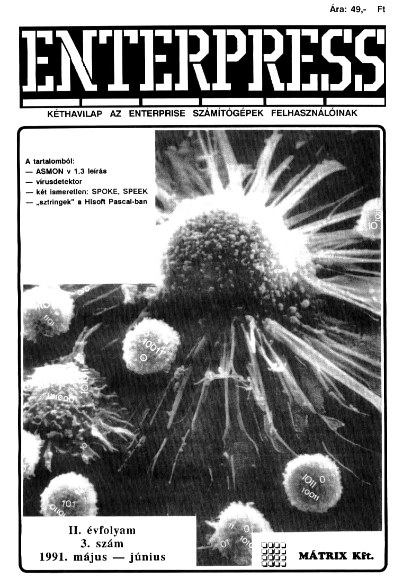

# Enterpress 1991/3 (1991.05-06)

[Онлайн версія](https://magazin.enterpress.news.hu/1991/3/) / [Ремастер PDF](https://magazin.enterpress.news.hu/1991/3/Enterpress-1991_per_3.pdf) / [Оригінальний PDF](http://enterprise.iko.hu/magazines/Enterpress_1991-3.pdf) (угорською)

## Зміст

Kedves Olvasó!  
[Assembly 5. rész](https://ep128.hu/Ep_Konyv/Enterpress_Gepikod.htm#a5) (ASMON)  
[Pascal 5. rész](https://ep128.hu/Ep_Konyv/Enterpress_Pascal.htm#3b)  
[Lehetőségek Páratlan Tárháza - az LPT kezelése 4. rész](https://ep128.hu/Ep_Konyv/Enterpress_Cikkek.htm#1)  
[Az ismeretlen SPOKE és SPEEK](https://ep128.hu/Ep_Konyv/Enterpress_Cikkek.htm#3)  
Víírus?  
Köztük: színkeverés, sztringek a Pascal-ban  
Green Hill, Super Robin Hood, Joeblade, Nether Earth  
Postafiók 334.  
Hirdetések, felhívások  

----

[Чернетка вмісту](1991-05-06/epress-1991-05-06.txt)
