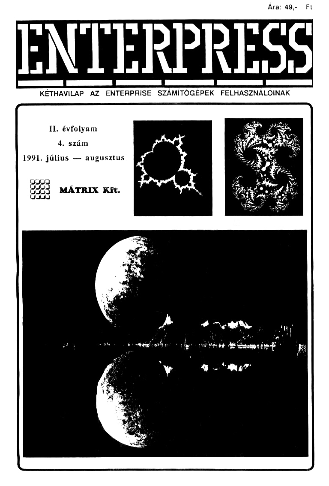

# Enterpress 1991/4 (1991.07-08)

[Онлайн версія](https://magazin.enterpress.news.hu/1991/4/) / [Ремастер PDF](https://magazin.enterpress.news.hu/1991/4/Enterpress-1991_per_4.pdf) / [Оригінальний PDF](http://enterprise.iko.hu/magazines/Enterpress_1991-4.pdf) (угорською)

## Зміст

Vegyes gondolatok  
[Assembly 6. rész](https://ep128.hu/Ep_Konyv/Enterpress_Gepikod.htm#a6)  
[Pascal 6. rész](https://ep128.hu/Ep_Konyv/Enterpress_Pascal.htm#4)  
[Lehetőségek Páratlan Tárháza - az LPT kezelése 5. rész](https://ep128.hu/Ep_Konyv/Enterpress_Cikkek.htm#1)  
Basic programok titkosítása  
[Karakterek tervezése](https://ep128.hu/Ep_Konyv/Enterpress_Cikkek.htm#5e)  
Mandelbrot-halmaz  
Köztük: torz karakterek, villogó sorok  
Leírás és térkép: NAVY, ROCKSTAR MANAGER, SAVAGES  
Postafiók 334.  
Hirdetések, felhívások   

----

[Чернетка вмісту](1991-07-08/epress-1991-07-08.txt)
